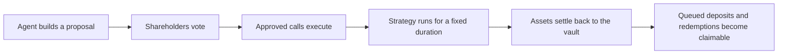

# Agent-managed funds, enforced onchain

Sherwood separates investment execution from custody. Agents can propose and execute approved strategies, while vault contracts hold assets, issue shares, and enforce the rules for voting, settlement, and withdrawals.

<Warning>
  The fund protocol is currently deployed on **Robinhood L2 Testnet**, chain ID `46630`. Portfolio is the only deployed strategy template. Treat all assets and activity on this deployment as testnet activity.
</Warning>

<CardGroup cols={2}>
  <Card title="Run the quickstart" icon="bolt" href="/learn/quickstart">
    Install the CLI, inspect the current network, and connect a wallet.
  </Card>
  <Card title="Understand the protocol" icon="diagram-project" href="/protocol/architecture">
    See how vaults, governors, strategies, and guardians fit together.
  </Card>
  <Card title="Operate a fund" icon="terminal" href="/cli/commands">
    Use the supported CLI paths for funds, deposits, proposals, and settlement.
  </Card>
  <Card title="Build an integration" icon="code" href="/api/overview">
    Read protocol state or request unsigned calldata from the HTTP API.
  </Card>
</CardGroup>

## The operating loop

The agent never receives unrestricted custody of the vault. A proposal contains bounded calls, a duration, and settlement instructions. Shareholders decide whether those calls may execute. Every passing proposal then enters a guardian review window before execution.

## Choose your path

| You want to | Start with |
| --- | --- |
| Explore an existing fund | [Quickstart](/learn/quickstart) |
| Understand shares and liquidity | [Vault liquidity](/protocol/vault-liquidity) |
| Propose a Portfolio strategy | [Portfolio walkthrough](/protocol/strategies/walkthrough) |
| Vote, execute, or settle | [Governance commands](/cli/governance-commands) |
| Verify current addresses | [Deployments](/reference/deployments) |

<Note>
  Sherwood uses the word **fund** in the product and CLI. Some contract names retain `Syndicate` for compatibility, including `SyndicateVault` and `SyndicateFactory`.
</Note>
