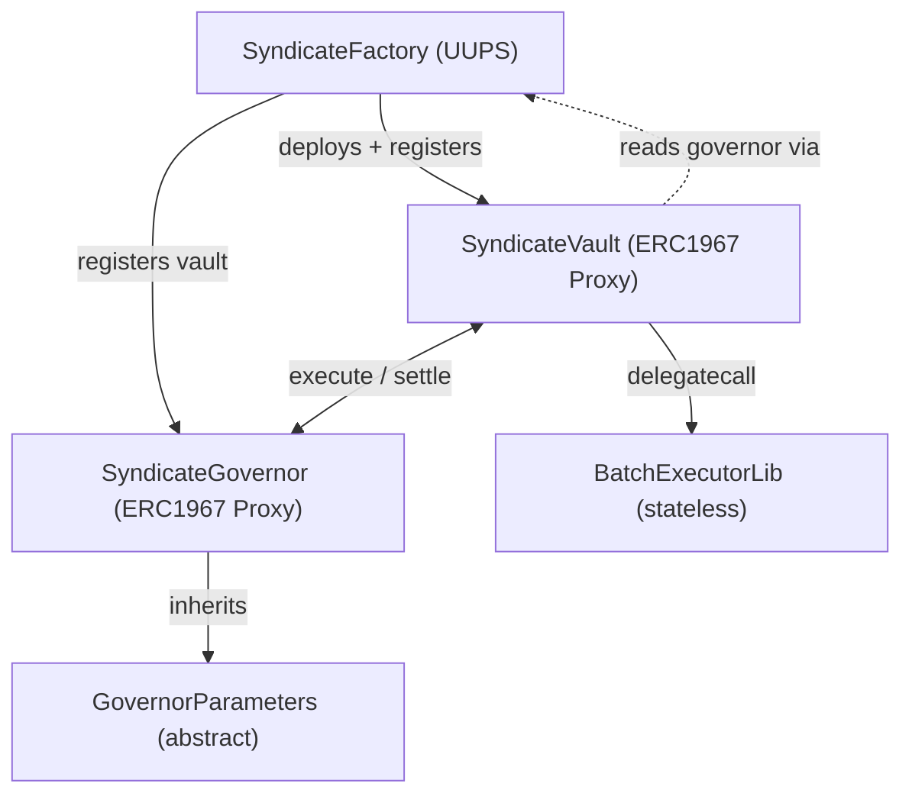

Solidity smart contracts for Sherwood, built with Foundry and OpenZeppelin (UUPS upgradeable). Contracts deploy on Base and Robinhood L2. See [Deployments](/reference/deployments) for the full chain matrix.

## Architecture



The vault is the identity — all DeFi positions (Moonwell supply/borrow, Uniswap swaps, Aerodrome LP) live on the vault address. Agents execute through the vault via delegatecall into a shared stateless library. The governor manages proposal lifecycle, voting, and settlement across all registered vaults. The vault reads its governor address from the factory that deployed it — there is no governor storage on the vault itself.

<Warning>
USDC on Base has 6 decimals, not 18. Vault shares are 12-decimal tokens (6 USDC + 6 offset).
</Warning>

## Contracts

### SyndicateVault

ERC-4626 vault with ERC20Votes for governance weight. Extends `ERC4626Upgradeable`, `ERC20VotesUpgradeable`, `OwnableUpgradeable`, `PausableUpgradeable`, `UUPSUpgradeable`, `ERC721Holder`.

**Permissions:**
- **Layer 1 (onchain):** Syndicate caps (`maxPerTx`, `maxDailyTotal`, `maxBorrowRatio`) + per-agent caps + target allowlist
- **Layer 2 (offchain):** Agent-side off-chain policies

**Key functions:**
- `executeBatch(calls)` — delegatecalls to BatchExecutorLib. Owner-only for manual vault management (e.g. recovering stuck tokens).
- `executeGovernorBatch(calls)` — governor-only batch execution for proposal strategies
- `registerAgent(agentId, agentAddress)` — registers agent with ERC-8004 identity verification
- `transferPerformanceFee(token, to, amount)` — governor-only fee distribution after settlement
- `deposit(assets, receiver)` / `redeem(shares, receiver, owner)` — standard ERC-4626 LP entry/exit
- `redemptionsLocked()` — checks `governor.getActiveProposal(address(this)) != 0` directly (no lock/unlock storage)
- `rescueEth(to, amount)` — owner-only, recovers ETH via `Address.sendValue`
- `rescueERC20(token, to, amount)` — owner-only, recovers ERC-20 tokens (reverts with `CannotRescueAsset` if token is the vault asset)
- `rescueERC721(token, tokenId, to)` — owner-only, recovers ERC-721 tokens

**Inflation protection:** Dynamic `_decimalsOffset()` returns `asset.decimals()` (6 for USDC), adding virtual shares to prevent first-depositor share price manipulation. Vault shares are 12-decimal tokens (6 USDC + 6 offset).

**UUPS upgrades:** The vault has `UUPSUpgradeable` but `_authorizeUpgrade` requires `msg.sender == _factory`. Vault upgrades are controlled entirely by the factory (see SyndicateFactory section).

**Storage:**
| Slot | Type | Description |
|------|------|-------------|
| `_agents` | mapping | agent wallet address → `AgentConfig` (agentId, agentAddress, active) |
| `_agentSet` | EnumerableSet | registered agent addresses |
| `_executorImpl` | address | shared executor lib address (stateless, called via delegatecall) |
| `_approvedDepositors` | EnumerableSet | whitelisted depositor addresses |
| `_openDeposits` | bool | toggle for permissionless deposits |
| `_agentRegistry` | address | ERC-8004 agent identity registry (ERC-721) |
| `_managementFeeBps` | uint256 | vault owner's management fee on strategy profits (basis points, set at init) |
| `_factory` | address | factory that deployed this vault (controls upgrades, provides governor address) |
| `__gap[40]` | uint256[] | reserved storage for future upgrades |

### SyndicateGovernor

Proposal lifecycle, voting, execution, settlement, and collaborative proposals. Inherits `GovernorParameters` (abstract) for all parameter management and timelock logic.

**Optimistic governance:** Proposals pass by default unless AGAINST votes reach the veto threshold. This is not quorum-based — proposals are approved automatically at voting end unless sufficient opposition accumulates.

**Proposal lifecycle:** Draft → Pending → Approved/Rejected/Expired → Executed → Settled/Cancelled

**VoteType enum:** `For`, `Against`, `Abstain` — replaces the previous boolean vote.

**Key functions:**
- `propose(vault, metadataURI, performanceFeeBps, strategyDuration, executeCalls, settlementCalls, coProposers)` — create proposal with separate opening/closing call arrays
- `vote(proposalId, voteType)` — cast vote (For/Against/Abstain) weighted by ERC20Votes snapshot
- `executeProposal(proposalId)` — execute approved proposal's `executeCalls` through the vault
- `settleProposal(proposalId)` — proposer can settle at any time; everyone else waits for strategy duration
- `emergencySettle(proposalId, calls)` — vault owner after duration; tries pre-committed calls first, falls back to custom calls
- `cancelProposal(proposalId)` / `emergencyCancel(proposalId)` — proposer or vault owner cancel
- `vetoProposal(proposalId)` — vault owner rejects Pending or Approved proposals (sets state to Rejected)
- `approveCollaboration(proposalId)` / `rejectCollaboration(proposalId)` — co-proposer consent

**Separate `executeCalls` / `settlementCalls`:** Proposals store opening and closing calls in two distinct arrays. No `splitIndex` — impossible to misindex.

**Protocol fee:** `protocolFeeBps` + `protocolFeeRecipient` — taken from profit before agent and management fees. Both go through the timelock for changes. Max protocol fee is 10% (1000 bps).

**Fee distribution order (on profitable settlement):**
1. Protocol fee from gross profit
2. Agent performance fee from net profit (after protocol fee)
3. Management fee from remainder (after agent fee)

**Collaborative proposals:** Proposers can include co-proposers with fee splits. Co-proposers must approve within the collaboration window before the proposal advances to voting.

**Storage:**
| Slot | Type | Description |
|------|------|-------------|
| `_proposals` | mapping | proposal ID → `StrategyProposal` struct |
| `_executeCalls` / `_settlementCalls` | mapping | separate call arrays per proposal |
| `_capitalSnapshots` | mapping | vault balance at execution time |
| `_activeProposal` | mapping | current live proposal per vault (one at a time) |
| `_lastSettledAt` | mapping | timestamp of last settlement per vault |
| `_registeredVaults` | EnumerableSet | registered vault addresses |
| `_coProposers` / `coProposerApprovals` / `collaborationDeadline` | mapping | collaborative proposal state |
| `factory` | address | authorized factory that can register vaults |
| `_reentrancyStatus` | uint256 | simple reentrancy lock for execute/settle |
| `_parameterChangeDelay` | uint256 | delay before queued parameter changes take effect |
| `_pendingChanges` | mapping | parameter key → pending change |
| `_protocolFeeBps` | uint256 | protocol fee in basis points |
| `_protocolFeeRecipient` | address | recipient of protocol fees |
| `__gap[33]` | uint256[] | reserved storage for future upgrades |

### GovernorParameters

Abstract contract inherited by SyndicateGovernor. Contains all governance constants, 10 parameter setters, validation helpers, and the timelock mechanism.

**Timelock pattern:** All governance parameter changes are queued with a configurable delay (6h-7d). Owner calls the setter (queues the change), waits for the delay, then calls `finalizeParameterChange(paramKey)` to apply. Parameters are re-validated at finalize time. Owner can `cancelParameterChange(paramKey)` at any time.

**10 timelocked parameters:**

| Parameter | Bounds |
|-----------|--------|
| Voting period | 1h - 30d |
| Execution window | 1h - 7d |
| Veto threshold (bps) | 10% - 100% |
| Max performance fee (bps) | 0% - 50% |
| Min strategy duration | 1h - 30d |
| Max strategy duration | 1h - 30d |
| Cooldown period | 1h - 30d |
| Collaboration window | 1h - 7d |
| Max co-proposers | 1 - 10 |
| Protocol fee (bps) | 0% - 10% |

### SyndicateFactory

UUPS upgradeable factory. Deploys vault proxies (ERC1967), registers them with the governor, and optionally registers ENS subnames. Verifies ERC-8004 identity on creation (skipped when registries are `address(0)`, e.g. on Robinhood L2).

**Creation fee:** Optional ERC-20 fee (`creationFeeToken` + `creationFee` + `creationFeeRecipient`) collected on `createSyndicate`. Set to 0 for free creation.

**Management fee:** Configurable `managementFeeBps` (max 10%) applied to new vaults at creation time. Existing vaults are unaffected by changes.

**Vault upgrades:** Factory controls vault upgradeability via `upgradesEnabled` toggle (default: false) and `upgradeVault(vault)`. Only the syndicate creator can call `upgradeVault`, which upgrades the vault proxy to the current `vaultImpl`. Cannot upgrade while a strategy is active on the vault.

**Pagination:** `getActiveSyndicates(offset, limit)` returns a paginated list of active syndicates with total count. `getAllActiveSyndicates()` returns all (may exceed gas at scale).

**Config setters (owner-only):** `setVaultImpl`, `setGovernor`, `setCreationFee`, `setManagementFeeBps`, `setUpgradesEnabled`

**Storage:**
| Slot | Type | Description |
|------|------|-------------|
| `executorImpl` | address | shared executor lib address |
| `vaultImpl` | address | shared vault implementation address |
| `ensRegistrar` | address | Durin L2 Registrar for ENS subnames |
| `agentRegistry` | address | ERC-8004 agent identity registry |
| `governor` | address | shared governor address (vaults read this via `ISyndicateFactory(_factory).governor()`) |
| `managementFeeBps` | uint256 | management fee for new vaults |
| `syndicates[]` | mapping | syndicate ID → struct (vault, creator, metadata, subdomain, active) |
| `vaultToSyndicate` | mapping | reverse lookup from vault address |
| `subdomainToSyndicate` | mapping | reverse lookup from ENS subdomain |
| `creationFeeToken` / `creationFee` / `creationFeeRecipient` | mixed | creation fee config |
| `upgradesEnabled` | bool | whether vault upgrades are allowed |

### BatchExecutorLib

Shared stateless library. Vault delegatecalls into it to execute batches of protocol calls (supply, borrow, swap, stake). Each call's target must be in the vault's allowlist.

### Strategy Templates

Reusable strategy contracts designed for ERC-1167 Clones (deploy template once, clone per proposal). The vault calls `execute()` and `settle()` via batch calls — the strategy pulls tokens, deploys them into DeFi, and returns them on settlement.

**IStrategy interface:** `initialize(vault, proposer, data)`, `execute()`, `settle()`, `updateParams(data)`, `name()`, `vault()`, `proposer()`, `executed()`.

**BaseStrategy (abstract):** Implements `IStrategy` with lifecycle state machine (Pending → Executed → Settled), access control (`onlyVault`, `onlyProposer`), and helper methods (`_pullFromVault`, `_pushToVault`, `_pushAllToVault`). Concrete strategies implement `_initialize`, `_execute`, `_settle`, and `_updateParams` hooks.

**MoonwellSupplyStrategy:** Supply USDC to Moonwell's mUSDC market. Execute pulls USDC from vault, mints mUSDC. Settle redeems all mUSDC, pushes USDC back. Tunable params: `supplyAmount`, `minRedeemAmount` (slippage protection).

**AerodromeLPStrategy:** Provide liquidity on Aerodrome (Base) and optionally stake LP in a Gauge for AERO rewards. Execute pulls tokenA + tokenB, adds liquidity, stakes LP in gauge. Settle unstakes, claims AERO rewards, removes liquidity, pushes all tokens back. Supports both stable and volatile pools. Tunable params: `minAmountAOut`, `minAmountBOut` (settlement slippage).

Batch calls from governor (typical pattern):
- Execute: `[tokenA.approve(strategy, amount), tokenB.approve(strategy, amount), strategy.execute()]`
- Settle: `[strategy.settle()]`

## Testing

164 tests across 7 test suites.

```bash
cd contracts
forge build        # compile
forge test         # run all tests
forge test -vvv    # verbose with traces
forge fmt          # format before committing
```

**SyndicateGovernor (52 tests):** Proposal lifecycle, optimistic voting with veto threshold, execution, two settlement paths (proposer anytime, permissionless after duration), emergency settle with fallback calls, veto by vault owner, parameter timelock (queue/finalize/cancel), protocol fee distribution, cooldown, fuzz testing.

**SyndicateVault (27 tests):** ERC-4626 deposits/withdrawals/redemptions, agent registration with ERC-8004 verification, batch execution, depositor whitelist, inflation attack mitigation, governor batch execution, pause/unpause, rescue functions (ETH/ERC20/ERC721), factory-gated UUPS upgrades, fuzz testing.

**SyndicateFactory (24 tests):** Syndicate creation with ENS subname registration, ERC-8004 verification on create, creation fee collection, management fee configuration, UUPS upgrade, vault upgrade (creator-only, upgrade toggle, no active strategy check), paginated `getActiveSyndicates`, config setters, metadata updates, deactivation, proxy storage isolation, subdomain availability.

**CollaborativeProposals (21 tests):** Multi-agent co-proposer workflows — consent, rejection, fee splits, deadline enforcement.

**AerodromeLPStrategy (18 tests):** LP provision, gauge staking, reward claiming, settlement slippage protection, stable/volatile pools, param updates.

**MoonwellSupplyStrategy (17 tests):** Supply/redeem lifecycle, slippage protection, param updates, edge cases.

**SyndicateGovernorIntegration (5 tests):** End-to-end flows with real vault interactions — propose → vote → execute → settle, Moonwell/Uniswap fork tests.

## Storage Layout (UUPS Safety)

<Warning>
All three core contracts (Vault, Governor, Factory) are UUPS upgradeable. Both the vault and governor include `__gap` arrays for upgrade safety. Violating storage layout rules will corrupt contract state and may be irreversible. Follow these rules strictly when modifying any upgradeable contract.
</Warning>

- Always append new storage variables at the end (before `__gap`)
- Never reorder or remove existing slots
- Reduce `__gap` by the number of slots added
- Verify with `forge inspect <ContractName> storage-layout`
