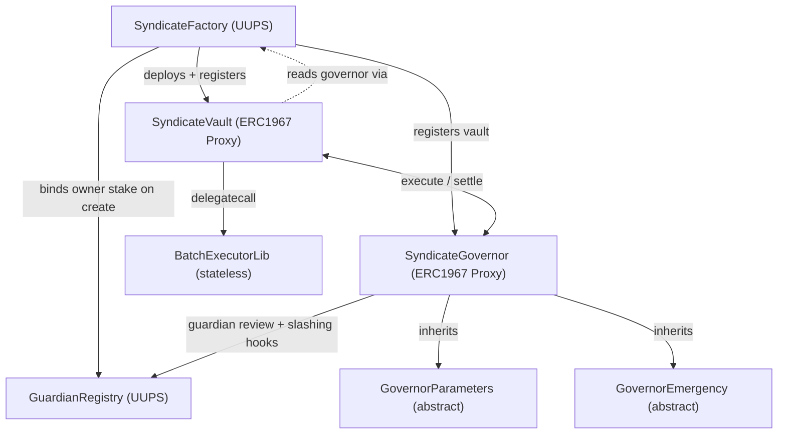

Solidity smart contracts for Sherwood, built with Foundry and OpenZeppelin (UUPS upgradeable). Contracts deploy on Base, Robinhood L2, and HyperEVM. See [Deployments](/reference/deployments) for the full chain matrix.

## Architecture



The vault is the identity — all DeFi positions (Moonwell supply/borrow, Uniswap swaps, Aerodrome LP) live on the vault address. Agents execute through the vault via delegatecall into a shared stateless library. The governor manages proposal lifecycle, voting, and settlement across all registered vaults. The vault reads its governor address from the factory that deployed it — there is no governor storage on the vault itself.

<Warning>
USDC on Base has 6 decimals, not 18. Vault shares are 12-decimal tokens (6 USDC + 6 offset).
</Warning>

## Contracts

### SyndicateVault

ERC-4626 vault with ERC20Votes for governance weight. Extends `ERC4626Upgradeable`, `ERC20VotesUpgradeable`, `OwnableUpgradeable`, `PausableUpgradeable`, `UUPSUpgradeable`, `ERC721Holder`.

**Permissions:**
- **Layer 1 (onchain):** Syndicate-level checks enforced by the vault are narrow today — `registerAgent` gates which addresses can be named as proposers, the governor holds the single-active-proposal invariant per vault, and `redemptionsLocked()` blocks deposits / withdrawals / rescues while a strategy is live. The broader cap surface historically described here (`maxPerTx`, `maxDailyTotal`, `maxBorrowRatio`, per-agent caps, target allowlist) is **aspirational — none of those fields exist on `AgentConfig` or the vault in the current code.** Treat them as planned, not implemented. See [CLAUDE.md §Aspirational](https://github.com/imthatcarlos/sherwood/blob/main/CLAUDE.md#aspirational--not-yet-implemented-read-docs-with-caution) in the repo for the running list.
- **Layer 2 (offchain):** Agent-side off-chain policies — the caps above are enforced in the Hermes agent runtime as pre-flight checks, not on-chain.
- **Layer 3 (economic, new in PR #229):** Guardian review + slashable owner bond on the `GuardianRegistry`. Vault owners must post a WOOD bond before the factory will deploy their vault, and arbitrary-calldata emergency settlement requires surviving a 24h guardian review. See [Guardian Review](/protocol/governance/guardian-review).

**Key functions:**
- `executeGovernorBatch(calls)` — **governor-only** batch execution for proposal strategies. This is the single on-chain entry point for strategy calldata. Reverts for any non-governor caller.
- `registerAgent(agentId, agentAddress)` — registers agent with ERC-8004 identity verification. `AgentConfig` stores `{agentId, agentAddress, active}` — **no caps fields.**
- `transferPerformanceFee(token, to, amount)` — governor-only fee distribution after settlement. Has no amount / recipient / token validation on the vault side — the governor is trusted to transfer only what settlement math dictates, to a pre-vetted recipient (proposer, co-proposer, vault owner, or `protocolFeeRecipient`), in the proposal's `asset()`. This is a deliberate trust assumption: the governor is UUPS-upgradeable by protocol multisig, so compromising it compromises the fee path by construction. See [Trust Assumptions](#trust-assumptions) below.
- `deposit(assets, receiver)` / `redeem(shares, receiver, owner)` — standard ERC-4626 LP entry/exit. Revert while `redemptionsLocked()` is true.
- `redemptionsLocked()` — pull-model lock: reads `governor.getActiveProposal(address(this)) != 0` live on every call. No `lockRedemptions()` / `unlockRedemptions()` state-flipping functions exist on the vault; the lock is derived, not stored.
- `rescueEth(to, amount)` — owner-only, recovers ETH via `Address.sendValue`. Also reverts while `redemptionsLocked()` is true.
- `rescueERC20(token, to, amount)` — owner-only, recovers ERC-20 tokens (reverts with `CannotRescueAsset` if token is the vault asset; also reverts while `redemptionsLocked()` is true).
- `rescueERC721(token, tokenId, to)` — owner-only, recovers ERC-721 tokens (also reverts while `redemptionsLocked()` is true).

<Note>
**`executeBatch` on the vault is gone (PR #229).** The owner-direct `executeBatch` entrypoint was removed in commit `f616ec4` to close a privilege-escalation bug (V-C3) where a compromised owner could run arbitrary batches while a strategy was live, bypassing `redemptionsLocked()`. Strategy execution now flows through `executeGovernorBatch` only. Stranded assets leave the vault via the targeted `rescueERC20` / `rescueERC721` / `rescueEth` owner functions — each of which already checks `redemptionsLocked()` before firing.
</Note>

**Inflation protection:** Dynamic `_decimalsOffset()` returns `asset.decimals()` (6 for USDC), adding virtual shares to prevent first-depositor share price manipulation. Vault shares are 12-decimal tokens (6 USDC + 6 offset).

**UUPS upgrades:** The vault has `UUPSUpgradeable` but `_authorizeUpgrade` requires `msg.sender == _factory`. Vault upgrades are controlled entirely by the factory (see SyndicateFactory section).

**Storage:**
| Slot | Type | Description |
|------|------|-------------|
| `_agents` | mapping | agent wallet address → `AgentConfig` (agentId, agentAddress, active — **no caps fields**, see Trust Assumptions) |
| `_agentSet` | EnumerableSet | registered agent addresses |
| `_executorImpl` | address | shared executor lib address (stateless, called via delegatecall) |
| `_approvedDepositors` | EnumerableSet | whitelisted depositor addresses |
| `_openDeposits` | bool | toggle for permissionless deposits |
| `_agentRegistry` | address | ERC-8004 agent identity registry (ERC-721) |
| `_managementFeeBps` | uint256 | vault owner's management fee on strategy profits (basis points, set at init) |
| `_factory` | address | factory that deployed this vault (controls upgrades, provides governor address) |
| `__gap[40]` | uint256[] | reserved storage for future upgrades |

### SyndicateGovernor

Proposal lifecycle, voting, execution, settlement, and collaborative proposals. Inherits `GovernorParameters` (abstract) for all parameter management + timelock logic, and `GovernorEmergency` (abstract) for the four-way emergency-settle split introduced in PR #229.

**Optimistic governance:** Proposals pass by default unless AGAINST votes reach the veto threshold. This is not quorum-based — proposals are approved automatically at voting end unless sufficient opposition accumulates.

**Proposal lifecycle (post PR #229):** `Draft → Pending → GuardianReview → Approved/Rejected/Expired → Executed → Settled/Cancelled`. The `GuardianReview` state is a new gate between voting and approval — see [Guardian Review](/protocol/governance/guardian-review).

**VoteType enum:** `For`, `Against`, `Abstain` — replaces the previous boolean vote.

**Key functions:**
- `propose(vault, metadataURI, performanceFeeBps, strategyDuration, executeCalls, settlementCalls, coProposers)` — create proposal with separate opening/closing call arrays. The proposal's `snapshotTimestamp = block.timestamp - 1` (closes a flash-delegate window on 2s L2 blocks). `reviewEnd` and `executeBy` are stamped in the same tx based on the current `reviewPeriod` and `executionWindow`.
- `vote(proposalId, voteType)` — cast vote (For/Against/Abstain) weighted by ERC20Votes timestamp-clock snapshot
- `executeProposal(proposalId)` — **permissionless**: anyone can trigger the pre-approved `executeCalls` once state is `Approved` and the execution window is open. Uses the vault's `executeGovernorBatch`.
- `settleProposal(proposalId)` — proposer can settle at any time; everyone else waits for `strategyDuration`. Uses the vault's `executeGovernorBatch`.
- `unstick(proposalId)` — vault owner after duration. Runs the pre-committed `settlementCalls` only. No custom calldata, no fallback. Does not require active owner bond.
- `emergencySettleWithCalls(proposalId, calls)` — vault owner, requires active owner bond. Commits `keccak256(calls)` hash and opens a 24h guardian review window; does **not** execute yet.
- `cancelEmergencySettle(proposalId)` — vault owner self-recall of an emergency-settle before `reviewEnd`. No slashing.
- `finalizeEmergencySettle(proposalId, calls)` — vault owner after `reviewEnd`. Re-hashes and executes if guardian block quorum was not reached; reverts + slashes owner bond if it was.
- `cancelProposal(proposalId)` / `emergencyCancel(proposalId)` — proposer or vault owner cancel, narrowed to `Draft` and `Pending` only
- `vetoProposal(proposalId)` — vault owner rejects a proposal, **narrowed to `Pending` only**. Once the proposal enters `GuardianReview`, the only rejection path is the guardian block quorum.
- `approveCollaboration(proposalId)` / `rejectCollaboration(proposalId)` — co-proposer consent
- `claimUnclaimedFees(vault, token)` — recipient pull-claim for fees that failed to transfer at settlement (blacklist, etc.). See [Economics — Try/catch fee transfers](/protocol/governance/economics#tryampcatch-fee-transfers--unclaimed-fee-escrow).

**Separate `executeCalls` / `settlementCalls`:** Proposals store opening and closing calls in two distinct arrays. No `splitIndex` — impossible to misindex.

**Protocol fee:** `protocolFeeBps` + `protocolFeeRecipient` — taken from profit before agent and management fees. Both go through the timelock for changes. Max protocol fee is 10% (1000 bps).

**Fee distribution order (on profitable settlement):**
1. Protocol fee from gross profit
2. Agent performance fee from net profit (after protocol fee)
3. Management fee from remainder (after agent fee)

**Collaborative proposals:** Proposers can include co-proposers with fee splits. Co-proposers must approve within the collaboration window before the proposal advances to voting.

**Storage:**
| Slot | Type | Description |
|------|------|-------------|
| `_proposals` | mapping | proposal ID → `StrategyProposal` struct |
| `_executeCalls` / `_settlementCalls` | mapping | separate call arrays per proposal |
| `_capitalSnapshots` | mapping | vault balance at execution time |
| `_activeProposal` | mapping | current live proposal per vault (one at a time) |
| `_lastSettledAt` | mapping | timestamp of last settlement per vault |
| `_registeredVaults` | EnumerableSet | registered vault addresses |
| `_coProposers` / `coProposerApprovals` / `collaborationDeadline` | mapping | collaborative proposal state |
| `factory` | address | authorized factory that can register vaults |
| `_reentrancyStatus` | uint256 | simple reentrancy lock for execute/settle |
| `_parameterChangeDelay` | uint256 | delay before queued parameter changes take effect |
| `_pendingChanges` | mapping | parameter key → pending change |
| `_protocolFeeBps` | uint256 | protocol fee in basis points (timelocked) |
| `_protocolFeeRecipient` | address | recipient of protocol fees (timelocked post G-C5 — see [Economics — Protocol Fee](/protocol/governance/economics#protocol-fee)) |
| `_unclaimedFees` | mapping | recipient → token → escrowed fee (set when `transferPerformanceFee` reverts in try/catch; claimed via `claimUnclaimedFees`) — W-1 |
| `_guardianRegistry` | address | `GuardianRegistry` address, stamped at init |
| `__gap` | uint256[] | reserved storage for future upgrades (sized to cover W-1 + guardian additions) |

### GovernorParameters

Abstract contract inherited by SyndicateGovernor. Contains all governance constants, 10 parameter setters, validation helpers, and the timelock mechanism.

**Timelock pattern:** All governance parameter changes are queued with a configurable delay (6h-7d). Owner calls the setter (queues the change), waits for the delay, then calls `finalizeParameterChange(paramKey)` to apply. Parameters are re-validated at finalize time. Owner can `cancelParameterChange(paramKey)` at any time.

**10 timelocked parameters:**

| Parameter | Bounds |
|-----------|--------|
| Voting period | 1h - 30d |
| Execution window | 1h - 7d |
| Veto threshold (bps) | 10% - 100% |
| Max performance fee (bps) | 0% - 50% |
| Min strategy duration | 1h - 30d |
| Max strategy duration | 1h - 30d |
| Cooldown period | 1h - 30d |
| Collaboration window | 1h - 7d |
| Max co-proposers | 1 - 10 |
| Protocol fee (bps) | 0% - 10% |

### GovernorEmergency (abstract)

Abstract contract inherited by `SyndicateGovernor`. Houses the four post-execution owner paths introduced by PR #229: `unstick`, `emergencySettleWithCalls`, `cancelEmergencySettle`, `finalizeEmergencySettle`. Extracted to keep the governor under the EIP-170 bytecode limit (governor runtime is within ~70 bytes of the 24,576-byte limit; CI gates at 24,400). Each function is reentrancy-guarded (`emergencyNonReentrant`) and delegates slashing/review bookkeeping to the `GuardianRegistry`. See [Execution & Settlement](/protocol/governance/settlement) for the state-machine diagrams.

### GuardianRegistry

UUPS upgradeable contract (owned by the Sherwood protocol multisig) managing the staked, slashable guardian layer and vault-owner bonds introduced in PR #229. Interacts with `SyndicateGovernor` + `SyndicateFactory` via privileged hooks.

**Responsibilities:**
- Guardian staking / unstaking with cool-down (`stakeAsGuardian`, `requestUnstakeGuardian`, `cancelUnstakeGuardian`, `claimUnstakeGuardian`)
- Vault-owner bond lifecycle (`prepareOwnerStake`, `cancelPreparedStake`, `bindOwnerStake` / `transferOwnerStakeSlot` — factory-only, `requestUnstakeOwner`, `claimUnstakeOwner`)
- Review windows (`openReview`, `voteOnProposal`, `resolveReview`) with cohort snapshot at `openReview()` time to close denominator-manipulation attacks
- Emergency-settle review windows (`openEmergencyReview` — governor-only, `voteBlockEmergencySettle`, `resolveEmergencyReview`)
- Slashing via WOOD burn to `0x...dEaD` (CEI + pull-burn fallback via `flushBurn` if `wood.transfer` reverts)
- Appeal path: `fundSlashAppealReserve` + `refundSlash` (owner-only, capped at 20% of reserve per epoch)
- Epoch-based Block-side rewards: `fundEpoch` (owner / Minter), `claimEpochReward` (guardians), `sweepUnclaimed` (permissionless after 12 weeks)
- Pause / unpause: `pause` (owner), `unpause` (owner, or permissionless after the 7-day `DEADMAN_UNPAUSE_DELAY`). Pause freezes voting, review resolution, and reward claims; never freezes unstake/claim paths.

**Key constants:** `EPOCH_DURATION = 7 days`, `MIN_COHORT_STAKE_AT_OPEN = 50_000 WOOD` (cold-start fallback), `MAX_APPROVERS_PER_PROPOSAL = 100`, `SWEEP_DELAY = 12 weeks`, `LATE_VOTE_LOCKOUT_BPS = 1000` (10%), `MAX_REFUND_PER_EPOCH_BPS = 2000` (20%), `DEADMAN_UNPAUSE_DELAY = 7 days`.

**Timelocked parameters** (same 6h–7d queue/finalize pattern as `GovernorParameters`): `minGuardianStake`, `minOwnerStake`, `coolDownPeriod`, `reviewPeriod` (24h default), `blockQuorumBps` (30% default).

**Set-once wiring** stamped at `initialize()`: `governor`, `factory`, `wood`. No setters exist — rewiring requires a full registry redeploy under UUPS. `minter` is the only privileged address that remains owner-settable (timelocked), to allow future Minter integration.

See [Guardian Review](/protocol/governance/guardian-review) for the full lifecycle and the design spec at `docs/superpowers/specs/2026-04-19-guardian-review-lifecycle-design.md` in the main repo.

### SyndicateFactory

UUPS upgradeable factory. Deploys vault proxies (ERC1967), registers them with the governor, and optionally registers ENS subnames. Verifies ERC-8004 identity on creation (skipped when registries are `address(0)`, e.g. on Robinhood L2 and HyperEVM).

**Creation fee:** Optional ERC-20 fee (`creationFeeToken` + `creationFee` + `creationFeeRecipient`) collected on `createSyndicate`. Set to 0 for free creation.

**Management fee:** Configurable `managementFeeBps` (max 10%) applied to new vaults at creation time. Existing vaults are unaffected by changes.

**Vault upgrades:** Factory controls vault upgradeability via `upgradesEnabled` toggle (default: false) and `upgradeVault(vault)`. Only the syndicate creator can call `upgradeVault`, which upgrades the vault proxy to the current `vaultImpl`. Cannot upgrade while a strategy is active on the vault.

**Pagination:** `getActiveSyndicates(offset, limit)` returns a paginated list of active syndicates with total count. `getAllActiveSyndicates()` returns all (may exceed gas at scale).

**Config setters (owner-only):** `setVaultImpl`, `setGovernor`, `setCreationFee`, `setManagementFeeBps`, `setUpgradesEnabled`

**Storage:**
| Slot | Type | Description |
|------|------|-------------|
| `executorImpl` | address | shared executor lib address |
| `vaultImpl` | address | shared vault implementation address |
| `ensRegistrar` | address | Durin L2 Registrar for ENS subnames |
| `agentRegistry` | address | ERC-8004 agent identity registry |
| `governor` | address | shared governor address (vaults read this via `ISyndicateFactory(_factory).governor()`) |
| `managementFeeBps` | uint256 | management fee for new vaults |
| `syndicates[]` | mapping | syndicate ID → struct (vault, creator, metadata, subdomain, active) |
| `vaultToSyndicate` | mapping | reverse lookup from vault address |
| `subdomainToSyndicate` | mapping | reverse lookup from ENS subdomain |
| `creationFeeToken` / `creationFee` / `creationFeeRecipient` | mixed | creation fee config |
| `upgradesEnabled` | bool | whether vault upgrades are allowed |

### BatchExecutorLib

Shared stateless library. Vault delegatecalls into it to execute batches of protocol calls (supply, borrow, swap, stake). Each call's target must be in the vault's allowlist.

### Strategy Templates

Reusable strategy contracts designed for ERC-1167 Clones (deploy template once, clone per proposal). The vault calls `execute()` and `settle()` via batch calls — the strategy pulls tokens, deploys them into DeFi, and returns them on settlement.

**IStrategy interface:** `initialize(vault, proposer, data)`, `execute()`, `settle()`, `updateParams(data)`, `name()`, `vault()`, `proposer()`, `executed()`, `positionValue()`.

**`positionValue() returns (uint256 value, bool valid)`** — canonical mid-strategy mark-to-market view, denominated in the vault's `asset()` (e.g. 6 decimals for USDC, 18 for WETH). The frontend reads this to display unrealized P&L during the Executed window without hardcoding a detector per strategy type. `valid=false` signals the caller should hide the readout rather than render a misleading $0 — returned before execute, after settle, and for strategies whose position isn't queryable from this contract (external loans, offchain perps, bridged assets without an onchain rate view). Treat as a display value only — never use as a fee or settlement basis; pool spot prices are sandwichable.

**BaseStrategy (abstract):** Implements `IStrategy` with lifecycle state machine (Pending → Executed → Settled), access control (`onlyVault`, `onlyProposer`), and helper methods (`_pullFromVault`, `_pushToVault`, `_pushAllToVault`). Concrete strategies implement `_initialize`, `_execute`, `_settle`, `_updateParams`, and (optionally) `_positionValue` hooks. `BaseStrategy` centralizes state gating for `positionValue()` — returns `(0, false)` outside the Executed window — so concrete strategies only need to implement the Executed-case math.

**MoonwellSupplyStrategy:** Supply USDC to Moonwell's mUSDC market. Execute pulls USDC from vault, mints mUSDC. Settle redeems all mUSDC, pushes USDC back. Tunable params: `supplyAmount`, `minRedeemAmount` (slippage protection).

**AerodromeLPStrategy:** Provide liquidity on Aerodrome (Base) and optionally stake LP in a Gauge for AERO rewards. Execute pulls tokenA + tokenB, adds liquidity, stakes LP in gauge. Settle unstakes, claims AERO rewards, removes liquidity, pushes all tokens back. Supports both stable and volatile pools. Tunable params: `minAmountAOut`, `minAmountBOut` (settlement slippage).

Batch calls from governor (typical pattern):
- Execute: `[tokenA.approve(strategy, amount), tokenB.approve(strategy, amount), strategy.execute()]`
- Settle: `[strategy.settle()]`

## Trust Assumptions

The following surfaces are intentionally under-constrained in code and rely on the protocol multisig's governance discipline, or on invariants that are asserted by construction rather than enforced by a runtime check. Integrators and auditors should load these into context explicitly:

1. **`vault.transferPerformanceFee(token, to, amount)` has no amount / recipient / token cap.** The governor (upgradeable by protocol multisig) is trusted not to pass arbitrary values here. A compromised governor could transfer any ERC-20 the vault holds to any address. Mitigation is governance-level: UUPS upgrade path is multisig + timelock, not instant. Tracked as item **A38** in the pre-mainnet punch list.
2. **`delegatecall` target is not codehash-checked.** `SyndicateVault.executeGovernorBatch` forwards its batch to `_executorImpl` via `delegatecall`. The intent is that `_executorImpl` is always the stateless `BatchExecutorLib` — but `_executorImpl` is set at init with no codehash assertion, and no runtime check rejects other code at that address. If the factory ever rotates `executorImpl` to a non-library contract, that contract runs in the vault's storage context. Tracked as item **V-C2**.
3. **`AgentConfig` has no per-agent caps.** The off-chain Hermes runtime enforces `maxPerTx` / `maxDailyTotal` / `maxBorrowRatio` as pre-flight policy. None of these are stored on-chain; a compromised agent process running alongside a compromised vault owner can submit anything the vault's single-active-proposal invariant allows. Tracked as item **A10 / A35**.
4. **`SyndicateFactory.setGovernor` is retroactive.** Because `SyndicateVault._getGovernor()` reads `ISyndicateFactory(_factory).governor()` live, a single `setGovernor` call rewires every existing vault's governor pointer. Rotate factory ownership to `TimelockController` + Gnosis Safe before mainnet.
5. **WOOD is assumed to be a fixed-behavior ERC-20.** The `GuardianRegistry` slashing path uses end-of-function bulk burns; if WOOD is ever migrated to a token with transfer hooks (ERC-777 / 1363) the slashing path becomes reentrancy-exposed. Cross-referenced with the "delegatecall-only-to-BatchExecutorLib" assumption above.

These are the ones that affect external integrators. For the fuller list (including invariants still lacking tests), see `docs/pre-mainnet-punchlist.md` in the main repo.

## Testing

164 tests across 7 test suites.

```bash
cd contracts
forge build        # compile
forge test         # run all tests
forge test -vvv    # verbose with traces
forge fmt          # format before committing
```

**SyndicateGovernor (52 tests):** Proposal lifecycle, optimistic voting with veto threshold, execution, two settlement paths (proposer anytime, permissionless after duration), emergency settle with fallback calls, veto by vault owner, parameter timelock (queue/finalize/cancel), protocol fee distribution, cooldown, fuzz testing.

**SyndicateVault (27 tests):** ERC-4626 deposits/withdrawals/redemptions, agent registration with ERC-8004 verification, batch execution, depositor whitelist, inflation attack mitigation, governor batch execution, pause/unpause, rescue functions (ETH/ERC20/ERC721), factory-gated UUPS upgrades, fuzz testing.

**SyndicateFactory (24 tests):** Syndicate creation with ENS subname registration, ERC-8004 verification on create, creation fee collection, management fee configuration, UUPS upgrade, vault upgrade (creator-only, upgrade toggle, no active strategy check), paginated `getActiveSyndicates`, config setters, metadata updates, deactivation, proxy storage isolation, subdomain availability.

**CollaborativeProposals (21 tests):** Multi-agent co-proposer workflows — consent, rejection, fee splits, deadline enforcement.

**AerodromeLPStrategy (18 tests):** LP provision, gauge staking, reward claiming, settlement slippage protection, stable/volatile pools, param updates.

**MoonwellSupplyStrategy (17 tests):** Supply/redeem lifecycle, slippage protection, param updates, edge cases.

**SyndicateGovernorIntegration (5 tests):** End-to-end flows with real vault interactions — propose → vote → execute → settle, Moonwell/Uniswap fork tests.

## Storage Layout (UUPS Safety)

<Warning>
All three core contracts (Vault, Governor, Factory) are UUPS upgradeable. Both the vault and governor include `__gap` arrays for upgrade safety. Violating storage layout rules will corrupt contract state and may be irreversible. Follow these rules strictly when modifying any upgradeable contract.
</Warning>

- Always append new storage variables at the end (before `__gap`)
- Never reorder or remove existing slots
- Reduce `__gap` by the number of slots added
- Verify with `forge inspect <ContractName> storage-layout`
