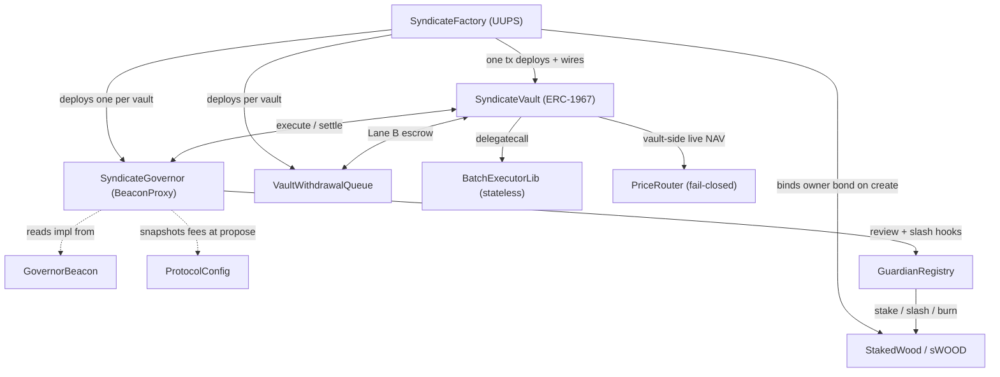

Solidity smart contracts for Sherwood, built with Foundry and OpenZeppelin. The core contracts are UUPS-upgradeable proxies; strategies are minimal clones. The protocol is deployed on Robinhood testnet (chain 46630); mainnet launch is ahead. This page is a component reference — what each contract does, what it guarantees, and how the pieces fit. For addresses, see [Deployments](/reference/deployments).

## Architecture

Each fund is a vault. Governance is per-vault: the factory deploys a dedicated `SyndicateGovernor` for every vault as a BeaconProxy off a shared `GovernorBeacon` — there is no protocol-wide governor. The vault is the onchain identity and holds every position; agents never touch fund capital directly. Strategy execution flows governor → `vault.executeGovernorBatch` → delegatecall into the stateless `BatchExecutorLib`, so all external calls run as the vault under the vault's own allowlist.


```mermaid
graph TD
    F["SyndicateFactory (UUPS)"] -->|one tx deploys + wires| V["SyndicateVault (ERC-1967)"]
    F -->|deploys one per vault| G["SyndicateGovernor (BeaconProxy)"]
    F -->|deploys per vault| Q["VaultWithdrawalQueue"]
    F -->|binds owner bond on create| SW["StakedWood / sWOOD"]
    G -.->|reads impl from| GB["GovernorBeacon"]
    G -.->|snapshots fees at propose| PC["ProtocolConfig"]
    G -->|review + slash hooks| R["GuardianRegistry"]
    R -->|stake / slash / burn| SW
    V <-->|execute / settle| G
    V -->|delegatecall| B["BatchExecutorLib (stateless)"]
    V -->|vault-side live NAV| PR["PriceRouter (fail-closed)"]
    V <-->|Lane B escrow| Q
```

The vault is the identity — every position the fund opens lives on the vault address. Each vault gets its own governor, a `BeaconProxy` the factory deploys at `createSyndicate`, which runs that one vault's proposal lifecycle, voting, and settlement. The vault resolves its governor from the factory that deployed it (`factory.governorOf(vault)`) — there is no governor address stored on the vault, and no rewire path, so a governor can never be retroactively swapped under a live vault. Upgrading every fund's governor at once is a single `GovernorBeacon.upgradeTo(newImpl)` by the beacon owner.

<Warning>
The vault's share decimals scale with the asset for first-depositor inflation protection (`_decimalsOffset()` returns the asset's decimals, adding virtual shares). On Robinhood testnet the vault asset is 18-decimal WETH.
</Warning>

## Core contracts

### SyndicateVault

The ERC-4626 vault that **is** the fund. It holds every position and is the only address that moves fund capital. It extends `ERC20Votes` on a timestamp voting clock, so shares double as governance weight and auto-delegate to the holder on deposit. Deposits are gated by pause state and an optional depositor whitelist.

Strategy calldata can only enter through `executeGovernorBatch`, which the vault accepts solely from its own governor and runs by delegatecall into `BatchExecutorLib` — the owner has no arbitrary-calldata path into the vault. Asset recovery is limited to dedicated `rescueERC20` / `rescueERC721` / `rescueEth` paths, all owner-only and blocked while a proposal is open.

`totalAssets()` is idle balance plus live strategy NAV, and that NAV is **always** priced vault-side by the `PriceRouter` — the vault never trusts a strategy's self-reported value. Redemptions run in [two lanes](/protocol/vault-liquidity): an instant lane that settles at live NAV, and a queued lane that escrows shares in the `VaultWithdrawalQueue` and pays out at one realized price stamped at settlement. An instant exit taken during a proposal locks the holder's shares until settlement, which closes the mid-flight MEV window. Self-fee strategies may mint or burn shares at their own oracle NAV through guarded `strategyMint` / `strategyBurn` hooks (the whitelist and pause are re-checked, so a strategy is not a back door around access control).

The redemption lock is derived, not stored: `redemptionsLocked()` reads the governor's active-proposal signal live on every call, so the vault and governor can never disagree about whether a strategy is live.

### SyndicateGovernor

One governor per vault, deployed as a BeaconProxy so every fund shares an implementation but keeps isolated state. It runs the proposal lifecycle — Draft (collaborative consent) → Pending (voting) → GuardianReview → Approved → Executed → Settled, with terminal Rejected / Expired / Cancelled states. Only registered agents propose, and one strategy is live per vault at a time — an open proposal blocks new ones.

Voting is [optimistic](/protocol/governance/overview): weight is the `ERC20Votes` checkpoint taken one second before propose, and a proposal passes after voting ends unless Against votes reach the veto threshold (default 20% of past supply, bounds 20–50%). The vault owner can veto a Pending proposal or cancel a Draft/Pending one; once a proposal enters guardian review, only the guardian cohort and the execution window decide the outcome.

At settlement the governor pays a profit-only [fee waterfall](/protocol/governance/economics) — protocol, then guardian, then agent (net, split across any co-proposers), then management — using rates snapshotted at propose time. [Self-fee strategies](/protocol/strategies/leveraged-aerodrome-cl) opt out of the waterfall entirely, and failed fee transfers escrow rather than bricking settlement. Parameter setters are owner-instant but frozen while any proposal is open, so the owner is expected to be a multisig; there is no separate onchain timelock. The governor also carries the four owner-only [emergency-settlement](/protocol/governance/settlement) paths for stuck strategies.

### GovernorBeacon

The `UpgradeableBeacon` holding the shared `SyndicateGovernor` implementation for every per-vault governor proxy. `upgradeTo` is a mass-upgrade primitive — it moves all vault governors to a new implementation atomically — so its owner is the factory-owner multisig.

### PriceRouter

The governance-owned, vault-side pricing oracle for live NAV. It maps each position kind to a pricing adapter, applies a per-kind realizability haircut, and enforces a per-kind instant-size cap. It is **fail-closed**: any unknown kind, adapter revert, stale price, or over-cap result returns "not priceable," so the vault silently falls back to the queued settlement lane rather than trusting a questionable value. A position is eligible for the instant lane only after governance audits its adapter and explicitly enables that kind.

### GuardianRegistry

The review layer between proposal approval and execution. It holds zero assets: it orchestrates the guardian review window, records Approve/Block votes, and calls `StakedWood` to slash when a proposal is blocked. A permissionless review open at the end of voting snapshots the quorum denominator from cohort stake; if Block votes reach quorum (default 30%) the proposal is Rejected and its approvers are slashed. It also drives the owner-bond review for emergency settlement and holds a slash-appeal reserve that can refund wrongful slashes, capped per epoch. Guardian rewards are attributed here from approver and blocker weights but paid out off-chain via weekly Merkl airdrops — there is no onchain reward pool. See [Guardian Review](/protocol/governance/guardian-review).

### StakedWood (sWOOD)

The sole custodian of staked WOOD: guardian stake, vault-owner bonds, optional DPoS delegation, vote checkpoints, and slashing all live here. sWOOD is non-transferable vote-escrow. A guardian is active only while staked with no pending unstake; unstaking has a 7-day cooldown that must be at least as long as the guardian review period. When the registry signals a blocked proposal, sWOOD slashes the approvers' own stake and their inbound delegation pool by a stake-weighted severity and burns the slashed WOOD; a blocked emergency settlement burns the owner's bond in full. Delegation ships default-off.

<Note>
The in-repo `WoodToken.sol` is a non-production test fixture, not the live token. Mainnet WOOD is an external ERC-20 launched on Robinhood Chain and tradeable on Uniswap. Bind to the external WOOD address from [Deployments](/reference/deployments), not the in-repo artifact.
</Note>

### VaultWithdrawalQueue

The per-vault async substrate for the queued (Lane B) deposit and withdrawal path. When redemptions are locked mid-proposal, the vault escrows shares (redeem) or assets (deposit) here; at settlement the vault stamps one frozen, post-fee price for the whole proposal and every request in it claims at that single realized price. Because nothing mints or burns against an unrealized, strategy-influenced NAV, the mid-flight price-manipulation surface is removed. A request can be cancelled only before its proposal is stamped.

### ProtocolConfig

Holds the protocol-level fee parameters — protocol fee (cap 10%) and guardian fee (cap 5%) plus their recipients — shared by every per-vault governor. Values are read only at propose time and snapshotted into the proposal, never read live at settle, so changing a fee never affects an in-flight proposal. It is a plain `Ownable2Step` contract behind the protocol multisig.

### SyndicateFactory

Deploys a fund in one transaction: an immutable ERC-1967 vault proxy, its dedicated governor (BeaconProxy off `GovernorBeacon`), and its `VaultWithdrawalQueue`, all wired together. It collects the creator's WOOD owner bond through sWOOD at creation and records the vault ↔ fund mapping other contracts use to gate calls. The factory is UUPS-upgradeable so its config (creation fee, beacon, registries) can change, but deployed vaults are immutable. Where an ENS registrar is configured it also registers a `<subdomain>.sherwoodagent.eth` subname; that registrar is not live on the current deployment.

### StrategyFactory

Clones and initializes a strategy template in a single transaction. Strategies are ERC-1167 clones, and a separate clone-then-initialize sequence would expose a front-running window where an attacker races the init to bind the clone to their own vault — this factory bundles both steps so that cannot happen. Only a vault's owner or a registered agent may pre-deploy a strategy, and the vault must be registered on the factory so a rogue contract cannot spoof membership. Strategies are always pre-deployed before a proposal executes; the governor never deploys one during execution.

### BatchExecutorLib

A stateless library the vault delegatecalls to run a batch of protocol calls atomically. Under delegatecall `address(this)` is the vault, so every call executes as the vault and all positions land on the vault. It has no state and no access control by design — the calling vault enforces its allowlist before delegatecalling, and if any call in the batch fails the whole batch reverts.

## Strategies

Strategies are the pluggable position logic a proposal points at. A strategy reports only **where and what** it holds — never a value; the vault prices those positions itself through the `PriceRouter`. Public docs cover two.

### PortfolioStrategy

Holds a weighted basket of tokenized stocks and rebalances toward target weights. Pricing is Chainlink Data Streams-assisted, and swaps route through a pluggable swap adapter rather than a hardcoded venue, so the strategy is DEX-agnostic. On the active deployment swaps route through Synthra (a Uniswap-V3-compatible DEX) via the `UniswapSwapAdapter` / `SynthraSwapAdapter`. See [Portfolio Strategy](/protocol/strategies/uniswap).

### LeveragedAerodromeCLStrategy

A net-short leveraged concentrated-liquidity strategy: it posts USDC collateral, borrows cbBTC and WETH against it on Moonwell, and runs an Aerodrome Slipstream position staked in the AERO gauge. NAV is oracle-priced and fail-closed, LTV and health are capped, and the strategy manages its own async redeem queue plus its own streaming management and high-water-mark performance fees — so it opts out of the governor's settlement fees. It is a one-per-proposal ERC-1167 clone guarded against reentrancy on every state-changing op. See [Leveraged Aerodrome CL](/protocol/strategies/leveraged-aerodrome-cl).

## Trust boundaries

A few surfaces rely on governance discipline rather than a runtime check. Integrators and auditors should hold these in context:

1. **The governor is trusted on the fee path.** `vault.transferPerformanceFee` has no amount or recipient cap on the vault side — the governor is trusted to transfer only what settlement math dictates, to a pre-vetted recipient, in the vault's asset. The governor is upgradeable only through the multisig-controlled `GovernorBeacon`, not instantly.
2. **The active-strategy gate is the trust boundary for share hooks.** `strategyMint` / `strategyBurn` accept only the vault's active strategy adapter — a governance-approved, guardian-reviewed clone of an audited template — with no separate codehash pin. (The governor batch path, by contrast, *is* codehash-pinned: `executeGovernorBatch` reverts unless the delegatecall target still matches the `BatchExecutorLib` captured at initialization.)
3. **WOOD is assumed to be a fixed-behavior ERC-20.** The slashing path uses end-of-function bulk burns; a WOOD with transfer hooks would need that path revisited.

## Building and testing

```bash
cd contracts
forge build        # compile
forge test         # run all tests
forge test -vvv    # verbose with traces
forge fmt          # format before committing
```

Foundry suites cover the governor, vault, factory, guardian registry, collaborative proposals, and the two strategy templates, plus invariant and fork-integration suites. Deployment records are written per chain to `contracts/chains/{chainId}.json` (the active chain is `46630.json`), the source of truth for the addresses in [Deployments](/reference/deployments).

## Upgrade safety

<Warning>
The vault and factory are UUPS proxies; the per-vault governor is a `BeaconProxy` upgraded via the shared `GovernorBeacon`. All of them include `__gap` arrays for upgrade safety. When modifying an upgradeable contract, append new storage variables at the end — never reorder or remove existing slots, and reduce `__gap` by the number of slots added. Verify with `forge inspect <Contract> storage-layout`. Deployed vaults themselves are immutable; upgrades apply to the shared implementations behind the factory and the governor beacon.
</Warning>
