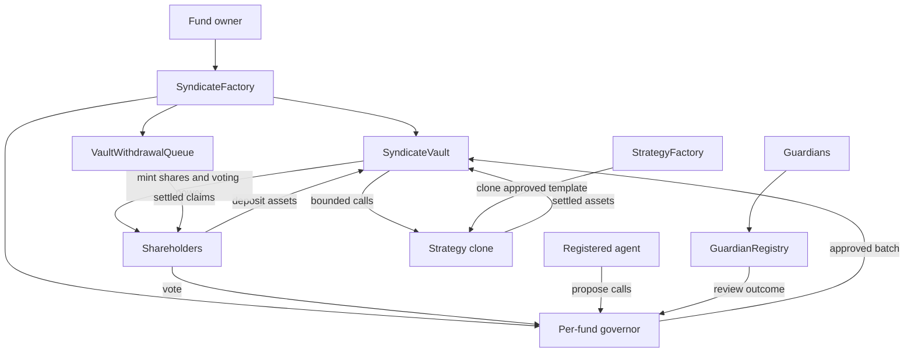
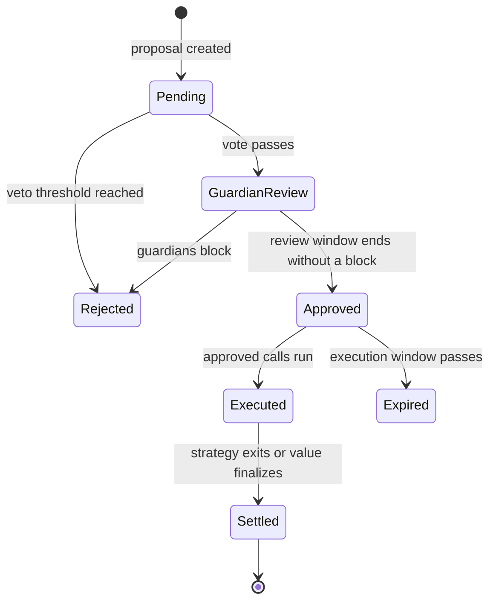

Sherwood gives each fund an isolated vault and governor. Shared factories deploy those components from reviewed implementations, but one fund cannot vote on or execute another fund's proposals.

## System map

```mermaid
flowchart TB
    Owner[Fund owner] --> Factory[SyndicateFactory]
    Factory --> Vault[SyndicateVault]
    Factory --> Governor[Per-fund governor]
    Factory --> Queue[VaultWithdrawalQueue]

    Holders[Shareholders] -->|deposit assets| Vault
    Vault -->|mint shares and voting power| Holders
    Holders -->|vote| Governor

    Agent[Registered agent] -->|propose calls| Governor
    Governor -->|approved batch| Vault
    Vault -->|bounded calls| Strategy[Strategy clone]
    StrategyFactory -->|clone approved template| Strategy
    Strategy -->|settled assets| Vault

    Guardians[Guardians] --> GuardianRegistry
    GuardianRegistry -->|review outcome| Governor
    Queue -->|settled claims| Holders
```

## Deployment layer

### SyndicateFactory

The factory creates a fund's vault, governor, and withdrawal queue. The prospective owner must first bond the required WOOD stake through `StakedWood`. This prevents an unbonded address from becoming a vault owner through the normal creation path.

### StrategyFactory

The strategy factory clones only approved templates. Initialization happens atomically with clone creation, which prevents another account from taking control of an uninitialized clone.

### ProtocolConfig

Shared economic parameters live in `ProtocolConfig`. The governor snapshots relevant fees when a proposal is created so a later configuration change does not rewrite the economics of an active proposal.

## Per-fund layer

### SyndicateVault

The vault is the asset custodian and share token. It implements ERC-4626 accounting, ERC20Votes checkpoints, depositor permissions, registered agent permissions, strategy execution, and the liquidity rules used during proposals.

The vault does not give an agent an open-ended allowance. Approved proposal calls pass through the governor and the vault's batch executor.

### Per-fund governor

The governor owns the proposal state machine for one vault. It checks who may propose, records votes, executes approved calls, tracks the strategy window, resolves guardian reviews, and settles the proposal.

Governor proxies share an implementation through `GovernorBeacon`. State remains local to each proxy.

### VaultWithdrawalQueue

The queue escrows deposits or shares submitted during an active proposal. After settlement freezes the proposal price, users claim the corresponding shares or vault assets.

## Governance lifecycle

```mermaid
stateDiagram-v2
    [*] --> Pending: proposal created
    Pending --> Rejected: veto threshold reached
    Pending --> GuardianReview: vote passes
    GuardianReview --> Approved: review window ends without a block
    GuardianReview --> Rejected: guardians block
    Approved --> Executed: approved calls run
    Approved --> Expired: execution window passes
    Executed --> Settled: strategy exits or value finalizes
    Settled --> [*]
```

Every passing proposal enters the guardian review window. The window length comes from the guardian registry and can be zero, in which case the proposal moves to `Approved` immediately. Use the [governance overview](/protocol/governance/overview) for the operator view, including the collaborative `Draft` stage and cancellation paths.

## Trust boundaries

| Actor or component | Can do | Cannot do by itself |
| --- | --- | --- |
| Fund owner | Configure the fund, register agents, manage depositor access | Bypass an active proposal's governor state |
| Registered agent | Create proposals and operate approved strategy hooks | Transfer arbitrary vault assets without approved calls |
| Shareholder | Deposit, hold voting shares, vote, redeem or queue a claim | Execute a proposal that did not pass |
| Guardian | Stake, receive delegation, review eligible proposals | Take custody of vault assets through the review vote |
| Strategy clone | Execute its initialized strategy logic | Change its template or act before governance execution |

## Current deployment limits

<Warning>
  The current fund deployment is testnet-only. Portfolio is the only deployed template, and its stock basket flow requires explicit, verified swap routes and price-feed configuration. The CLI registry does not currently provide default stock routes.
</Warning>

The deployment does not expose a global identity registry, naming registry, or hosted subgraph. Clients should resolve funds and read state through the HTTP API or directly from chain `46630`.
