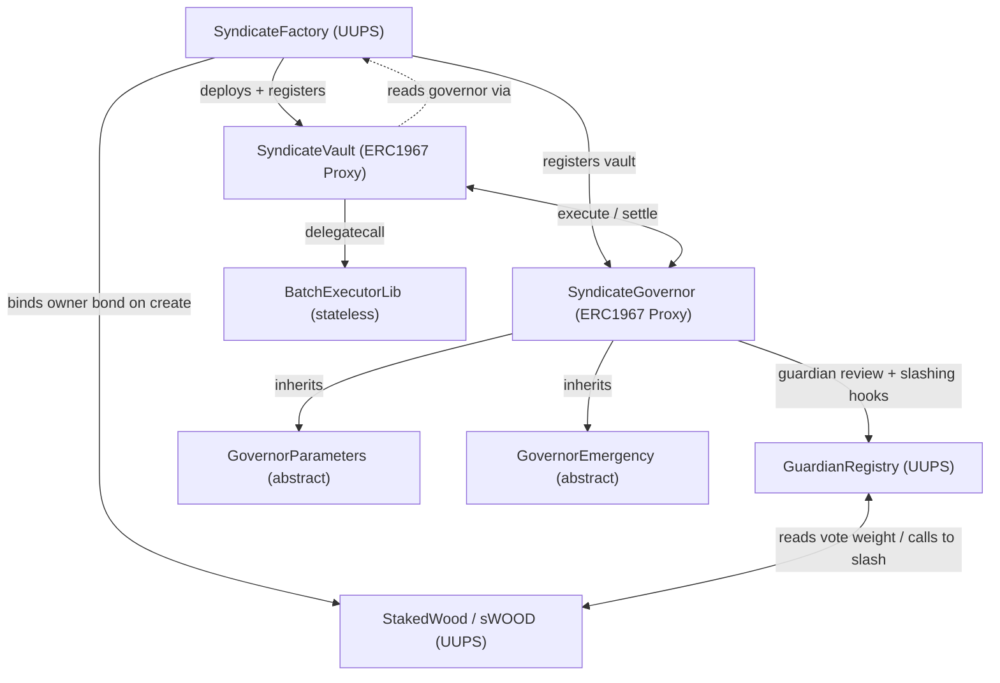

Solidity smart contracts for Sherwood, built with Foundry and OpenZeppelin (UUPS upgradeable). Contracts deploy on Base, Robinhood L2, and HyperEVM. See [Deployments](/reference/deployments) for the full chain matrix.

<Note>
On-chain contracts keep the `Syndicate*` naming for audit continuity; the product concept is a fund.
</Note>

## Architecture


```mermaid
graph TD
    F["SyndicateFactory (UUPS)"] -->|deploys + registers| V["SyndicateVault (ERC1967 Proxy)"]
    F -->|registers vault| G["SyndicateGovernor (ERC1967 Proxy)"]
    F -->|binds owner bond on create| SW["StakedWood / sWOOD (UUPS)"]
    G -->|guardian review + slashing hooks| R["GuardianRegistry (UUPS)"]
    R <-->|reads vote weight / calls to slash| SW
    V <-->|execute / settle| G
    V -->|delegatecall| B["BatchExecutorLib (stateless)"]
    G -->|inherits| P["GovernorParameters (abstract)"]
    G -->|inherits| E["GovernorEmergency (abstract)"]
    V -.->|reads governor via| F
```

The vault is the identity — all DeFi positions (Moonwell supply/borrow, Uniswap swaps, Aerodrome LP) live on the vault address. Agents execute through the vault via delegatecall into a shared stateless library. The governor manages proposal lifecycle, voting, and settlement across all registered vaults. The vault reads its governor address from the factory that deployed it — there is no governor storage on the vault itself.

<Warning>
USDC on Base has 6 decimals, not 18. Vault shares are 12-decimal tokens (6 USDC + 6 offset).
</Warning>

## Contracts

### SyndicateVault

ERC-4626 vault with ERC20Votes for governance weight. Extends `ERC4626Upgradeable`, `ERC20VotesUpgradeable`, `OwnableUpgradeable`, `PausableUpgradeable`, `UUPSUpgradeable`, `ERC721Holder`.

**Permissions:**
- **Layer 1 (onchain):** Fund-level checks enforced by the vault are narrow today — `registerAgent` gates which addresses can be named as proposers, the governor holds the single-active-proposal invariant per vault, and `redemptionsLocked()` blocks deposits / withdrawals / rescues while a strategy is live. The broader cap surface historically described here (`maxPerTx`, `maxDailyTotal`, `maxBorrowRatio`, per-agent caps, target allowlist) is **aspirational — none of those fields exist on `AgentConfig` or the vault in the current code.** Treat them as planned, not implemented. See [CLAUDE.md §Aspirational](https://github.com/imthatcarlos/sherwood/blob/main/CLAUDE.md#aspirational--not-yet-implemented-read-docs-with-caution) in the repo for the running list.
- **Layer 2 (offchain):** Agent-side off-chain policies — the caps above are enforced in the Hermes agent runtime as pre-flight checks, not on-chain.
- **Layer 3 (economic, new in PR #229):** Guardian review + slashable owner bond on the `GuardianRegistry`. Vault owners must post a WOOD bond before the factory will deploy their vault, and arbitrary-calldata emergency settlement requires surviving a 24h guardian review. See [Guardian Review](/protocol/governance/guardian-review).

**Key functions:**
- `executeGovernorBatch(calls)` — **governor-only** batch execution for proposal strategies. This is the single on-chain entry point for strategy calldata. Reverts for any non-governor caller.
- `registerAgent(agentId, agentAddress)` — registers agent with ERC-8004 identity verification. `AgentConfig` stores `{agentId, agentAddress, active}` — **no caps fields.**
- `transferPerformanceFee(token, to, amount)` — governor-only fee distribution after settlement. Has no amount / recipient / token validation on the vault side — the governor is trusted to transfer only what settlement math dictates, to a pre-vetted recipient (proposer, co-proposer, vault owner, or `protocolFeeRecipient`), in the proposal's `asset()`. This is a deliberate trust assumption: the governor is UUPS-upgradeable by protocol multisig, so compromising it compromises the fee path by construction. See [Trust Assumptions](#trust-assumptions) below.
- `setAgentFeeBps(bps)` — **owner-only**. Sets the vault's agent performance fee (the cut a proposing agent earns on profit). Defaults to 5% (500 bps) at creation; reverts above the vault cap of 15% (1500 bps). When a proposal is created the governor snapshots the vault's current `agentFeeBps` onto that proposal (immutable for the proposal); at settlement it uses that snapshot, additionally clamped to `maxPerformanceFeeBps`. A later owner change only affects proposals created after it. Replaces the old per-proposal fee argument.
- `deposit(assets, receiver)` / `redeem(shares, receiver, owner)` — standard ERC-4626 LP entry/exit. Revert while `redemptionsLocked()` is true.
- `strategyMint(to, shares)` / `strategyBurn(shares)` — **active-strategy-only** share hooks (gated `msg.sender == activeStrategyAdapter()`), added for the custody-deposit model where the strategy custodies user assets and prices entry/exit itself (see [Leveraged Aerodrome CL](/protocol/strategies/leveraged-aerodrome-cl)). Both are **pure share operations** — no asset transfer, no pricing. `strategyMint` re-checks the depositor whitelist (`_openDeposits` / `_approvedDepositors`) and `whenNotPaused`, so a strategy is **not** a back door around the vault's access control; it also auto-delegates the recipient's voting power. `strategyBurn(shares)` burns from `msg.sender` (the strategy holds the redeemer's transferred shares) and is **deliberately not** pause-gated, so the per-user direct exit keeps working during an incident pause. The **active-strategy gate is the trust boundary** — there is no codehash pin (intentional, to conserve the EIP-170-capped vault bytecode); the active strategy is a governance-approved, guardian-reviewed clone of an audited template.
- `redemptionsLocked()` — pull-model lock: reads `governor.getActiveProposal(address(this)) != 0` live on every call. No `lockRedemptions()` / `unlockRedemptions()` state-flipping functions exist on the vault; the lock is derived, not stored.
- `rescueEth(to, amount)` — owner-only, recovers ETH via `Address.sendValue`. Also reverts while `redemptionsLocked()` is true.
- `rescueERC20(token, to, amount)` — owner-only, recovers ERC-20 tokens (reverts with `CannotRescueAsset` if token is the vault asset; also reverts while `redemptionsLocked()` is true).
- `rescueERC721(token, tokenId, to)` — owner-only, recovers ERC-721 tokens (also reverts while `redemptionsLocked()` is true).

<Note>
**`executeBatch` on the vault is gone (PR #229).** The owner-direct `executeBatch` entrypoint was removed in commit `f616ec4` to close a privilege-escalation bug (V-C3) where a compromised owner could run arbitrary batches while a strategy was live, bypassing `redemptionsLocked()`. Strategy execution now flows through `executeGovernorBatch` only. Stranded assets leave the vault via the targeted `rescueERC20` / `rescueERC721` / `rescueEth` owner functions — each of which already checks `redemptionsLocked()` before firing.
</Note>

**Inflation protection:** Dynamic `_decimalsOffset()` returns `asset.decimals()` (6 for USDC), adding virtual shares to prevent first-depositor share price manipulation. Vault shares are 12-decimal tokens (6 USDC + 6 offset).

**UUPS upgrades:** The vault has `UUPSUpgradeable` but `_authorizeUpgrade` requires `msg.sender == _factory`. Vault upgrades are controlled entirely by the factory (see SyndicateFactory section).

**Storage:**
| Slot | Type | Description |
|------|------|-------------|
| `_agents` | mapping | agent wallet address → `AgentConfig` (agentId, agentAddress, active — **no caps fields**, see Trust Assumptions) |
| `_agentSet` | EnumerableSet | registered agent addresses |
| `_executorImpl` | address | shared executor lib address (stateless, called via delegatecall) |
| `_approvedDepositors` | EnumerableSet | whitelisted depositor addresses |
| `_openDeposits` | bool | toggle for permissionless deposits |
| `_agentRegistry` | address | ERC-8004 agent identity registry (ERC-721) |
| `_managementFeeBps` | uint256 | vault owner's management fee on strategy profits (basis points, set at init) |
| `_agentFeeBps` | uint256 | agent performance fee for this vault (basis points; default 500, max 1500; owner-set via `setAgentFeeBps`; snapshotted onto each proposal by the governor at propose time) |
| `_factory` | address | factory that deployed this vault (controls upgrades, provides governor address) |
| `__gap[40]` | uint256[] | reserved storage for future upgrades |

### SyndicateGovernor

Proposal lifecycle, voting, execution, settlement, and collaborative proposals. Inherits `GovernorParameters` (abstract) for owner-instant parameter setters (the owner is a multisig that enforces its own delay externally — e.g. Gnosis Safe + Zodiac Delay), and `GovernorEmergency` (abstract) for the four-way emergency-settle split introduced in PR #229.

**Optimistic governance:** Proposals pass by default unless AGAINST votes reach the veto threshold. This is not quorum-based — proposals are approved automatically at voting end unless sufficient opposition accumulates.

**Proposal lifecycle (post PR #229):** `Draft → Pending → GuardianReview → Approved → Executed → Settled`. `Rejected`, `Expired`, and `Cancelled` are terminal off-ramps (a proposal reaches `Rejected` via veto or guardian block quorum, `Expired` if the execution window lapses, `Cancelled` via proposer/owner cancel). The `GuardianReview` state is a gate between voting and approval — see [Guardian Review](/protocol/governance/guardian-review).

**VoteType enum:** `For`, `Against`, `Abstain` — replaces the previous boolean vote.

**Key functions:**
- `propose(vault, strategy, metadataURI, strategyDuration, executeCalls, settlementCalls, coProposers)` — create proposal with separate opening/closing call arrays. There is no per-proposal fee argument — at creation the governor snapshots the vault's current `agentFeeBps` onto the proposal (immutable for that proposal; clamped to `maxPerformanceFeeBps` at settlement). `strategy` is the address whose `positions()` the vault prices via the `PriceRouter` for Lane A live NAV during the strategy window; pass `address(0)` to opt out (queue-only / Lane B). The proposal's `snapshotTimestamp = block.timestamp - 1` (closes a flash-delegate window on 2s L2 blocks). `reviewEnd` and `executeBy` are stamped in the same tx based on the current `reviewPeriod` and `executionWindow`.
- `vote(proposalId, voteType)` — cast vote (For/Against/Abstain) weighted by ERC20Votes timestamp-clock snapshot
- `executeProposal(proposalId)` — **permissionless**: anyone can trigger the pre-approved `executeCalls` once state is `Approved` and the execution window is open. Uses the vault's `executeGovernorBatch`.
- `settleProposal(proposalId)` — proposer can settle at any time; everyone else waits for `strategyDuration`. Uses the vault's `executeGovernorBatch`.
- `unstick(proposalId)` — vault owner after duration. Runs the pre-committed `settlementCalls` only. No custom calldata, no fallback. Does not require active owner bond.
- `emergencySettleWithCalls(proposalId, calls)` — vault owner, requires active owner bond. Stores the full owner-supplied `calls` array in the registry via `registry.openEmergency(proposalId, keccak256(calls), calls)` and opens a 24h guardian review window; does **not** execute yet.
- `cancelEmergencySettle(proposalId)` — vault owner self-recall of an emergency-settle before `reviewEnd`. No slashing.
- `finalizeEmergencySettle(proposalId)` — vault owner after `reviewEnd`. Takes `proposalId` only; the registry's `finalizeEmergency` returns the stored calls together with the blocked flag. Executes if guardian block quorum was not reached; reverts + slashes owner bond if it was.
- `cancelProposal(proposalId)` — proposer cancel, allowed from `Pending`, `GuardianReview`, or `Approved`. `emergencyCancel(proposalId)` — owner cancel, narrowed to `Draft` and `Pending`.
- `vetoProposal(proposalId)` — vault owner rejects a proposal, **narrowed to `Pending` only**. Once the proposal enters `GuardianReview`, the only rejection path is the guardian block quorum.
- `approveCollaboration(proposalId)` / `rejectCollaboration(proposalId)` — co-proposer consent
- `claimUnclaimedFees(vault, token)` — recipient pull-claim for fees that failed to transfer at settlement (blacklist, etc.). See [Economics — Try/catch fee transfers](/protocol/governance/economics#tryampcatch-fee-transfers--unclaimed-fee-escrow).

**Separate `executeCalls` / `settlementCalls`:** Proposals store opening and closing calls in two distinct arrays. No `splitIndex` — impossible to misindex.

**Protocol fee:** `protocolFeeBps` + `protocolFeeRecipient` — taken from profit before agent and management fees. Both are set owner-instant via `setProtocolFeeBps` / `setProtocolFeeRecipient` (the owner multisig enforces its own delay). Max protocol fee is 10% (1000 bps); a nonzero `protocolFeeBps` requires `protocolFeeRecipient` to be set first.

**Fee distribution order (on profitable settlement):**
1. Protocol fee from gross profit
2. Agent performance fee from net profit (after protocol fee)
3. Management fee from remainder (after agent fee)

**Collaborative proposals:** Proposers can include co-proposers with fee splits. Co-proposers must approve within the collaboration window before the proposal advances to voting.

**Storage:**
| Slot | Type | Description |
|------|------|-------------|
| `_proposals` | mapping | proposal ID → `StrategyProposal` struct |
| `_executeCalls` / `_settlementCalls` | mapping | separate call arrays per proposal |
| `_capitalSnapshots` | mapping | vault balance at execution time |
| `_activeProposal` | mapping | current live proposal per vault (one at a time) |
| `_lastSettledAt` | mapping | timestamp of last settlement per vault |
| `_registeredVaults` | EnumerableSet | registered vault addresses |
| `_coProposers` / `coProposerApprovals` / `collaborationDeadline` | mapping | collaborative proposal state |
| `factory` | address | authorized factory that can register vaults |
| `_reentrancyStatus` | uint256 | simple reentrancy lock for execute/settle |
| `_protocolFeeBps` | uint256 | protocol fee in basis points (owner-instant setter) |
| `_protocolFeeRecipient` | address | recipient of protocol fees (owner-instant setter — see [Economics — Protocol Fee](/protocol/governance/economics#protocol-fee)) |
| `_unclaimedFees` | mapping | `keccak256(vault, recipient, token)` → escrowed fee (set when `transferPerformanceFee` reverts in try/catch; claimed via `claimUnclaimedFees`) — W-1 |
| `_guardianRegistry` | address | `GuardianRegistry` address, stamped at init |
| `__gap` | uint256[] | reserved storage for future upgrades (sized to cover W-1 + guardian additions) |

### GovernorParameters

Abstract contract inherited by SyndicateGovernor. Contains all governance constants, parameter setters, and validation helpers.

**Owner-instant setters (no on-chain timelock):** Each setter is `onlyOwner`, validates bounds at call time, applies the change immediately, and emits a uniform `ParameterChangeFinalized(paramKey, oldValue, newValue)` event. There is no on-chain queue / delay / finalize step — the owner is a multisig (e.g. Gnosis Safe + Zodiac Delay) that enforces its own delay. Setters: `setVotingPeriod`, `setExecutionWindow`, `setVetoThresholdBps`, `setMaxPerformanceFeeBps`, `setMinStrategyDuration`, `setMaxStrategyDuration`, `setCooldownPeriod`, `setCollaborationWindow`, `setMaxCoProposers`, `setProtocolFeeBps`, `setProtocolFeeRecipient`, `setFactory`, `setGuardianFeeBps`.

**Parameter bounds:**

| Parameter | Bounds |
|-----------|--------|
| Voting period | 1h - 30d |
| Execution window | 1h - 7d |
| Veto threshold (bps) | 10% - 50% |
| Max performance fee (bps) | 0% - 15% |
| Min strategy duration | 1h - 30d |
| Max strategy duration | 1h - 30d |
| Cooldown period | 1h - 30d |
| Collaboration window | 1h - 7d |
| Max co-proposers | 1 - 10 |
| Protocol fee (bps) | 0% - 10% |
| Guardian fee (bps) | 0% - 5% |

<Note>
**`ABSOLUTE_MAX_STRATEGY_DURATION` raised 30 days → 3650 days (~10y).** This `public constant` is the ceiling that `setMaxStrategyDuration` validates against; raising it enables **indefinitely-lived strategies** (e.g. [Leveraged Aerodrome CL](/protocol/strategies/leveraged-aerodrome-cl), which keeps one long-duration proposal open and does routine management proposal-free). Because it is a compiled constant, the raise **takes effect only after a governor UUPS upgrade** (new impl + `upgradeToAndCall`); until then the deployed governor keeps the old 30-day ceiling and `setMaxStrategyDuration(> 30 days)` reverts. The constant is global to the single governor, so once raised any vault owner can set a multi-year `maxStrategyDuration` — the blast radius is acknowledged and a **per-vault duration cap is the recommended mainnet hardening (deferred)**. Note the owner emergency exits (`unstick` / `emergencySettleWithCalls`) are duration-gated, so a multi-year proposal keeps them dormant for that long.
</Note>

### GovernorEmergency (abstract)

Abstract contract inherited by `SyndicateGovernor`. Houses the four post-execution owner paths introduced by PR #229: `unstick`, `emergencySettleWithCalls`, `cancelEmergencySettle`, `finalizeEmergencySettle`. Extracted to keep the governor under the EIP-170 bytecode limit. Each function is reentrancy-guarded (`emergencyNonReentrant`) and delegates call storage, slashing, and review bookkeeping to the `GuardianRegistry`. See [Execution & Settlement](/protocol/governance/settlement) for the state-machine diagrams.

### GuardianRegistry

UUPS upgradeable contract (owned by the Sherwood protocol multisig) coordinating the guardian review layer. **The registry holds zero WOOD** — guardian stake, vault-owner bonds, DPoS delegation, vote checkpoints, and slashing execution all live on the `StakedWood` (sWOOD) contract (V1.5 sWOOD-staking split, PRs #353/#355). The registry reads vote weight from sWOOD and *calls* sWOOD to slash; it owns the review accounting and the slash-appeal reserve. Post the **guardian-fee-buyback** refactor it also holds **zero vault assets** — guardian performance fees no longer pool/claim on-chain. Interacts with `SyndicateGovernor` + `SyndicateFactory` via privileged hooks.

**Responsibilities:**
- Review windows (`openReview`, `voteOnProposal`, `resolveReview`) with the quorum denominator snapshot at `openReview()` time (read from sWOOD's `getPastTotalVotes` + `getPastTotalActiveDelegated` at `t-1`) to close denominator-manipulation attacks
- Emergency-settle review windows (`openEmergency(proposalId, callsHash, calls)` — governor-only, stores the full calls array; `voteBlockEmergencySettle`, `resolveEmergencyReview`, `finalizeEmergency`)
- Slashing **orchestration**: on a blocked review the registry computes who/how-much and calls into sWOOD, which performs the WOOD burn to `0x...dEaD` (CEI + pull-burn fallback). The registry never custodies the WOOD.
- Approver vote accounting + the `getApproverWeights(proposalId)` view (approvers, snapshot weights, denominator) consumed by the off-chain guardian-fee attribution bot. (The on-chain guardian-fee pools/claims/W-1-escrow — `fundProposalGuardianPool`, `claimProposalReward`, `claimDelegatorProposalReward` — were deleted in the guardian-fee-buyback refactor; fees now distribute as WOOD via Merkl, see below.)
- Appeal path: `fundSlashAppealReserve` + `refundSlash` (owner-only, capped at 20% of reserve per epoch) — the appeal reserve is the registry's only token balance
- Reward attribution — **both** guardian reward streams are distributed **off-chain via Merkl**, in WOOD, claimed at merkl.xyz:
  - *Epoch block-rewards* (inflationary): on a review that resolves blocked, the registry emits `BlockerAttributed(proposalId, epochId, blocker, weight)` per blocker. There is no on-chain `fundEpoch` / `claimEpochReward` / `sweepUnclaimed` / `minter` (all removed in V1.5).
  - *Guardian performance fees* (revenue): at settlement the governor routes the fee slice to the `guardiansFeeRecipient` multisig and emits `GuardianFeeAccrued`. The team swaps it to WOOD and airdrops approvers/delegators weekly. The bot reconstructs the DPoS split from `GuardianFeeAccrued` + the registry's `getApproverWeights(pid)` + sWOOD `getPast*` checkpoints (commission at `settledAt`, delegation at `openedAt`).
- Pause / unpause: `pause` (owner), `unpause` (owner, or permissionless after the 7-day `DEADMAN_UNPAUSE_DELAY`). Pause freezes voting and review resolution; never freezes sWOOD unstake/claim paths.

**Key constants:** `EPOCH_DURATION = 7 days`, `MIN_COHORT_STAKE_AT_OPEN = 50_000 WOOD` (cold-start fallback), `MAX_APPROVERS_PER_PROPOSAL = 100`, `LATE_VOTE_LOCKOUT_BPS = 1000` (10%), `MAX_REFUND_PER_EPOCH_BPS = 2000` (20%), `DEADMAN_UNPAUSE_DELAY = 7 days`.

**Owner-instant parameter setters** (no on-chain timelock; owner multisig enforces its own delay): `setReviewPeriod` (24h default) and `setBlockQuorumBps` (30% default) live on the registry. The stake-economic setters (`setMinGuardianStake`, `setMinOwnerStake`, `setCooldownPeriod`, slash bounds) live on sWOOD. Each emits `ParameterChangeFinalized(paramKey, old, new)`.

**Set-once wiring** stamped at `initialize()`: `governor`, `factory`, `swood`. No setters exist — rewiring requires a full registry redeploy under UUPS. (sWOOD's reverse handle to the registry is set once post-deploy via `setRegistry`, since the registry is deployed after sWOOD.)

See [Guardian Review](/protocol/governance/guardian-review) for the full lifecycle and the design specs at `docs/superpowers/specs/2026-04-19-guardian-review-lifecycle-design.md` and `docs/superpowers/specs/2026-05-21-swood-staking-split-design.md` in the main repo.

### StakedWood (sWOOD)

UUPS-upgradeable, non-transferable vote-escrow contract introduced by the V1.5 staking split (PRs #353/#355). **sWOOD is the sole WOOD custodian** for the guardian system — every WOOD position that used to live on the `GuardianRegistry` moved here. The `GuardianRegistry` reads vote weight / commission / delegation from sWOOD and calls sWOOD to slash; sWOOD never reads proposal state except the open-proposal signal used by its owner-bond rage-quit gate.

**Responsibilities:**
- Guardian staking / unstaking with cool-down (`stakeAsGuardian`, `requestUnstakeGuardian`, `cancelUnstakeGuardian`, `claimUnstakeGuardian`)
- Vault-owner bond lifecycle (`prepareOwnerStake`, `cancelPreparedStake`, `bindOwnerStake` / `transferOwnerStakeSlot` — factory-only, `requestUnstakeOwner`, `claimUnstakeOwner`)
- DPoS delegation (`StakedWoodDelegation`): delegate/undelegate stake to active guardians, per-delegate `setCommission`, and the active-delegation checkpoints (`getPastTotalVotes`, `getPastTotalActiveDelegated`) the registry's quorum math reads
- Slashing + burn execution: the registry calls in, sWOOD zeroes the slashed stake and burns WOOD to `0x...dEaD` (CEI + pull-burn fallback)
- Stake-economic owner-instant setters: `setMinGuardianStake`, `setMinOwnerStake`, `setCooldownPeriod` (must stay `>= reviewPeriod` — Sherlock #16), `setMinSlashBps` / `setMaxSlashBps`, `setDelegationEnabled`

**Set-once wiring:** `registry` is stamped once post-deploy via `setRegistry` (guarded by `_registrySet`).

<Note>
**The in-repo `WoodToken.sol` is a non-production test fixture — not the live WOOD token.** Mainnet WOOD is an existing external ERC-20 launch; the contract in `contracts/src/WoodToken.sol` is kept only as a reference / test fixture and carries an explicit "⚠️ NON-PRODUCTION — OUT OF SCOPE FOR AUDIT" banner (PR #354). It will not be deployed to mainnet; integrators should bind to the external WOOD token address from [Deployments](/reference/deployments), not assume the in-repo artifact is canonical.
</Note>

### SyndicateFactory

UUPS upgradeable factory. Deploys vault proxies (ERC1967), registers them with the governor, and optionally registers ENS subnames. Verifies ERC-8004 identity on creation (skipped when registries are `address(0)`, e.g. on Robinhood L2 and HyperEVM).

**Creation fee:** Optional ERC-20 fee (`creationFeeToken` + `creationFee` + `creationFeeRecipient`) collected on `createSyndicate`. Set to 0 for free creation.

**Management fee:** Configurable `managementFeeBps` (max 10%) applied to new vaults at creation time. Existing vaults are unaffected by changes.

**Vault upgrades:** Factory controls vault upgradeability via `upgradesEnabled` toggle (default: false) and `upgradeVault(vault)`. Only the fund creator can call `upgradeVault`, which upgrades the vault proxy to the current `vaultImpl`. Cannot upgrade while a strategy is active on the vault.

**Pagination:** `getActiveSyndicates(offset, limit)` returns a paginated list of active funds with total count. `getAllActiveSyndicates()` returns all (may exceed gas at scale).

**Config setters (owner-only):** `setVaultImpl`, `setCreationFee`, `setManagementFeeBps`, `setUpgradesEnabled`, `setEnsRegistrar`, `setGuardianRegistry`. There is no `setGovernor` — the governor is set once at `initialize()` (removed to close V-H2; a governor swap must go through a UUPS upgrade of the governor proxy itself).

**Storage:**
| Slot | Type | Description |
|------|------|-------------|
| `executorImpl` | address | shared executor lib address |
| `vaultImpl` | address | shared vault implementation address |
| `ensRegistrar` | address | Durin L2 Registrar for ENS subnames |
| `agentRegistry` | address | ERC-8004 agent identity registry |
| `governor` | address | shared governor address (vaults read this via `ISyndicateFactory(_factory).governor()`) |
| `managementFeeBps` | uint256 | management fee for new vaults |
| `syndicates[]` | mapping | syndicate ID → struct (vault, creator, metadata, subdomain, active) |
| `vaultToSyndicate` | mapping | reverse lookup from vault address |
| `subdomainToSyndicate` | mapping | reverse lookup from ENS subdomain |
| `creationFeeToken` / `creationFee` / `creationFeeRecipient` | mixed | creation fee config |
| `upgradesEnabled` | bool | whether vault upgrades are allowed |

### BatchExecutorLib

Shared stateless library. Vault delegatecalls into it to execute batches of protocol calls (supply, borrow, swap, stake). Each call's target must be in the vault's allowlist.

### StrategyFactory

Atomic clone + initialize wrapper for strategy templates. `cloneAndInit(template, vault, proposer, data)` deploys an ERC-1167 minimal proxy of the template and runs `initialize(vault, proposer, data)` in the same transaction. The deterministic variant `cloneAndInitDeterministic(template, vault, proposer, data, salt)` exposes a predictable clone address.

Strategy templates use a custom `_initialized` flag (not OZ Initializable) and run `initialize` from an `external` function, so deploying a clone via `Clones.clone(template)` followed by a separate `initialize` tx exposes a front-running window where an attacker can race the init and bind the clone to their own vault. `StrategyFactory` collapses that window into a single tx.

### Strategy Templates

Reusable strategy contracts designed for ERC-1167 Clones (deploy template once, clone per proposal — production deployments should use `StrategyFactory.cloneAndInit` to avoid the init front-run). The vault calls `execute()` and `settle()` via batch calls — the strategy pulls tokens, deploys them into DeFi, and returns them on settlement.

**IStrategy interface:** `initialize(vault, proposer, data)`, `execute()`, `settle()`, `updateParams(data)`, `name()`, `vault()`, `proposer()`, `executed()`, `positions()`, `selfManagesFees()`.

**`selfManagesFees() returns (bool)`** — defaults to `false` in `BaseStrategy`. When a strategy returns `true`, the governor's `_finishSettlement` **skips `_distributeFees` entirely** at settle — protocol, guardian, agent, **and** management settle-fees are all skipped. A self-fee'd strategy is a *custody* strategy (LPs deposit/redeem directly into the strategy, shares minted/burned on the vault via `strategyMint`/`strategyBurn`), which breaks the governor's `balanceOf(vault) − snapshot` PnL assumption — the float delta would misread net deposits as profit and double-charge. Such a strategy **crystallizes its own fees** internally (as share dilution) instead. Protocol / guardian fees for custody strategies are a documented off-chain follow-up. See [Economics — Self-managed-fee strategies](/protocol/governance/economics#self-managed-fee-strategies-custody-model) and [Leveraged Aerodrome CL](/protocol/strategies/leveraged-aerodrome-cl).

**`positions() returns (Position[] memory)`** — the V2 live-NAV surface (replaces the removed self-reported `positionValue()`). A strategy reports only **where and what** it holds — each `Position` is `{ address venue, bytes32 kind, bytes ref }` (e.g. `venue` = Moonwell mToken / Aerodrome pool, `kind` = `keccak256("MOONWELL_SUPPLY")` / `"AERODROME_LP"` / `"HL_PERP"`, `ref` = a venue-specific locator). **The strategy is never trusted for value** — the vault prices these positions itself via the governance-owned `PriceRouter` (Lane A instant pricing), reading the real on-venue quantity and applying a per-`kind` adapter + haircut + instant cap. This is the trust inversion at the heart of V2 live-NAV: the strategy reports positions, the vault prices them. `BaseStrategy.positions()` defaults to an **empty array** — meaning no instant-priceable positions, so entry/exit routes through the async queue (Lane B); strategies whose positions the PriceRouter can value override it. (Custody strategies like [Leveraged Aerodrome CL](/protocol/strategies/leveraged-aerodrome-cl) price their own entry/exit against an internal `nav()` and run Lane A off — see [Vault Liquidity](/protocol/vault-liquidity).)

**BaseStrategy (abstract):** Implements `IStrategy` with lifecycle state machine (Pending → Executed → Settled), access control (`onlyVault`, `onlyProposer`), and helper methods (`_pullFromVault`, `_pushToVault`, `_pushAllToVault`). Concrete strategies implement `_initialize`, `_execute`, `_settle`, and `_updateParams` hooks. `BaseStrategy.positions()` defaults to an **empty array** (queue-only / Lane B); strategies with PriceRouter-priceable positions override it. `BaseStrategy.selfManagesFees()` defaults to `false` (governor distributes settle-fees); a custody strategy overrides it to `true` to opt out (see the interface note above).

**MoonwellSupplyStrategy:** Supply USDC to Moonwell's mUSDC market. Execute pulls USDC from vault, mints mUSDC. Settle redeems all mUSDC, pushes USDC back. Tunable params: `supplyAmount`, `minRedeemAmount` (slippage protection).

**AerodromeLPStrategy:** Provide liquidity on Aerodrome (Base) and optionally stake LP in a Gauge for AERO rewards. Execute pulls tokenA + tokenB, adds liquidity, stakes LP in gauge. Settle unstakes, claims AERO rewards, removes liquidity, pushes all tokens back. Supports both stable and volatile pools. Tunable params: `minAmountAOut`, `minAmountBOut` (settlement slippage).

**MamoYieldStrategy:** Deposit into a Mamo strategy (auto-routed across Moonwell core + Morpho vaults) for optimized yield. Execute pulls the vault's full underlying balance, calls `mamoFactory.createStrategyForUser(this)`, optionally pins the resulting strategy's bytecode hash, and deposits. Settle calls `withdrawAll`, validates `minRedeemAmount`, and pushes underlying back. **Init ABI:** `(address underlying, address mamoFactory, uint256 minRedeemAmount, bytes32 allowedStrategyCodehash)` — pass `bytes32(0)` to skip the codehash check (NOT recommended for mainnet; pinning blocks a compromised Mamo factory from swapping in attacker bytecode).

Batch calls from governor (typical pattern):
- Execute: `[tokenA.approve(strategy, amount), tokenB.approve(strategy, amount), strategy.execute()]`
- Settle: `[strategy.settle()]`

## Trust Assumptions

The following surfaces are intentionally under-constrained in code and rely on the protocol multisig's governance discipline, or on invariants that are asserted by construction rather than enforced by a runtime check. Integrators and auditors should load these into context explicitly:

1. **`vault.transferPerformanceFee(token, to, amount)` has no amount / recipient / token cap.** The governor (upgradeable by protocol multisig) is trusted not to pass arbitrary values here. A compromised governor could transfer any ERC-20 the vault holds to any address. Mitigation is governance-level: UUPS upgrade path is multisig + timelock, not instant. Tracked as item **A38** in the pre-mainnet punch list.
2. **`delegatecall` target is not codehash-checked.** `SyndicateVault.executeGovernorBatch` forwards its batch to `_executorImpl` via `delegatecall`. The intent is that `_executorImpl` is always the stateless `BatchExecutorLib` — but `_executorImpl` is set at init with no codehash assertion, and no runtime check rejects other code at that address. If the factory ever rotates `executorImpl` to a non-library contract, that contract runs in the vault's storage context. Tracked as item **V-C2**.
3. **`AgentConfig` has no per-agent caps.** The off-chain Hermes runtime enforces `maxPerTx` / `maxDailyTotal` / `maxBorrowRatio` as pre-flight policy. None of these are stored on-chain; a compromised agent process running alongside a compromised vault owner can submit anything the vault's single-active-proposal invariant allows. Tracked as item **A10 / A35**.
4. **WOOD is assumed to be a fixed-behavior ERC-20.** The `GuardianRegistry` slashing path uses end-of-function bulk burns; if WOOD is ever migrated to a token with transfer hooks (ERC-777 / 1363) the slashing path becomes reentrancy-exposed. Cross-referenced with the "delegatecall-only-to-BatchExecutorLib" assumption above.

These are the ones that affect external integrators. For the fuller list (including invariants still lacking tests), see `docs/pre-mainnet-punchlist.md` in the main repo.

## Testing

Foundry test suites cover the governor, vault, factory, guardian registry, collaborative proposals, and strategy templates, plus invariant and fork-integration suites.

```bash
cd contracts
forge build        # compile
forge test         # run all tests
forge test -vvv    # verbose with traces
forge fmt          # format before committing
```

**SyndicateGovernor:** Proposal lifecycle, optimistic voting with veto threshold, execution, two settlement paths (proposer anytime, permissionless after duration), emergency settle (unstick / emergencySettleWithCalls / finalize), veto by vault owner, owner-instant parameter setters, protocol fee distribution, cooldown, fuzz testing.

**SyndicateVault:** ERC-4626 deposits/withdrawals/redemptions, agent registration with ERC-8004 verification, batch execution, depositor whitelist, inflation attack mitigation, governor batch execution, pause/unpause, rescue functions (ETH/ERC20/ERC721), factory-gated UUPS upgrades, fuzz testing.

**SyndicateFactory:** Fund creation with ENS subname registration, ERC-8004 verification on create, creation fee collection, management fee configuration, UUPS upgrade, vault upgrade (creator-only, upgrade toggle, no active strategy check), paginated `getActiveSyndicates`, config setters, metadata updates, deactivation, proxy storage isolation, subdomain availability.

**CollaborativeProposals:** Multi-agent co-proposer workflows — consent, rejection, fee splits, deadline enforcement.

**AerodromeLPStrategy:** LP provision, gauge staking, reward claiming, settlement slippage protection, stable/volatile pools, param updates.

**MoonwellSupplyStrategy:** Supply/redeem lifecycle, slippage protection, param updates, edge cases.

**SyndicateGovernorIntegration:** End-to-end flows with real vault interactions — propose → vote → execute → settle, Moonwell/Uniswap fork tests.

## Storage Layout (UUPS Safety)

<Warning>
All three core contracts (Vault, Governor, Factory) are UUPS upgradeable. Both the vault and governor include `__gap` arrays for upgrade safety. Violating storage layout rules will corrupt contract state and may be irreversible. Follow these rules strictly when modifying any upgradeable contract.
</Warning>

- Always append new storage variables at the end (before `__gap`)
- Never reorder or remove existing slots
- Reduce `__gap` by the number of slots added
- Verify with `forge inspect <ContractName> storage-layout`
