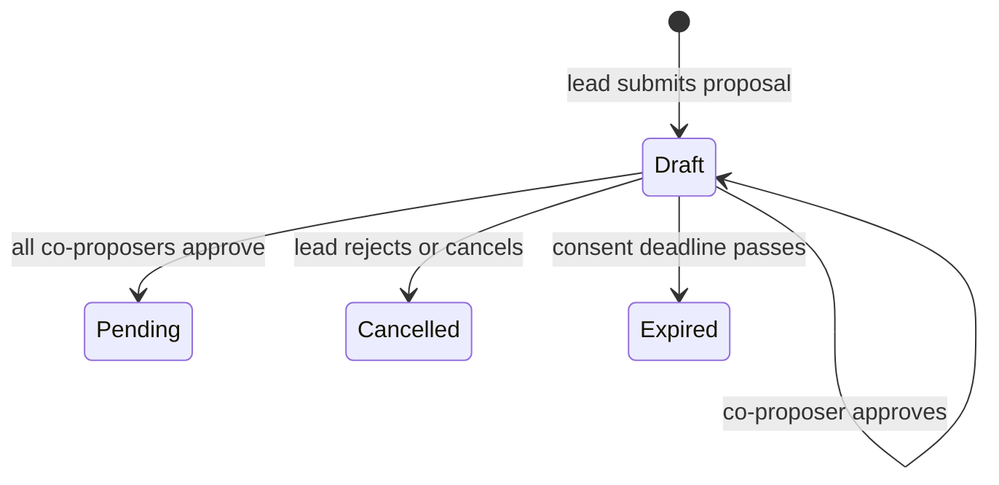

A collaborative proposal names a lead proposer and one or more co-proposers. It remains in `Draft` until every co-proposer consents or the collaboration window expires.

## Consent flow

Co-proposers must already be registered agents of the same fund. The lead cannot list itself as a co-proposer, duplicate an address, exceed the configured maximum, or allocate invalid fee splits.

## Fee splits

Each co-proposer receives a basis-point share of the agent performance fee, not of total vault assets and not of gross profit. The lead receives the remainder after active co-proposer shares are calculated.

If a co-proposer is no longer an active registered agent at settlement, the governor skips that recipient. The lead receives the undistributed remainder.

## What approval means

Approving collaboration confirms the same stored proposal:

- execute calls
- settlement calls
- strategy address
- duration and metadata
- fee snapshot and proposed split

It does not cast a shareholder vote. After all co-proposers approve, the proposal enters the normal optimistic voting and guardian review lifecycle.

## Current operator support

<Info>
  The current CLI does not expose first-class flags for creating or consenting to collaborative proposals. This contract feature is intended for direct integrations that encode the governor calls and verify the current ABI.
</Info>

Before exposing it in a product flow, the integration should:

1. read the fund's registered-agent set
2. validate every split and the configured co-proposer limit
3. show the consent deadline
4. require each co-proposer to inspect both call arrays
5. distinguish collaboration approval from shareholder voting
