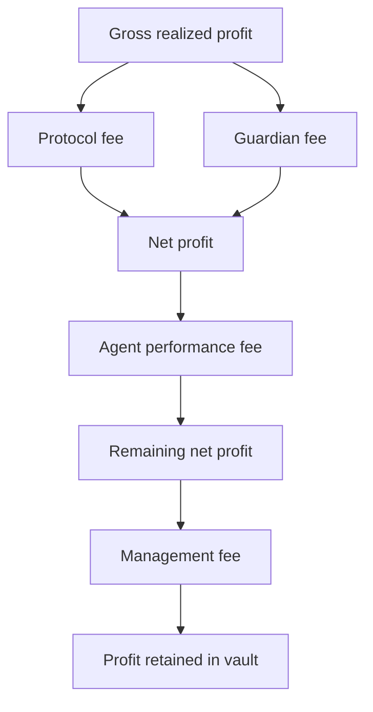

The governor charges proposal fees only when settlement records a positive realized profit. Fee rates are expressed in basis points, where `100` means 1%.

## Fee order



The implemented calculation is:

```text
protocol fee = gross profit * snapshotted protocol rate
guardian fee = gross profit * snapshotted guardian rate
net profit = gross profit - protocol fee - guardian fee
agent fee = net profit * snapshotted agent rate
management fee = (net profit - agent fee) * vault management rate
```

If realized profit is zero or negative, these profit-based transfers are zero.

## Who receives each fee

| Fee | Recipient | Source of rate |
| --- | --- | --- |
| Protocol | Protocol fee recipient | `ProtocolConfig`, snapshotted at proposal creation |
| Guardian | Guardian fee recipient | `ProtocolConfig`, snapshotted at proposal creation |
| Agent | Lead proposer and approved co-proposers | Vault agent rate and collaboration splits |
| Management | Fund owner | Vault management rate |

The agent performance rate is also constrained by the governor's maximum at settlement. If the stored proposal rate is above the current cap, the governor clamps it and emits an event.

## Why snapshots matter

Protocol fee recipients and rates can change globally, but an active proposal should settle under the terms voters inspected. The governor stores the protocol fee, guardian fee, and their recipients when the proposal is created.

The vault's agent performance rate is also captured for the proposal. Read the proposal itself when presenting expected economics.

## Guardian distribution boundary

The guardian fee is paid in the vault asset to the configured recipient. An offchain process can convert that value to WOOD and publish a Merkl distribution for guardians and delegators.

Do not equate the vault-asset transfer with an immediately claimable WOOD amount. The conversion and distribution happen outside the governor.

## Example

Assume a proposal realizes `10` units of profit with these illustrative rates:

- protocol: 1%
- guardian: 0.5%
- agent: 10%
- management: 2%

```text
protocol = 10 * 1% = 0.10
guardian = 10 * 0.5% = 0.05
net = 10 - 0.10 - 0.05 = 9.85
agent = 9.85 * 10% = 0.985
management = (9.85 - 0.985) * 2% = 0.1773
retained profit = 8.6877
```

These numbers explain order of operations only. Query the proposal and vault for actual rates.
