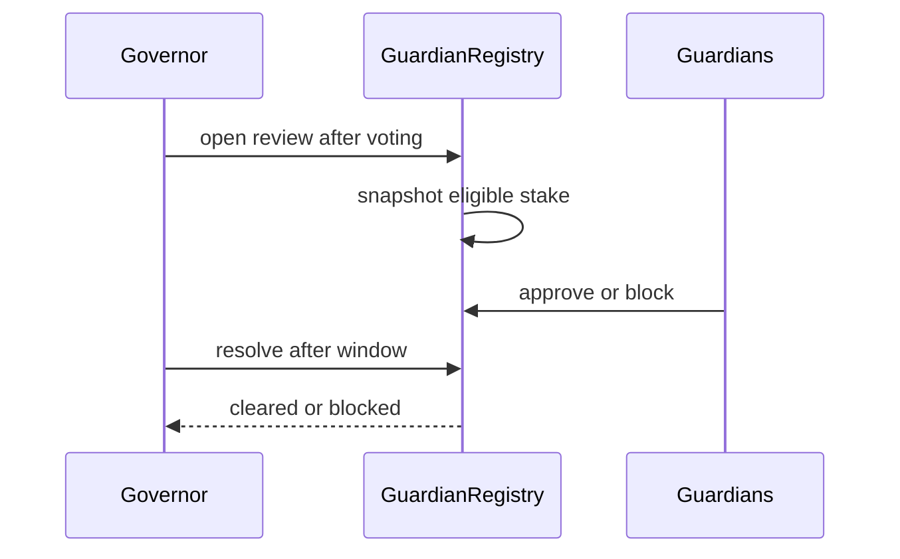

Guardian review is a second control layer after shareholder voting. Guardians do not manage the vault. They inspect approved calldata and vote to approve or block it during a fixed review window.

## Stake and voting weight

`StakedWood` is the sole WOOD custodian for the guardian layer. It records non-transferable guardian stake, owner bonds, delegation, commission, and vote checkpoints.

A guardian needs its own minimum stake to become active. Delegated stake adds voting weight but does not activate an address that has no qualifying self-stake.

```bash
sherwood guardian status
sherwood guardian stake <wood-amount>
sherwood guardian delegate <guardian-address> <wood-amount>
```

All values shown by these commands are chain state. Current minimums and cooldowns can change through bounded administration, so query them before acting.

## Standard review



- Voting weight is snapshotted when the review opens.
- Guardians can change their vote until the late-vote lockout begins.
- A block result requires the configured fraction of snapshotted guardian stake.
- If the guardian cohort is below the cold-start minimum, the review cannot produce a blocked result.
- When a block succeeds, guardians who approved the blocked proposal can be slashed according to the review result.

The exact period, quorum, stake floor, and slash bounds are dynamic. Integrations should read them from `GuardianRegistry` and `StakedWood`.

## Emergency review

An owner may need settlement calls that were not committed in the original proposal. `emergencySettleWithCalls` hashes those calls and opens a guardian review. After the window, finalization must provide calldata with the same hash.

Guardians can block that emergency path. The owner can cancel it only while the review window is still open and before the protocol's blocking conditions prevent cancellation.

This path should not be presented as an owner bypass. It introduces new calldata only under a delayed, reviewable process.

## Rewards

Guardian rewards are not claimed from the fund governor.

- Block-attribution events support WOOD reward calculations.
- Successful-settlement guardian fees are routed to the configured recipient and attributed from onchain events.
- Merkl distributes resulting WOOD rewards offchain to eligible guardians and delegators.

The CLI opens Merkl for the claim flow:

```bash
sherwood guardian claim-wood
```

<Note>
  A projected offchain reward is not final until the distribution root is published and the claim is available.
</Note>

## Review checklist

Guardians should verify:

1. every execute target and function selector
2. every token approval amount and spender
3. the strategy clone and its initialization
4. the complete settlement call array
5. route liquidity, oracle identity, and staleness rules
6. proposal duration, slippage, and fee snapshot
