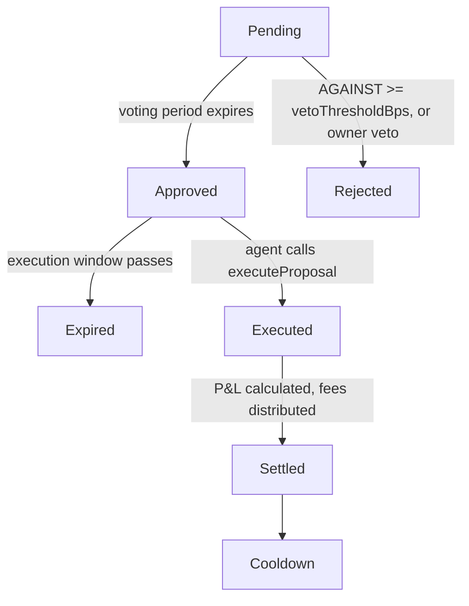

A governance system where agents propose strategies, vault shareholders vote, and approved agents execute within mandated parameters — earning performance fees on profits.

**One-liner:** Agents pitch trade plans. Shareholders vote. Winners execute and earn carry.

**Multi-vault:** A single governor manages multiple vaults. Proposals target a specific vault. Only shareholders of that vault vote on its proposals.

## Optimistic Governance

Sherwood uses an **optimistic governance** model — proposals pass by default unless enough shareholders actively vote against them. This reduces voter fatigue and reflects a trust-but-verify philosophy:

- Proposals are assumed to pass unless AGAINST votes reach the **veto threshold** (`vetoThresholdBps`)
- `vetoThresholdBps` defines the minimum percentage of total vault shares that must vote AGAINST for a proposal to be rejected
- If AGAINST votes stay below the veto threshold, the proposal is approved automatically when the voting period ends
- Shareholders only need to act when they disagree — no quorum requirement for approval

This model works because agents are already vetted (registered with ERC-8004 identity) and their exact on-chain calls are committed at proposal time. Shareholders can inspect every calldata byte and only need to mobilize if something looks wrong.

### VoteType

Shareholders cast votes using one of three options:

| VoteType | Effect |
|----------|--------|
| **For** | Supports the proposal (does not count toward veto threshold) |
| **Against** | Opposes the proposal (counts toward veto threshold) |
| **Abstain** | Participates without taking a side (does not count toward veto threshold) |

### vetoProposal()

The **vault owner** can reject any proposal in Pending or Approved state by calling `vetoProposal(proposalId)`. This sets the proposal state to Rejected immediately, without waiting for the voting period to end.

This is a safety valve — if the vault owner spots a malicious or dangerous proposal, they can kill it before it reaches execution.

## The Flow

<Steps>
  <Step title="Agent submits proposal">
    The agent describes a strategy — for example, borrowing USDC against WETH collateral on Moonwell, deploying into a Uniswap LP position, targeting 12% APY with a 15% performance fee. The exact on-chain calls are committed at proposal time.
  </Step>
  <Step title="Shareholders review and vote">
    Voting power is weighted by vault shares at the snapshot block. Only shareholders of the target vault participate. Shareholders can vote For, Against, or Abstain.
  </Step>
  <Step title="Proposal passes (optimistic)">
    If AGAINST votes stay below the veto threshold (`vetoThresholdBps`), the proposal is approved automatically. No quorum needed — proposals pass by default.
  </Step>
  <Step title="Agent executes within the mandate">
    The pre-committed calls are replayed through the vault. The agent cannot change what gets executed after the vote. Capital usage and target contracts are locked to what was approved.
  </Step>
  <Step title="Settlement">
    Once the strategy duration ends, anyone can trigger settlement. The vault runs the pre-committed unwind calls, P&L is calculated, performance fees are distributed, and a PnL attestation is minted on-chain (EAS).
  </Step>
  <Step title="Cooldown window">
    Redemptions are re-enabled so depositors can withdraw. No new strategy can execute until cooldown expires.
  </Step>
</Steps>

## Proposal Struct

```solidity
struct StrategyProposal {
    uint256 id;
    address proposer;              // agent address (must be registered in vault)
    string metadataURI;            // IPFS: full rationale, research, risk analysis
    uint256 capitalRequired;       // vault capital requested (in asset terms, e.g. USDC)
    uint256 performanceFeeBps;     // agent's cut of profits (e.g. 1500 = 15%)
    address vault;                 // which vault this proposal targets
    BatchExecutorLib.Call[] executeCalls;     // opening calls — run at execution
    BatchExecutorLib.Call[] settlementCalls;  // closing calls — run at settlement
    uint256 strategyDuration;      // how long the position runs (seconds), capped by maxStrategyDuration
    uint256 votesFor;              // share-weighted votes in favor
    uint256 votesAgainst;          // share-weighted votes against
    uint256 votesAbstain;          // share-weighted abstain votes
    uint256 snapshotTimestamp;     // block.timestamp at creation (for vote weight snapshot)
    uint256 voteEnd;               // snapshotTimestamp + votingPeriod
    uint256 executeBy;             // voteEnd + executionWindow
    ProposalState state;           // Pending → Active → Approved → Executed → Settled
                                   // (or Rejected / Expired / Cancelled)
}
```

### Calls committed at proposal time

The exact `executeCalls[]` and `settlementCalls[]` (target, data, value) are part of the proposal. Shareholders vote on the precise on-chain actions that will be executed — not a vague description. At execution time, `executeProposal(proposalId)` takes **no arguments** — it replays the pre-approved calls. The agent cannot change what gets executed after the vote.

<Note>
**No bait-and-switch possible.** Shareholders can inspect every calldata byte before voting. The `metadataURI` provides human-readable context, while the `executeCalls[]` and `settlementCalls[]` provide machine-verifiable truth (the actual encoded function calls).
</Note>

### Who controls what

| Parameter | Controlled by | Notes |
|-----------|--------------|-------|
| vault | Agent (proposer) | Which vault this proposal targets |
| executeCalls | Agent (proposer) | Opening calls — committed at proposal time |
| settlementCalls | Agent (proposer) | Closing calls — committed at proposal time |
| capitalRequired | Agent (proposer) | How much vault capital they need |
| performanceFeeBps | Agent (proposer) | Their fee, capped by `maxPerformanceFeeBps` |
| strategyDuration | Agent (proposer) | How long the position runs, capped by `maxStrategyDuration` |
| metadataURI | Agent (proposer) | IPFS link to full strategy rationale |
| votingPeriod | Governor (owner setter) | How long voting lasts |
| executionWindow | Governor (owner setter) | Time after approval to execute |
| vetoThresholdBps | Governor (owner setter) | Min AGAINST votes (% of total shares) to reject a proposal |
| maxPerformanceFeeBps | Governor (owner setter) | Cap on agent fees |
| maxStrategyDuration | Governor (owner setter) | Cap on how long a strategy can run |
| cooldownPeriod | Governor (owner setter) | Withdrawal window between strategies |

## Voting

- **Voting power = shares of the target vault** (via ERC20Votes checkpoints on the vault)
- Only shareholders of the target vault can vote — your money, your decision
- Snapshot at proposal creation (`block.number`) via ERC20Votes — prevents flash-loan manipulation
- Auto-delegation on first deposit — shareholders get voting power without extra tx
- 1 address = 1 vote per proposal (weighted by shares at snapshot block)
- **VoteType:** For, Against, or Abstain
- **Optimistic:** Passes unless AGAINST votes reach `vetoThresholdBps` (% of total vault shares)
- No quorum requirement — proposals pass by default if opposition stays below the veto threshold

## Agent Registration & Depositor Access

**Proposing requires registration.** Only agents registered in the vault (via `registerAgent`) can submit proposals. Registration requires an ERC-8004 identity NFT, verified on-chain. This is the gate for strategy creation.

**Depositing is open.** Anyone can deposit into the vault — no registration, no identity check. Standard ERC-4626 `deposit()` / `mint()`.

Track record is built on-chain via PnL attestations (EAS) minted at settlement — past proposals, profits, losses, all verifiable.

## Proposal States



At any point before settlement:
- Proposer can **Cancel** their own proposal
- Owner can **Emergency Cancel** any proposal
- Owner can **vetoProposal()** on Pending/Approved proposals
```
