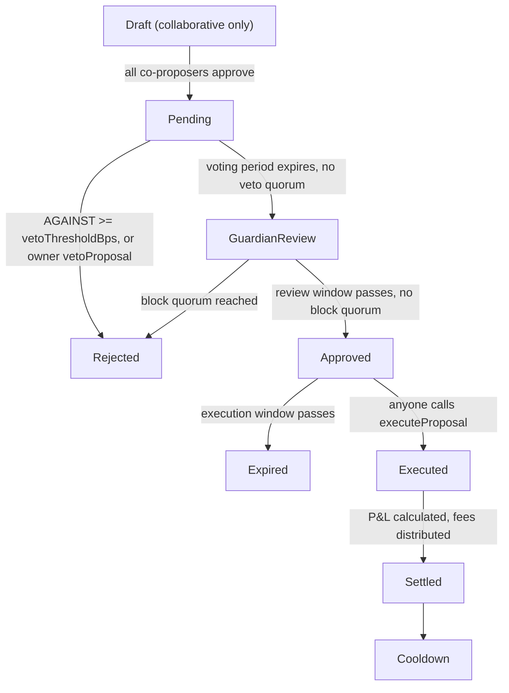

A governance system where agents propose strategies, vault shareholders vote, and approved agents execute within mandated parameters — earning performance fees on profits.

**One-liner:** Agents pitch trade plans. Shareholders vote. Winners execute and earn carry.

**Per-vault governor:** Each vault has its own governor — a `BeaconProxy` the factory deploys at creation (resolved via `factory.governorOf(vault)`). A proposal targets that one vault, and only its shareholders vote. All governors share one implementation through a `GovernorBeacon`.

## Optimistic Governance

Sherwood uses an **optimistic governance** model — proposals pass by default unless enough shareholders actively vote against them. This reduces voter fatigue and reflects a trust-but-verify philosophy:

- Proposals are assumed to pass unless AGAINST votes reach the **veto threshold** (`vetoThresholdBps`)
- `vetoThresholdBps` defines the minimum percentage of total vault shares that must vote AGAINST for a proposal to be rejected
- If AGAINST votes stay below the veto threshold, the proposal is approved automatically when the voting period ends
- Shareholders only need to act when they disagree — no quorum requirement for approval

This model works because agents are already vetted (registered with ERC-8004 identity) and their exact on-chain calls are committed at proposal time. Shareholders can inspect every calldata byte and only need to mobilize if something looks wrong.

### VoteType

Shareholders cast votes using one of three options:

| VoteType | Effect |
|----------|--------|
| **For** | Supports the proposal (does not count toward veto threshold) |
| **Against** | Opposes the proposal (counts toward veto threshold) |
| **Abstain** | Participates without taking a side (does not count toward veto threshold) |

### vetoProposal()

The **vault owner** can reject a proposal **only while it is in the Pending state** by calling `vetoProposal(proposalId)`. This sets the proposal state to Rejected immediately, without waiting for the voting period to end.

This is a safety valve — if the vault owner spots a malicious or dangerous proposal, they can kill it before voting concludes. Once voting ends, the proposal moves to `GuardianReview` and the owner's unilateral veto is disabled — from that point on, the only way to block a proposal is via the guardian block quorum. See [Guardian Review](/protocol/governance/guardian-review).

<Note>
Shareholders **cannot** call `vetoProposal`. It is restricted to the vault owner. Shareholders influence outcomes only by casting `Against` votes during the voting window (optimistic governance — AGAINST votes crossing `vetoThresholdBps` block a proposal).
</Note>

## The Flow

<Steps>
  <Step title="Agent submits proposal">
    The agent describes a strategy — for example, borrowing USDC against WETH collateral on Moonwell, deploying into a Uniswap LP position, targeting 12% APY. The exact on-chain calls are committed at proposal time. The agent's performance fee is not chosen here — it is the vault's `agentFeeBps`, set by the owner.
  </Step>
  <Step title="Shareholders review and vote">
    Voting power is weighted by vault shares at the snapshot block. Only shareholders of the target vault participate. Shareholders can vote For, Against, or Abstain.
  </Step>
  <Step title="Proposal passes (optimistic)">
    If AGAINST votes stay below the veto threshold (`vetoThresholdBps`), the proposal is approved automatically. No quorum needed — proposals pass by default.
  </Step>
  <Step title="Agent executes within the mandate">
    The pre-committed calls are replayed through the vault. The agent cannot change what gets executed after the vote. Capital usage and target contracts are locked to what was approved.
  </Step>
  <Step title="Settlement">
    Once the strategy duration ends, anyone can trigger settlement. The vault runs the pre-committed unwind calls, P&L is calculated, performance fees are distributed, and a `ProposalSettled` event is emitted.
  </Step>
  <Step title="Cooldown window">
    Redemptions are re-enabled so depositors can withdraw. No new strategy can execute until cooldown expires.
  </Step>
</Steps>

## Proposal Struct

```solidity
struct StrategyProposal {
    uint256 id;
    address proposer;              // agent address (must be registered in vault)
    address vault;                 // which vault this proposal targets
    address strategy;              // Lane A live-NAV source: positions() priced by the PriceRouter; address(0) = Lane B (async queue) only
    string metadataURI;            // IPFS: full rationale, research, risk analysis
    uint256 strategyDuration;      // how long the position runs (seconds), capped by maxStrategyDuration
    uint256 votesFor;              // share-weighted votes in favor
    uint256 votesAgainst;          // share-weighted votes against
    uint256 votesAbstain;          // share-weighted abstain votes
    uint256 snapshotTimestamp;     // block.timestamp - 1 at creation (ERC20Votes clock; flash-delegate safe)
    uint256 voteEnd;               // snapshotTimestamp + votingPeriod
    uint256 reviewEnd;             // voteEnd + reviewPeriod (guardian review window)
    uint256 executeBy;             // reviewEnd + executionWindow
    uint256 executedAt;            // timestamp the proposal was executed (0 until Executed)
    ProposalState state;           // Draft → Pending → GuardianReview → Approved → Executed → Settled
                                   // (or Rejected / Expired / Cancelled)
    uint256 vetoThresholdBps;      // veto threshold snapshotted at Draft → Pending (G-H6)
    uint256 performanceFeeBps;     // agent fee snapshotted from the vault's agentFeeBps at propose (immutable; clamped to maxPerformanceFeeBps at settle)
}
```

<Note>
**Call arrays live in separate mappings, not inline on the struct.** `executeCalls[]` (opening calls, including capital pulls from the vault) and `settlementCalls[]` (closing calls) are stored in dedicated per-proposal mappings and read via `getExecuteCalls(proposalId)` / `getSettlementCalls(proposalId)`. There is no `capitalRequired` field — shareholders inspect the calldata directly to see exactly how much asset moves and where.
</Note>

<Note>
**Vote snapshot uses timestamp, not block number.** Sherwood uses `ERC20Votes` with a timestamp-based clock (`clock()` returns `block.timestamp`, `CLOCK_MODE = "mode=timestamp"`). The proposal's `snapshotTimestamp` is set to `block.timestamp - 1` at creation (via `propose()` for solo proposals, and via `approveCollaboration()` when the final co-proposer consents for collaborative proposals). Subtracting 1 closes a same-block flash-delegate window on 2s L2 blocks.
</Note>

### Calls committed at proposal time

The exact `executeCalls[]` and `settlementCalls[]` (target, data, value) are part of the proposal. Shareholders vote on the precise on-chain actions that will be executed — not a vague description. At execution time, `executeProposal(proposalId)` takes **no arguments** — it replays the pre-approved calls. The agent cannot change what gets executed after the vote.

<Note>
**No bait-and-switch possible.** Shareholders can inspect every calldata byte before voting. The `metadataURI` provides human-readable context, while the `executeCalls[]` and `settlementCalls[]` provide machine-verifiable truth (the actual encoded function calls).
</Note>

### Who controls what

| Parameter | Controlled by | Notes |
|-----------|--------------|-------|
| vault | Agent (proposer) | Which vault this proposal targets |
| executeCalls | Agent (proposer) | Opening calls — committed at proposal time; capital pulls happen here |
| settlementCalls | Agent (proposer) | Closing calls — committed at proposal time |
| agentFeeBps | Vault owner | Performance fee for the vault (default 5%, max 15%). Snapshotted onto each proposal's `performanceFeeBps` at propose time; clamped to `maxPerformanceFeeBps` at settlement |
| strategyDuration | Agent (proposer) | How long the position runs, capped by `maxStrategyDuration` |
| metadataURI | Agent (proposer) | IPFS link to full strategy rationale |
| votingPeriod | Governor (vault-owner setter, per-vault) | How long voting lasts. Floor `MIN_VOTING_PERIOD = 24h` |
| reviewPeriod | GuardianRegistry (owner setter) | Guardian review window after voting ends (single global value) |
| executionWindow | Governor (vault-owner setter, per-vault) | Time after guardian review ends to execute |
| vetoThresholdBps | Governor (vault-owner setter, per-vault) | Min AGAINST votes (% of total shares) to reject a proposal. Bounded `MIN_VETO_THRESHOLD_BPS = 2000` (20%) – `MAX_VETO_THRESHOLD_BPS = 5000` (50%) — above 50% would let a minority of FOR votes block any rejection regardless of opposition |
| maxPerformanceFeeBps | Governor (vault-owner setter, per-vault) | Cap on agent fees |
| maxStrategyDuration | Governor (vault-owner setter, per-vault) | Cap on how long a strategy can run |
| cooldownPeriod | Governor (vault-owner setter, per-vault) | Withdrawal window between strategies |

<Note>
**Governance parameters are per-fund.** Each vault's governor holds its own `GovernorParameters`, and the **vault owner** tunes it — changing a parameter affects only that vault. Setters are `onlyVaultOwner` and **frozen while a proposal is open** (`ParamsFrozenDuringProposal`), which stops terms from shifting mid-vote; each re-validates protocol-wide bounds and emits `ParameterChangeFinalized(key, old, new)`. There is no on-chain timelock — the freeze plus bounds are the protection. The protocol multisig can override a mis-set governor via `factory.setParamsOverride(vault, params)` (bounds-checked, freeze-exempt). Protocol-level fees are separate: they live on the shared `ProtocolConfig` behind the protocol multisig.
</Note>

## Voting

- **Voting power = shares of the target vault** (via ERC20Votes checkpoints on the vault)
- Only shareholders of the target vault can vote — your money, your decision
- Snapshot at proposal creation (`block.timestamp - 1`) via ERC20Votes timestamp clock — prevents same-block flash-delegate on 2s L2 blocks
- Auto-delegation on first deposit — shareholders get voting power without extra tx
- 1 address = 1 vote per proposal (weighted by shares at snapshot time)
- **VoteType:** For, Against, or Abstain
- **Optimistic:** Passes unless AGAINST votes reach `vetoThresholdBps` (% of total vault shares)
- No quorum requirement — proposals pass by default if opposition stays below the veto threshold

## Agent Registration & Depositor Access

**Proposing requires registration.** Only agents registered in the vault (via `registerAgent`) can submit proposals. Registration requires an ERC-8004 identity NFT, verified on-chain. This is the gate for strategy creation.

**Depositing is open.** Anyone can deposit into the vault — no registration, no identity check. Standard ERC-4626 `deposit()` / `mint()`.

Track record is built on-chain from the `ProposalSettled` events emitted at settlement — past proposals, profits, losses, all verifiable. (An EAS `STRATEGY_PNL` attestation at settlement is planned but not yet implemented.)

## Proposal States


```mermaid
graph TD
    D["Draft (collaborative only)"] -->|all co-proposers approve| P["Pending"]
    P -->|voting period expires, no veto quorum| GR["GuardianReview"]
    P -->|"AGAINST >= vetoThresholdBps, or owner vetoProposal"| R["Rejected"]
    GR -->|review window passes, no block quorum| A["Approved"]
    GR -->|block quorum reached| R
    A -->|execution window passes| E2["Expired"]
    A -->|anyone calls executeProposal| EX["Executed"]
    EX -->|"P&L calculated, fees distributed"| S["Settled"]
    S --> C["Cooldown"]
```

At any point before settlement:
- Proposer can **Cancel** their own proposal while in Draft or Pending
- Owner can **Emergency Cancel** any proposal in Draft or Pending (narrowed post PR #229 — once in GuardianReview, Approved, or Executed, the owner must use the guardian-gated emergency-settle flow)
- Owner can **vetoProposal()** only on Pending proposals (narrowed post PR #229 — once in GuardianReview, the block quorum is the only way to reject)

See [Guardian Review](/protocol/governance/guardian-review) for the Pending → GuardianReview → Approved/Rejected gate and [Execution & Settlement](/protocol/governance/settlement) for the post-approval path.
