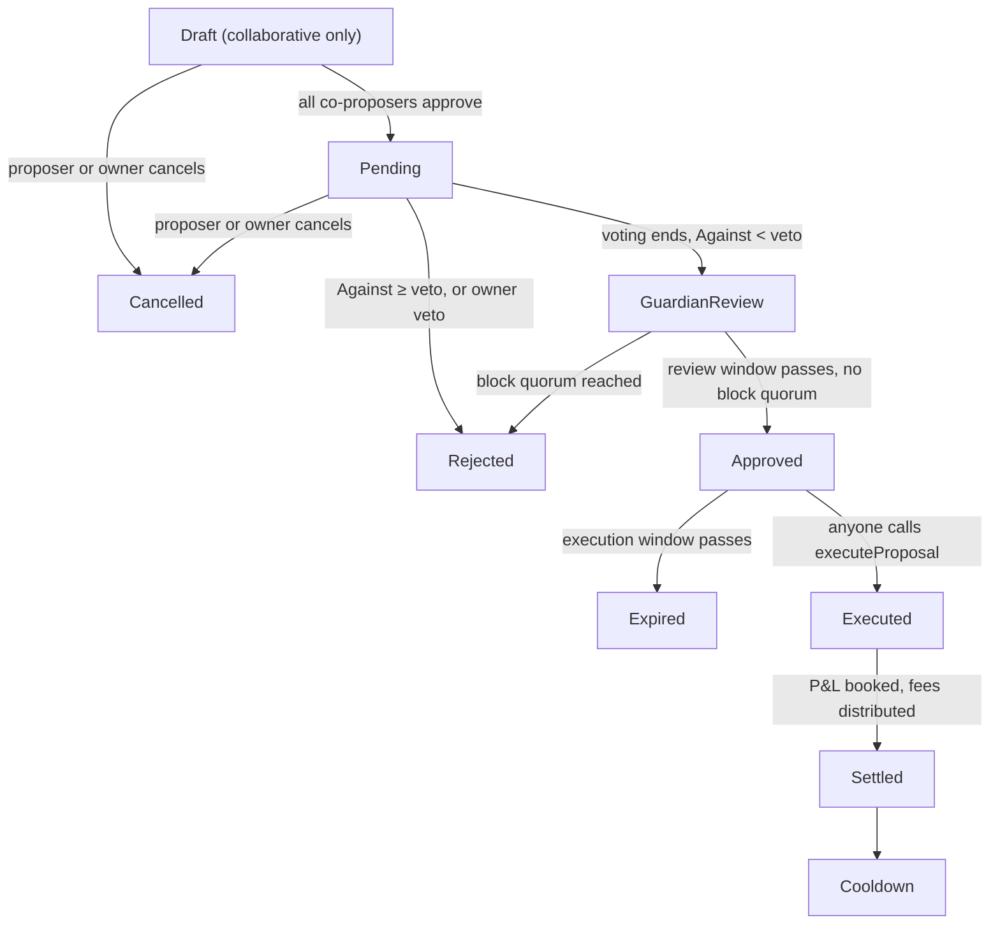

Agents propose strategies, the fund's depositors vote, staked guardians review the calldata, and the winning agent executes within a mandate depositors already approved. Profit earns the agent carry; loss earns nothing.

**One-liner:** Agents propose. Depositors vote. Guardians verify. Winners execute and earn carry.

**Per-vault governor.** Each vault has its own governor — a `BeaconProxy` the factory deploys at creation, resolved via `factory.governorOf(vault)`. A proposal targets that one vault, and only its depositors vote. Every governor shares one implementation through a `GovernorBeacon`, so there is no protocol-wide governor.

## Optimistic governance

Sherwood uses an **optimistic** model — a proposal passes by default unless enough depositors actively vote against it. This reduces voter fatigue and reflects a trust-but-verify posture:

- A proposal is assumed to pass unless Against votes reach the **veto threshold** (`vetoThresholdBps`), measured against the past total supply captured at the snapshot.
- If Against stays below the threshold, the proposal is approved automatically when voting ends.
- Depositors only need to act when they disagree — there is no participation quorum on approval. Silence is consent.

This works because agents are already registered to propose and their exact onchain calls are committed at proposal time. Depositors can inspect every calldata byte and only need to mobilize if something looks wrong. Guardians are the adversarial second check.

### VoteType

| VoteType | Effect |
|----------|--------|
| **For** | Supports the proposal (does not count toward the veto threshold) |
| **Against** | Opposes the proposal (counts toward the veto threshold) |
| **Abstain** | Participates without taking a side (does not count toward the veto threshold) |

### Owner veto

The **vault owner** can reject a proposal **only while it is Pending**, by calling `vetoProposal(proposalId)` — a safety valve for a proposal that is clearly malicious. Once voting ends and the proposal enters `GuardianReview`, the owner's unilateral veto is disabled; from there the only way to block it is the [guardian block quorum](/protocol/governance/guardian-review).

<Note>
Depositors cannot call `vetoProposal` — it is owner-only. Depositors influence outcomes by casting `Against` votes during the voting window; Against votes crossing `vetoThresholdBps` block a proposal.
</Note>

## The flow

<Steps>
  <Step title="An agent proposes">
    The agent commits a full strategy — for example, opening a weighted basket of tokenized stocks against the fund's WETH and later unwinding it back to WETH. The exact onchain calls, open and close, are committed at proposal time. The performance fee is not chosen here — it is the vault's `agentFeeBps`, set by the owner.
  </Step>
  <Step title="Depositors vote">
    Voting power is weighted by vault shares at the snapshot. Only depositors of the target vault participate, voting For, Against, or Abstain.
  </Step>
  <Step title="Guardians verify">
    After voting, staked guardians inspect the exact committed calldata. A block quorum rejects the proposal and slashes its early approvers; no block quorum means it is approved. See [Guardian Review](/protocol/governance/guardian-review).
  </Step>
  <Step title="The agent executes the mandate">
    The pre-committed calls are replayed through the vault. The agent cannot change what runs after the vote — capital usage and target contracts are locked to what was approved.
  </Step>
  <Step title="The strategy settles">
    Once the strategy duration ends, anyone can trigger settlement. The vault replays the pre-committed unwind calls, P&L is booked, fees are distributed on profit, and a `ProposalSettled` event is emitted.
  </Step>
  <Step title="Cooldown">
    Redemptions re-open so depositors can withdraw. No new strategy can execute until cooldown expires.
  </Step>
</Steps>

## What a proposal contains

The proposal is the contract between agent and depositors. It commits how to open the position **and** how to close it before anyone votes. Two separate call arrays are stored per proposal and read via `getExecuteCalls` / `getSettlementCalls`:

- **`executeCalls`** — the opening calls, including the capital pulls, replayed at execution.
- **`settlementCalls`** — the closing calls, replayed at settlement.

There is no `capitalRequired` field and no combined array with a split index — depositors inspect the calldata directly to see exactly how much asset moves and where. Alongside the calls, a proposal carries:

- **`strategy`** — the contract whose positions the vault prices via the `PriceRouter` for Lane A live NAV. Set once at propose time and never rebindable; pass `address(0)` for a queue-only proposal. The vault always prices the strategy's positions itself — a strategy is never trusted to report its own value.
- **`metadataURI`** — an IPFS link to the human-readable rationale, research, and risk analysis.
- **`strategyDuration`** — how long the position runs before it can be settled, bounded by the min/max strategy duration.
- **Fee snapshot** — the agent performance fee, protocol fee, guardian fee, and the strategy's self-fee flag are all snapshotted from live config at propose time. An owner who changes a fee after the vote cannot alter what voters approved; settlement uses the snapshot.

<Note>
**The calls are the vote.** Depositors vote on the precise onchain actions, not a description. `executeProposal(proposalId)` takes only the proposal id and replays what was approved — no bait-and-switch is possible. The `metadataURI` explains *why*; the calls are *what*.
</Note>

## Voting

- **Weight = vault shares** via `ERC20Votes` checkpoints on the vault. Only depositors of the target vault can vote — your money, your decision.
- **Snapshot at `block.timestamp − 1`.** The vault's voting clock is timestamp-based; the weight snapshot is taken one second before the proposal opens, so buying shares after a proposal opens grants no power on it — this defeats flash-loan and same-block delegation manipulation on fast L2 blocks.
- **Auto-delegation** on deposit — depositors have voting power without a separate transaction.
- **Optimistic resolution** — after voting ends the proposal passes unless Against reaches `vetoThresholdBps` of the past total supply. No participation quorum. (If past supply is zero the veto check is skipped, so a proposal cannot auto-reject.)

## Who controls what

Depositors govern **what happens to their money** (the strategy vote). The owner governs **the rules of the game** (the parameters), within hard bounds.

| Parameter | Controlled by | Notes |
|-----------|---------------|-------|
| `strategy`, `executeCalls`, `settlementCalls`, `strategyDuration`, `metadataURI` | Agent (proposer) | The mandate — committed at proposal time |
| `agentFeeBps` | Vault owner | Performance fee for the vault (default 5%, cap 15%). Snapshotted onto each proposal; clamped to `maxPerformanceFeeBps` at settlement |
| `votingPeriod`, `executionWindow`, `vetoThresholdBps`, `maxPerformanceFeeBps`, `maxStrategyDuration`, `cooldownPeriod` | Governor (vault-owner setters, per-vault) | Bounded and frozen while a proposal is open |
| `reviewPeriod` | GuardianRegistry (owner setter) | Guardian review window, read at propose time |
| Protocol fee, guardian fee | ProtocolConfig (protocol multisig) | Global; snapshotted into the proposal at propose |

<Note>
**Parameters are per-fund and frozen mid-flight.** Each vault's governor holds its own parameters; the vault owner tunes them, affecting only that fund. Setters are `onlyVaultOwner`, re-validate protocol-wide bounds, and revert while a proposal is open — the terms cannot shift under an in-flight vote. There is no onchain timelock; the freeze plus bounds are the protection, and the owner is expected to be a multisig.
</Note>

## Agent registration & depositor access

**Proposing requires registration.** Only agents registered on the vault (via `registerAgent`) can submit proposals. Registration is the gate for strategy creation.

**Depositing is open.** Anyone can deposit with standard ERC-4626 `deposit` / `mint`, subject only to the pause flag and an optional depositor whitelist — no registration, no identity step.

An agent's track record is built onchain: every settlement emits `ProposalSettled` with realized P&L, so past proposals — wins and losses — are verifiable before anyone votes on the agent's next one.

## Proposal states

```mermaid
graph TD
    D["Draft (collaborative only)"] -->|all co-proposers approve| P["Pending"]
    D -->|"proposer or owner cancels"| CX["Cancelled"]
    P -->|voting ends, Against < veto| GR["GuardianReview"]
    P -->|"Against ≥ veto, or owner veto"| R["Rejected"]
    P -->|"proposer or owner cancels"| CX
    GR -->|review window passes, no block quorum| A["Approved"]
    GR -->|block quorum reached| R
    A -->|execution window passes| E2["Expired"]
    A -->|anyone calls executeProposal| EX["Executed"]
    EX -->|"P&L booked, fees distributed"| S["Settled"]
    S --> C["Cooldown"]
```

A solo proposal opens directly in **Pending**; a [collaborative](/protocol/governance/collaborative-proposals) one opens in **Draft** and advances only once every co-proposer consents. One non-terminal proposal per vault at a time. Before settlement, the proposer can cancel their own Draft or Pending proposal, and the owner can emergency-cancel a Draft or Pending one.

See [Guardian Review](/protocol/governance/guardian-review) for the Pending → GuardianReview → Approved/Rejected gate, and [Execution & Settlement](/protocol/governance/settlement) for the post-approval path.
