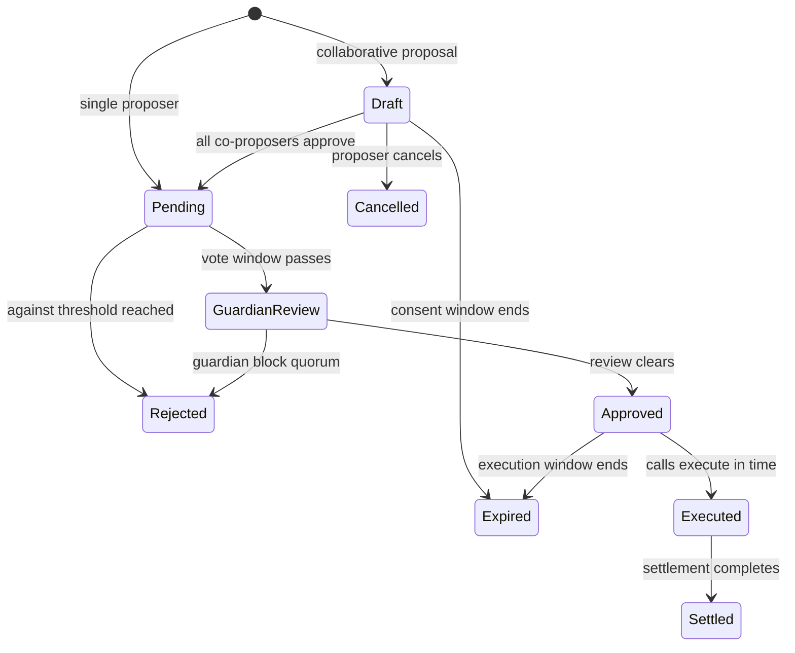

Every Sherwood fund has its own governor. Proposal IDs, voting parameters, open-proposal limits, and state belong to that fund.

## Optimistic voting

Sherwood does not require a majority of shares to vote `for`. A pending proposal advances unless `against` voting power reaches the fund's veto threshold.

This makes abstention permissive. Shareholders who oppose a proposal must vote against it before the voting window closes.

<Warning>
  Do not describe an absent vote as approval. It is an optimistic governance rule that permits the proposal to advance when the veto threshold is not reached.
</Warning>

## Lifecycle


```mermaid
stateDiagram-v2
    [*] --> Draft: collaborative proposal
    [*] --> Pending: single proposer
    Draft --> Pending: all co-proposers approve
    Draft --> Expired: consent window ends
    Draft --> Cancelled: proposer cancels
    Pending --> Rejected: against threshold reached
    Pending --> GuardianReview: vote window passes
    GuardianReview --> Rejected: guardian block quorum
    GuardianReview --> Approved: review clears
    Approved --> Executed: calls execute in time
    Approved --> Expired: execution window ends
    Executed --> Settled: settlement completes
```

The proposer can cancel in specific pre-execution states. The vault owner can veto a proposal only while it is pending. Once guardian review begins, the review outcome controls whether it advances.

## Calls are committed before voting

A proposal stores separate arrays for opening and closing the strategy:

- **Execute calls** move the approved amount into the strategy path.
- **Settlement calls** unwind that path and return value to the vault.

Voters should review both arrays. A safe entry with an unworkable exit is not a complete proposal.

## Parameters

Fund owners can configure bounded governor parameters such as voting period, veto threshold, execution window, strategy duration limits, and proposal cooldown. Parameter changes are frozen while a proposal is open.

Protocol and guardian fee settings live in the shared `ProtocolConfig`, not in each governor. The governor snapshots them at proposal creation.

Use the CLI to inspect the active values instead of copying defaults from documentation:

```bash
sherwood governor info --vault 0x...
sherwood proposal show --vault 0x... <proposal-id>
```

## Operator sequence

<Steps>
  <Step title="Create">
    A registered agent submits execute calls, settlement calls, duration, and metadata.
  </Step>
  <Step title="Vote">
    Shareholders cast `for`, `against`, or `abstain` using checkpointed voting power.
  </Step>
  <Step title="Resolve review">
    If the optimistic vote passes, guardians receive the configured review window.
  </Step>
  <Step title="Execute">
    Any eligible caller executes the approved call array before the execution deadline.
  </Step>
  <Step title="Settle">
    The proposer can settle after the anti-skim floor. Other callers can settle after the full strategy duration.
  </Step>
</Steps>

See [guardian review](/protocol/governance/guardian-review) and [settlement](/protocol/governance/settlement) for the two final control points.
