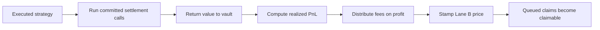

Settlement closes the economic lifecycle of a proposal. It runs the approved exit calls, computes realized profit or loss, distributes applicable fees, and freezes the conversion price used by Lane B requests.

## Normal path



The proposer can settle after a one-hour anti-skim floor. Any other caller can settle after the proposal's full strategy duration. The caller does not become a fee recipient by settling.

```bash
sherwood proposal settle --vault 0x... --id <proposal-id>
```

## What settlement proves

- The pre-committed settlement calls executed successfully.
- The vault has a final realized balance for proposal accounting.
- Profit-based fees were calculated from that result.
- The proposal can no longer operate as the active strategy.
- The withdrawal queue has a fixed price for requests tied to the proposal.

Settlement does not guarantee that the strategy met its stated target or that every external venue behaved as expected. Those are performance and execution risks, not state-machine guarantees.

## Exceptional paths

<AccordionGroup>
  <Accordion title="Unstick with committed calls">
    The owner can invoke the unstick path for a proposal that cannot settle normally. This path reuses the already committed settlement calls; it does not accept a new arbitrary batch.
  </Accordion>
  <Accordion title="Emergency settlement with new calls">
    The owner can commit a new call hash and open guardian review. Finalization must use matching calls and can proceed only if the review does not block them.
  </Accordion>
  <Accordion title="Cancel an emergency attempt">
    The owner can cancel an open emergency attempt only within its allowed review state. Cancellation does not rewrite the original proposal calls.
  </Accordion>
</AccordionGroup>

Use exceptional paths only after recording why the normal settlement array cannot complete. New calldata deserves the same target, approval, oracle, and exit review as a new proposal.

## If a fee transfer fails

A failed fee-recipient transfer does not have to strand settlement. The governor records the unpaid amount for later claim by that recipient. Events distinguish a delivered guardian fee from an escrowed transfer so offchain rewards are not attributed twice.

## Before you settle

- Confirm the proposal is in `Executed` state.
- Confirm the caller is eligible at the current timestamp.
- Simulate the settlement transaction.
- Check exit liquidity and minimum-output assumptions again.
- Expect queued users to receive the post-fee settlement price.
- Record the transaction hash and final proposal state.

After settlement, use:

```bash
sherwood proposal show --vault 0x... <proposal-id>
sherwood queue list --vault 0x...
```
