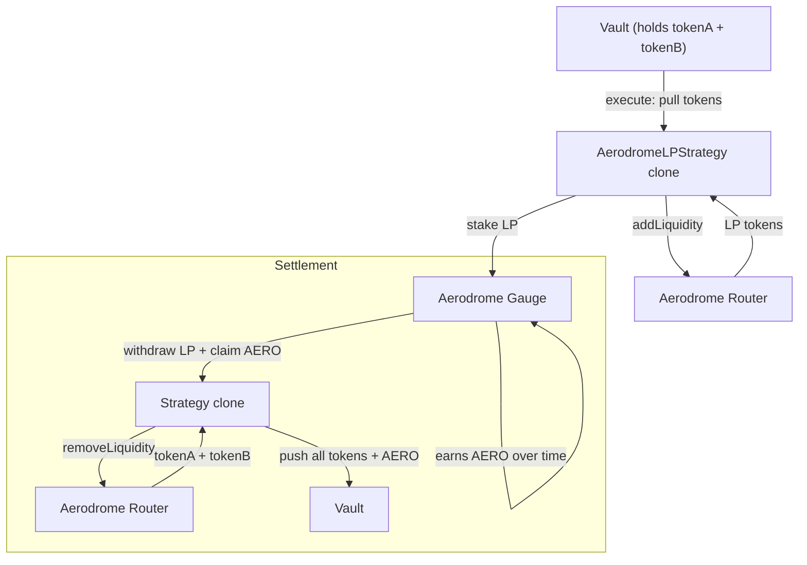

The `AerodromeLPStrategy` provides liquidity to an Aerodrome pool on Base and optionally stakes the LP tokens in a gauge to earn AERO rewards. On settlement, it unstakes, claims rewards, removes liquidity, and pushes all tokens back to the vault.

## Architecture



## Stable vs Volatile Pools

<CardGroup cols={2}>
  <Card title="Stable Pool" icon="equals">
    For correlated assets (e.g., USDC/USDbC). Uses the `stable = true` flag. Lower fees, tighter curve.
  </Card>
  <Card title="Volatile Pool" icon="chart-line">
    For uncorrelated assets (e.g., USDC/WETH). Uses `stable = false`. Standard AMM curve.
  </Card>
</CardGroup>

## Lifecycle

```
Pending → execute() → Executed → settle() → Settled
```

| Phase | What happens | Who calls |
|-------|-------------|-----------|
| **Execute** | Pull tokenA + tokenB → addLiquidity → stake LP in gauge | Governor (proposal execution) |
| **Executed** | LP earns trading fees; gauge earns AERO rewards | — |
| **Settle** | Unstake LP → claim AERO → removeLiquidity → push all to vault | Governor (proposal settlement) |

<Info>
  Any dust (unused tokens from addLiquidity) is returned to the vault immediately during execution.
</Info>

## Batch Calls

### Execute

```
[tokenA.approve(strategy, amountA), tokenB.approve(strategy, amountB), strategy.execute()]
```

### Settle

```
[strategy.settle()]
```

Settlement pushes three types of tokens to the vault: tokenA, tokenB (from removed liquidity), and AERO (gauge rewards).

## Gauge Staking

Gauge staking is optional. Pass `--gauge <address>` to enable it.

- If a gauge is set, the strategy stakes all LP tokens after adding liquidity
- On settlement, LP is withdrawn from the gauge and AERO rewards are claimed
- The gauge's `stakingToken` must match the `lpToken` address (validated at initialization)
- If no gauge is set, LP tokens sit in the strategy clone (earning trading fees only)

## InitParams

```solidity
struct InitParams {
    address tokenA;         // First token in the pair
    address tokenB;         // Second token in the pair
    bool stable;            // true = stable pool, false = volatile
    address factory;        // Aerodrome pool factory
    address router;         // Aerodrome Router
    address gauge;          // Gauge address (address(0) to skip staking)
    address lpToken;        // Pool LP token address
    uint256 amountADesired; // tokenA to provide
    uint256 amountBDesired; // tokenB to provide
    uint256 amountAMin;     // Min tokenA on addLiquidity (slippage)
    uint256 amountBMin;     // Min tokenB on addLiquidity (slippage)
    uint256 minAmountAOut;  // Min tokenA on removeLiquidity (slippage)
    uint256 minAmountBOut;  // Min tokenB on removeLiquidity (slippage)
}
```

## CLI Usage

```bash
sherwood strategy propose aerodrome-lp \
  --vault 0x... \
  --token-a 0x833589fCD6eDb6E08f4c7C32D4f71b54bdA02913 \
  --token-b 0x4200000000000000000000000000000000000006 \
  --amount-a 500 --amount-b 0.2 \
  --gauge 0x... --lp-token 0x... \
  --min-a-out 490 --min-b-out 0.19 \
  --name "USDC/WETH Aerodrome LP" \
  --performance-fee 1000 --duration 14d
```

| Flag | Description | Default |
|------|------------|---------|
| `--token-a <address>` | Token A address | required |
| `--token-b <address>` | Token B address | required |
| `--amount-a <n>` | Token A amount | required |
| `--amount-b <n>` | Token B amount | required |
| `--stable` | Stable pool (correlated assets) | false |
| `--gauge <address>` | Gauge for AERO rewards | none |
| `--lp-token <address>` | LP token address | required |
| `--min-a-out <n>` | Min token A on settle | 0 |
| `--min-b-out <n>` | Min token B on settle | 0 |

## Tunable Parameters

While in `Executed` state, the proposer can update settlement slippage:

| Parameter | Description |
|-----------|-------------|
| `minAmountAOut` | Minimum tokenA on removeLiquidity |
| `minAmountBOut` | Minimum tokenB on removeLiquidity |

```solidity
strategy.updateParams(abi.encode(newMinAmountAOut, newMinAmountBOut));
// Pass 0 to keep current value
```

## Allowlist Targets

Targets are pool-specific — gauge and LP token addresses vary per pool.

```bash
sherwood vault add-target --target 0xcF77a3Ba9A5CA399B7c97c74d54e5b1Beb874E43  # Aerodrome Router
sherwood vault add-target --target 0x940181a94A35A4569E4529A3CDfB74e38FD98631  # AERO Token
sherwood vault add-target --target <token-a-address>                             # Token A
sherwood vault add-target --target <token-b-address>                             # Token B
sherwood vault add-target --target <gauge-address>                               # Pool gauge
sherwood vault add-target --target <lp-token-address>                            # Pool LP token
sherwood vault add-target --target <strategy-clone-address>                      # Your strategy clone
```

## Addresses (Base Mainnet)

| Contract | Address |
|----------|---------|
| AerodromeLPStrategy template | `0x6ccdD48C6A83cCdD6712DEB02E85FbEA8CF426CE` |
| Aerodrome Router | `0xcF77a3Ba9A5CA399B7c97c74d54e5b1Beb874E43` |
| Aerodrome Default Factory | `0x420DD381b31aEf6683db6B902084cB0FFECe40Da` |
| AERO Token | `0x940181a94A35A4569E4529A3CDfB74e38FD98631` |

<Warning>
  If the vault only holds one asset (e.g., USDC), the agent should add a swap call before the strategy in the execute batch to acquire the second token.
</Warning>
