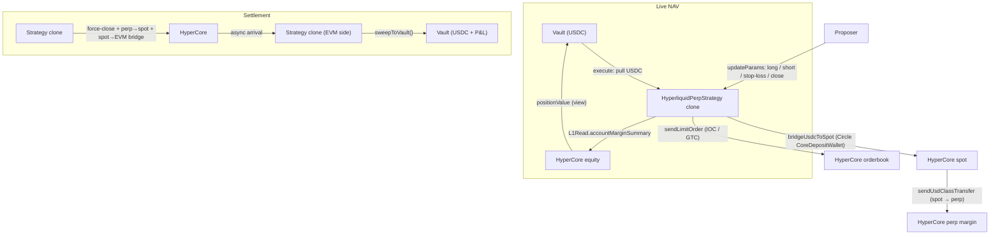

The `HyperliquidPerpStrategy` lets a syndicate run leveraged perpetual positions on Hyperliquid from an on-chain vault. USDC is pulled from the vault, **bridged EVM → HyperCore spot** via Circle's CoreDepositWallet (`HyperliquidBridge.bridgeUsdcToSpot`), and then moved **spot → perp margin** via `L1Write.sendUsdClassTransfer`. The proposer drives trading actions (open long, open short, stop-loss, close, plus multi-asset variants) through `updateParams`. Position state is read live from HyperCore via `L1Read.position2()` — nothing is cached on-chain.

HyperEVM mainnet only.

<Warning>
  This strategy holds leveraged positions on a centralized-matching venue. A liquidation on HyperCore permanently destroys vault equity up to the deposit amount. Use conservative `leverage`, set `maxPositionSize` and `maxTradesPerDay` at init, and monitor the position directly on Hyperliquid.
</Warning>

## Architecture



## Lifecycle

```
Pending → execute() → Executed → (trade actions) → settle() → Settled → sweep
```

| Phase | What happens | Who calls |
|-------|-------------|-----------|
| **Execute** | Pull USDC from vault → `bridgeUsdcToSpot` (EVM → HC spot) → `sendUsdClassTransfer` (spot → perp margin) | Governor (proposal execution) |
| **Executed** | Proposer opens / closes long & short positions, updates stop-losses, trades multiple assets via `updateParams`. Leverage is set off-chain via the exchange API. | Proposer only |
| **Settle** | Force-close all positions → perp → spot class transfer → spot → EVM bridge → push EVM USDC to vault | Governor (proposal settlement) |
| **Sweep** | `sweepToVault()` pushes any latecomer HC USDC to the vault. Callable by anyone; repeatable for partial arrivals. | Anyone |

## Batch Calls

### Execute

```
[USDC.approve(strategy, depositAmount), strategy.execute()]
```

### Settle

```
[strategy.settle()]
```

After `settle()`, anyone can call `strategy.sweepToVault()` once the async USD transfer lands. Funds can only flow to the vault.

## InitParams

Init data is an **ABI-encoded positional tuple** decoded in this order:

```solidity
(
  address asset,            // USDC on HyperEVM
  uint256 depositAmount,    // USDC to park as perp margin (fits in uint64; 0 = full vault balance at execute)
  uint32  perpAssetIndex,   // HyperCore perp asset index (0 = BTC, 3 = ETH)
  uint32  leverage,         // 1–50
  uint256 maxPositionSize,  // Max USDC in a single position — on-chain hard cap
  uint32  maxTradesPerDay   // Rate limit on trading actions per day
)
```

On-chain risk caps:

- `leverage` must be 1–50
- Opening a position where `sz * limitPx / 1e6 > maxPositionSize` reverts with `PositionTooLarge`
- Exceeding `maxTradesPerDay` (counted per UTC day) reverts with `MaxTradesExceeded`

<Info>
  There is no `minReturnAmount` floor. It was removed in #255 (S-C6) because it could permanently lock funds on a lossy strategy — `sweepToVault()` pushes whatever HC returns, with no minimum check.
</Info>

## Proposer Actions (Executed state)

Encoded as `updateParams(abi.encode(action, ...))`:

Single-asset actions use the `perpAssetIndex` stored at init. Multi-asset actions (6/7/8) carry the `assetIndex` in calldata, so one clone can trade any whitelisted perp and `_settle` closes every traded asset.

| Action | Encoding | Description |
|--------|----------|-------------|
| `1` — open long | `(uint8, uint64 limitPx, uint64 sz, uint64 stopLossPx, uint64 stopLossSz)` | IOC long + GTC stop-loss (reduce-only sell). Stop-loss uses a fixed CLOID so each new one replaces the previous. |
| `2` — close position | `(uint8, uint64 limitPx, uint64 sz)` | Reduce-only IOC close. |
| `3` — update stop-loss (long) | `(uint8, uint64 triggerPx, uint64 sz)` | Cancel the current stop-loss and place a new GTC reduce-only **sell** (for longs). |
| `4` — open short | `(uint8, uint64 limitPx, uint64 sz, uint64 stopLossPx, uint64 stopLossSz)` | IOC short entry + GTC stop-loss (reduce-only **buy** to close the short). |
| `5` — update stop-loss (short) | `(uint8, uint64 triggerPx, uint64 sz)` | Cancel and place a new GTC reduce-only **buy** stop for a short position. |
| `6` — open long (multi-asset) | `(uint8, uint32 assetIndex, uint64 limitPx, uint64 sz, uint64 stopLossPx, uint64 stopLossSz)` | Same as action 1 but for the `assetIndex` in calldata. |
| `7` — open short (multi-asset) | `(uint8, uint32 assetIndex, uint64 limitPx, uint64 sz, uint64 stopLossPx, uint64 stopLossSz)` | Same as action 4 but for the `assetIndex` in calldata. |
| `8` — close (multi-asset) | `(uint8, uint32 assetIndex, bool isBuy, uint64 limitPx, uint64 sz)` | Reduce-only IOC close on a specific asset and direction (`isBuy=true` closes a short, `false` closes a long). |

Position direction is **not** tracked on-chain — the proposer must send the matching stop-loss action (3 for longs, 5 for shorts). Before acting, read HyperCore directly (`L1Read.position2`). Funds never leave margin on trade actions — settlement / `initiateReturn()` initiates the transfer back to EVM.

## Live NAV

This strategy exposes **live NAV**. `positionValue()` sums HyperCore perp account equity (`L1Read.accountMarginSummary`), HyperCore spot USDC, and the strategy's EVM USDC balance, then reconciles that observable total against an in-flight high-water mark (`inFlightToHc`) using a Circle-fee-sized tolerance: when observable is within tolerance it trusts observable; a genuine cross-block bridge window (gap ≫ tolerance) falls back to `inFlightToHc` so NAV stays stable. It returns `valid=true` throughout the `Executed` state, so the vault marks shares to market and LPs can deposit / withdraw mid-proposal. New deposits forward through `onLiveDeposit`, which bridges the freshly-pushed USDC EVM → HC spot and class-transfers it into perp margin.

## Funding the position (bridge mechanics)

Moving USDC from the EVM vault onto HyperCore perp margin is a **two-step** flow, not a single class transfer:

1. **EVM → HC spot** — `HyperliquidBridge.bridgeUsdcToSpot` sends USDC to Circle's CoreDepositWallet, which credits the clone's HC **spot** account post-block. Circle charges a **1-USDC new-account fee** on the first deposit per HC address, so the first class transfer can exceed the actually-landed spot and be dropped by HC.
2. **HC spot → perp** — `L1Write.sendUsdClassTransfer(amount, true)` moves spot to perp margin. If the first transfer was dropped because of the new-account fee, the proposer calls `moveSpotToPerp()` one or more blocks later to class-transfer whatever actually landed on spot.

On the way out, `_settle()` / `initiateReturn()` reverse this: force-close positions, class-transfer perp → spot, then bridge spot → EVM. The spot → EVM leg consumes HC HYPE for gas — if the clone's HC HYPE is unfunded, that leg no-ops and `recoverHcResiduals()` (post-settle) retries it after funding.

## Risk Notes

- **Liquidation:** HyperCore liquidates positions that breach maintenance margin. The on-chain contract has no view into liquidation state — settlement and sweep still work, but returned USDC may be well below `depositAmount`.
- **Async settlement:** `settle()` does not immediately return funds. The USD transfer from HyperCore to EVM is asynchronous; `sweepToVault()` may need to be called multiple times for partial arrivals.
- **No off-chain keeper:** All actions are on-chain through precompiles. There is no bot watching price — set stop-losses explicitly (action `3` for longs, `5` for shorts) if you want automated exits.
- **Long and short:** The template supports both directions — long (1), short (4), their stop-losses (3/5), close (2), and multi-asset variants (6/7/8). Always pair a position with the correct-direction stop-loss action; a mismatched reduce-only order is a no-op on HyperCore.
- **Funding fees:** Perp positions accrue HyperCore funding payments while open; these are reflected in the live margin summary and in the realized USDC at settle.

## CLI Usage

```bash
sherwood strategy propose hyperliquid-perp \
  --vault 0x... \
  --amount 5000 \
  --leverage 5 \
  --asset-index 3 \
  --max-position 20000 \
  --max-trades-per-day 20 \
  --chain hyperevm \
  --name "ETH Perp 5x" \
  --duration 7d
```

| Flag | Description | Default |
|------|------------|---------|
| `--amount <n>` | USDC collateral to deploy | required |
| `--leverage <n>` | Leverage multiplier (1–50) | 10 |
| `--asset-index <n>` | HyperCore perp asset index | 0 (BTC) |
| `--max-position <amount>` | Max USD in a single position | 100000 |
| `--max-trades-per-day <n>` | Daily trading action limit | 50 |

After the proposal executes, drive trades with `sherwood proposal update-params` using the action encodings above.

## Addresses (HyperEVM)

| Contract | Address |
|----------|---------|
| HyperliquidPerpStrategy template | `0xC0fA169fdbBb3638AdE917A5B8A9A87caf90d91e` |
| USDC | `0xb88339CB7199b77E23DB6E890353E22632Ba630f` |
| SyndicateFactory | `0xd05Ae0E8bcf13075C29817c805d6Cc14F214393a` |
| SyndicateGovernor | `0x67AD3D5F3d127Ef923Fd6f67b178633c408D3fd3` |
