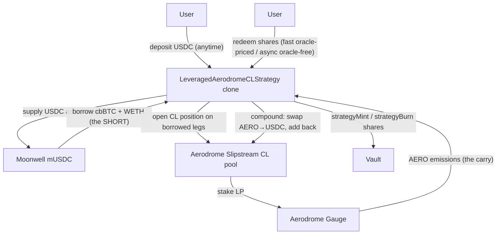

The `LeveragedAerodromeCLStrategy` runs a **net-short, leveraged** position on Aerodrome's Slipstream concentrated-liquidity (CL) pools, funded by a Moonwell borrow. USDC is supplied to Moonwell as collateral, cbBTC + WETH are borrowed against it, the two borrowed legs open a Slipstream CL position, and the LP is staked in the gauge to farm and compound AERO.

The Moonwell debt is the **short**; the LP re-adds long exposure; the operator sizes the range and the borrow so that residual delta stays **net-short**. AERO emissions are the carry. The position is **indefinitely-lived** — a single long-duration governor proposal keeps it open, and routine management is proposal-free.

<Info>
  **The key differentiator:** users deposit and redeem **at any time, directly at the strategy** (`strategy.deposit` / `strategy.redeem`) — not through a governor proposal and not through the vault's async Lane-A / Lane-B queue. This is a **third** deposit/withdraw model alongside Lane A (instant) and Lane B (async), a direct-at-strategy custody model that bypasses both lanes. Exit is two-sided: an oracle-priced **fast lane** for the everyday case, and an oracle-free **async lane** (`requestRedeem`) for sizes the fast lane's LTV gate can't serve or when the oracle is down.
</Info>

## Architecture



## Net-short thesis

- **Collateral / long:** USDC supplied to Moonwell, plus the CL position's re-added long exposure.
- **Short:** the cbBTC + WETH debt borrowed from Moonwell.
- The operator picks the range and borrow size so the net delta is **short** the borrowed assets. AERO gauge emissions are the yield that carries the position.
- The position is designed to be held **indefinitely** — one long-duration proposal, no per-cycle settle.

## Anytime deposit / redeem (custody model)

Unlike every other strategy, this one **holds user share balances directly** and lets users enter and exit whenever they want, at any size, without a proposal.

### Deposit — `strategy.deposit(assets, minShares)`

Live once the genesis proposal is `Executed`.

1. **Crystallize fees first**, on the pre-deposit NAV, before any USDC is pulled — prevents a phantom performance fee on the just-arrived idle USDC.
2. Snapshot `NAV_pre`, pull `assets`.
3. `shares = assets × (totalSupply + 1e6 offset) / (NAV_pre + 1)` — mirrors the vault's ERC-4626 virtual offset, rounds **down** (vault-favorable). Reverts if `< minShares`.
4. `vault.strategyMint(user, shares)` — the vault re-checks the depositor whitelist and `whenNotPaused`, so the strategy is **not** a back door around vault access control.
5. USDC lands idle in the strategy; the proposer later calls `deployIdle(...)` on MEV-safe timing.

<Warning>
  If `nav()` is unpriceable (oracle outage or calm-gate rejection), `deposit` **reverts** (fail-closed). A manipulated price can only **deny** a deposit — never mint cheap shares.
</Warning>

### Redeem — LTV-gated, two-sided exit

Redeeming is a **three-entrypoint** exit: an oracle-priced fast lane for the everyday case, and an oracle-free async lane for sizes the fast lane can't serve (or when the oracle is down). All exits pull shares via `safeTransferFrom`, so the redeemer must first call `vault.approve(strategy, shares)` — ERC-2612 permit is **not** available on the vault, so `approve` is the only path.

| Function | Access | What it does |
|----------|--------|-------------|
| `redeem(shares, minAssetsOut)` | anyone (holder) | **Fast lane, oracle-priced.** |
| `requestRedeem(shares, minAssetsOut)` | anyone (holder) | Escrow shares for the async lane; returns an `id`. |
| `fulfillRedeem(id)` | `onlyProposer` | Execute the oracle-free proportional unwind for a request. |
| `cancelRedeem(id)` | request owner | Return escrowed shares (only before fulfill). |
| `emergencyRedeem(id, minAssetsOut)` | request owner | Deadman self-fulfill after `FULFILL_WINDOW` (2 days). |

**Fast lane — `redeem(shares, minAssetsOut)`.** The everyday exit. Pays `shares × navNet / supply`, funded from the **Moonwell USDC collateral only** — no LP touch, no debt repay. It is **oracle-priced and fail-closed**: `navPre = nav()` is computed first and reverts on a down oracle, exactly like `deposit`. No protocol-fee skim runs on this path because `nav()` is already net of `protocolFeeOwed`. An **LTV gate** in `fastRedeemImpl` computes the post-withdraw LTV on pre-withdraw prices and reverts `FastRedeemExceedsLtv(ltvBps, maxLtvBps)` if it would breach `maxLtvBps` — the caller then routes to `requestRedeem`.

**Async lane — `requestRedeem` → `fulfillRedeem`.** `requestRedeem` escrows the shares in the strategy with **no price stamped** (shares keep bearing PnL until fulfill, so `cancelRedeem` is not a free look-back option). The proposer then deleverages (via `adjustLeverage`) and calls `fulfillRedeem(id)` — deliberately `onlyProposer`, **not** owner-callable, so the demoted oracle-free path can't be resurrected through a side door. Fulfill runs the **oracle-free proportional unwind**: it removes fraction `f = shares / supply` of **every leg** — pays `f` of idle USDC, removes `f` of CL liquidity, repays `f` of each debt, withdraws `f` of collateral, sweeps the residual to USDC. The legs themselves define the amount (no `nav()` computation), which is what keeps this lane **never blocked by an oracle outage**. `cancelRedeem(id)` returns the escrowed shares any time before fulfill.

**Deadman — `emergencyRedeem(id, minAssetsOut)`.** If the proposer hasn't fulfilled within `FULFILL_WINDOW = 2 days`, the request's owner runs the same oracle-free proportional unwind trustlessly, passing a fresh `minAssetsOut`.

<Info>
  **Stayer-safe guarantee (async / deadman path).** The proportional unwind leaves a stayer (`f < 1`) fully oracle-free: stayers keep `(1 − f)` of every leg regardless of price, and the redeemer bears only their own fill via `minAssetsOut`.
</Info>

The **one** exception: a literal 100%-of-supply proportional unwind that *also* hits an IL shortfall after idle USDC is exhausted falls back to oracle-sizing a collateral→USDC swap to clear the residual debt (fail-safe — a stale feed reverts). This dilutes no one, since by definition there are no stayers.

`previewRedeem(shares)` is an advisory view: it returns the predicted `assetsOut` and a `fastOk` flag (true iff the fast lane would both price *and* clear the LTV gate), so a frontend can pre-route to `requestRedeem` before submitting.

## NAV (deposit + fast-redeem pricing)

`nav()` prices deposits and the fast-lane redeem. It is computed by `LeveragedAeroValuation`, denominated in USDC, and returned **net of the accrued protocol-fee liability** (`protocolFeeOwed`, floored at 0):

```
NAV = (idleStrategy + idleLegs + collateral + clLegs − debt) − protocolFeeOwed
```

| Term | Source |
|------|--------|
| `idleStrategy` | `USDC.balanceOf(strategy)` at face |
| `idleLegs` | out-of-position cbBTC / WETH (rerange remainder), priced on Chainlink |
| `collateral` | `mUSDC.balanceOf × exchangeRateStored / 1e18` (view-safe — never `balanceOfUnderlying`) |
| `debt` | `borrowBalanceStored(cbBTC) × P + borrowBalanceStored(WETH) × P` |
| `clLegs` | CL `token0` / `token1` via `positions()` → `getAmountsForLiquidity` at an **oracle-implied sqrtP derived from Chainlink prices** (not the manipulable pool `slot0` tick), each leg × Chainlink price |

<Note>
  **Vault float is not a NAV term.** The strategy prices deposits and serves redeems against strategy-controlled value only.
</Note>

<Note>
  The `− protocolFeeOwed` term is load-bearing: netting the fee liability into `nav()` feeds both deposit share-pricing and the next HWM basis, and is why the fast-lane redeem takes **no** protocol-fee skim (it prices at `f × navNet`, which is already net).
</Note>

### Oracle hardening

Every Chainlink read enforces: positive answer, freshness (`now − updatedAt ≤ maxDelay`), round completeness (`answeredInRound ≥ roundId`, `startedAt ≠ 0`), an L2 sequencer-uptime feed + grace period, and `decimals == 8`. On top of that, a **calm-gate** rejects the mark if the pool spot tick deviates from the pool TWAP beyond a bound.

If any check fails, `nav()` **reverts** → deposit reverts. This is the manipulation-resistant, fail-closed design: the worst a manipulated price can do is deny a deposit.

## Fees (self-managed)

The strategy manages its own fees by minting **fee-shares** — it does not rely on the governor's settle-time fee distribution.

<CardGroup cols={2}>
  <Card title="Management fee" icon="clock">
    Streaming fee, crystallized by minting fee-shares. Needs only `totalSupply` (no price). Cap **500 bps** at init.
  </Card>
  <Card title="Performance fee" icon="chart-line">
    High-water-mark **per share** (in 1e18 WAD), measured on the oracle NAV, crystallized by minting fee-shares. Cap **1500 bps** at init.
  </Card>
</CardGroup>

- New depositors don't pay prior gains; redeemers can't escape (fees crystallize before shares move).
- The performance fee is **paused when NAV is unpriceable** — no phantom fees during an oracle outage.
- `selfManagesFees()` returns **`true`**, so the governor skips **all** settle-fee distribution for this strategy (protocol, guardian, agent, and management settle-fees). Fees are the strategy's own share-dilution, not governor-routed.

**Protocol fee is a USDC liability, not fee-shares.** The protocol slice is taken off the gross gain **first** (read live from the governor's `protocolFeeBps`), then accrued into `protocolFeeOwed` (6dp) rather than minted as shares. It is discharged where USDC naturally flows: the fast-redeem skim (`_dischargeRedeemSkim`), the compound skim, and `_settle`. `LeveragedAeroFees` returns this `protocolUsdc` slice separately from the perf-fee shares.

<Note>
  Only the **guardian** fee for custody strategies remains a documented off-chain follow-up. The protocol fee is collected on-chain as the `protocolFeeOwed` liability above.
</Note>

## Management / recovery entrypoints

| Function | Access | What it does |
|----------|--------|-------------|
| `deployIdle(amount, minLiquidity)` | `onlyProposer` | Deploy idle USDC into the levered position (proposer picks MEV-safe timing). |
| `compound(minUsdcOut, minLiquidity)` | `onlyProposer` | Claim AERO from the gauge, swap **AERO→USDC via a direct Aerodrome v2 router swap** (`swapExactTokensForTokens`, `require(minUsdcOut > 0)`), then add back to the position. |
| `rerange(minLiq0, minLiq1)` | `onlyProposer` | **Single-position, no-swap recenter** behind the calm-gate; the unmatched borrowed leg is left idle and priced back into NAV via `idleLegs`. |
| `adjustLeverage(targetLtvBps, minLiq, minOut)` | `onlyProposer` | Retarget LTV on the debt side only (collateral untouched); reverts `TargetLtvExceedsMax` if `targetLtvBps > maxLtvBps`; ends with a health assert. |
| `deleverage(minOut)` | **permissionless** | Anyone may unwind + repay when health falls below `minHealthBps` (see below). |
| `rescueToVault(token)` | proposer **or** vault owner | Sweep a stray **non-position** token back to the vault. Reverts on position/asset tokens (USDC / cbBTC / WETH / mTokens / AERO) — no exfil. The dual access (`NotProposerOrOwner`) is deliberate: `vault.rescueERC20/721/Eth` are dormant during the indefinite proposal, so this is the only recovery path and it must survive a dead proposer key. Target is always `vault()`, never caller-supplied. |

<Warning>
  `compound` performs a **direct Aerodrome v2 swap** of AERO→USDC (not CowSwap), but the fill is bounded by an on-chain **AERO/USD oracle floor**: `compoundImpl` enforces `max(minUsdcOut, oracleFloor)`, where `oracleFloor` derives from a hardened Chainlink AERO/USD read minus `maxSlippageBps` and reverts `BelowOracleFloor` on a thin-pool sandwich. The `aeroUsdFeed` is a required init param (non-zero, `decimals() == 8` asserted). A stale AERO feed fail-closes → `compound` reverts (defers the harvest).
</Warning>

<Note>
  `rerange` ships as a **single position** plus an idle remainder — it is not a dual "main + alt" position model.
</Note>

Every position-touching op enforces invariants: post-op LTV `≤ maxLtvBps` and Moonwell health OK (revert otherwise), two-sided slippage minimums on swaps / LP ops, and `nonReentrant`.

## Leverage & health safety

- LTV is capped at `maxLtvBps` on every position-touching operation.
- **`deleverage()` is permissionless.** Anyone may call it when the strategy's own-oracle `health = collateral_USDC / debt_USDC` (bps) falls below `minHealthBps`; it unwinds and repays down to a small buffer (`minHealthBps × 1.05`). It reverts `HealthyNoDeleverage` when already safe or when there is zero debt.
- This is an **early-warning buffer ahead of Moonwell's own liquidation** (which uses Moonwell's oracle), not a replacement. It gives anyone the ability to protect the position before it reaches Moonwell's liquidation threshold.

<Info>
  User safety is independent of governance: **withdrawals are always available** (the oracle-free async lane — `requestRedeem` → `fulfillRedeem`, with `emergencyRedeem` as the deadman backstop — is never blocked by an oracle outage) and **`deleverage()` is permissionless**.
</Info>

## Genesis window & lifecycle

- A single **long-duration** proposal keeps the position deployed. Routine management (`deployIdle`, `compound`, `rerange`, `adjustLeverage`) is proposal-free.
- Opening and final settle each carry a **one-time governance window** (voting period `≥ 1h`, cold-start guardians → review auto-passes, owner veto while `Pending`).
- Before the genesis proposal is `Executed`, the strategy's own lifecycle gate blocks entry: `deposit` / `redeem` revert `NotExecuted()` while `_state != State.Executed` — the one-time **genesis blackout** that precedes the first deposit. (The vault's `activeStrategyAdapter()` view also returns `address(0)` pre-execution, but the strategy checks its own `_state`, not that view.)
- Once `Executed`, anytime deposit / redeem is live **indefinitely**.

<Note>
  The indefinite lifecycle depends on `ABSOLUTE_MAX_STRATEGY_DURATION`, which is **3650 days (~10y)** in current source. Fresh deployments pick it up immediately; it is a compiled `public constant`, so an **already-deployed** governor built from older code keeps the old 30-day ceiling until a governor UUPS upgrade. The constant is global to the single governor, so once live any vault owner can set a multi-year `maxStrategyDuration` — a **per-vault duration cap is the recommended mainnet hardening**.
</Note>

## Live NAV

Lane A is **off** for this strategy. Because the position is fully-invested and levered, `vault.totalAssets()` is **float-only** while the proposal is active — it does **not** reflect the strategy's collateral, debt, or CL legs.

<Warning>
  Integrators must read **`strategy.nav()`** for the position's value, not `vault.totalAssets()` or `vault.previewRedeem(...)`.
</Warning>

## CLI Usage

<Note>
  CLI support for proposing this strategy is **pending**. `sherwood strategy propose` does not yet expose a `leveraged-aerodrome-cl` template — the current template set is `moonwell-supply`, `aerodrome-lp`, `venice-inference`, `wsteth-moonwell`, `mamo-yield`, `portfolio`, `hyperliquid-perp`, and `hyperliquid-grid`. This page will document the CLI flags once the command lands.
</Note>

## Addresses (Base Mainnet)

| Contract | Address |
|----------|---------|
| LeveragedAerodromeCLStrategy template | not yet deployed (beta) |
| USDC | `0x833589fCD6eDb6E08f4c7C32D4f71b54bdA02913` |
| cbBTC | `0xcbB7C0000aB88B473b1f5aFd9ef808440eed33Bf` |
| WETH | `0x4200000000000000000000000000000000000006` |
| AERO Token | `0x940181a94A35A4569E4529A3CDfB74e38FD98631` |
| Moonwell Comptroller | `0xfBb21d0380beE3312B33c4353c8936a0F13EF26C` |

<Warning>
  This is a new, not-yet-audited, not-yet-deployed contract. Addresses will be published when the template is deployed on beta.
</Warning>
