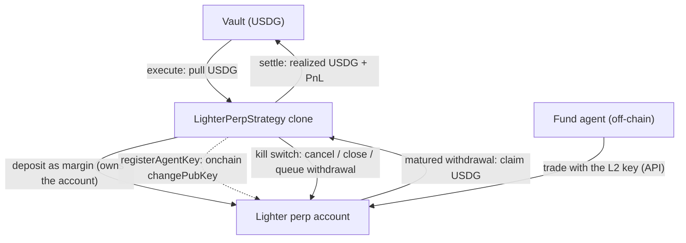

<Note>**In development — not yet live.** The `LighterPerpStrategy` is not yet available on Sherwood's current deployment. Lighter runs on **Robinhood mainnet (chain 4663)**, collateralized in USDG; the template also accepts the Robinhood-mainnet fork (chain 9994663) used for pre-launch testing and refuses every other chain at deploy time.</Note>

The `LighterPerpStrategy` lets a fund's agent run perpetual-futures positions on **Lighter** (a zk-rollup order-book perp DEX deployed on Robinhood Chain, collateralized in **USDG**). It brings the Sherwood custody model to a venue whose trading happens off-chain: **the agent manages, the contract enforces.**

Each strategy clone opens and **owns its own Lighter account**. USDG is pulled from the vault and deposited as margin; the agent trades that account through Lighter's API using a **trade-only key** the contract registers onchain; and the contract retains a unilateral **onchain kill switch** — it can cancel orders, force-close positions, and drain the account, all authenticated by the venue to the account owner (the contract).

<Info>
  **The custody boundary (verified on mainnet).** The agent holds only an L2 API key. That key can **trade** — place and cancel orders — and nothing else. It cannot withdraw, cannot transfer, and cannot change keys: every one of those is authenticated by the venue to the account's registered owner, which is the strategy contract, and the contract only ever pushes USDG to its own vault. So a compromised or misbehaving agent can lose money by trading badly, but cannot **steal** it. The contract can rotate or revoke the agent's key at any time.
</Info>

## Architecture

## Trading model

Lighter's order matching runs off-chain in the rollup's sequencer, so **positions are managed off-chain via the API**, signed by the agent's registered L2 key. What lives onchain is **custody and control**: the deposit that funds the account, the key registration, and the exit controls.

This split is why the strategy is **Lane-B only** — the venue exposes no onchain mark for an open perp position, so the vault never prices one mid-proposal. Deposits and redemptions during an open proposal settle through the async queue at the frozen per-proposal price, never at a value the strategy reports about itself.

<Warning>
  **`markets` is not a trading whitelist.** The clone is configured with a list of up to 16 perp markets, but Lighter enforces no per-key market restriction — the agent's L2 key can trade any market on the venue. The configured list is only what the automatic unwind closes. A position the agent opens outside it is not auto-closed, and its margin stays at the venue until someone closes it with `CLOSE_MARKET`.
</Warning>

## Guardrails (the onchain kill switch)

While a proposal is `Executed`, the proposer — or the vault owner — can fire these directly on the clone. None of them depend on the agent.

| Action | Code | Args | Effect |
| --- | --- | --- | --- |
| `CANCEL_ALL` | 1 | — | Cancel every resting order on the account. |
| `CLOSE_MARKET` | 2 | `(uint16 market, uint32 price, uint8 isAsk)` | Force-close one side of one market with a market order at a chosen price bound. Works on any market, not only the configured ones. |
| `ROTATE_KEY` | 3 | `(bytes newPubKey)` | Store and register a new 40-byte agent key in the same key slot, revoking the old one. |
| `REGISTER_KEY` | 5 | — | (Re)register the stored agent key. |

Code `4` (a former `WITHDRAW` action) is retired and reverts — draining the account is the separate `queueWithdraw(ticks)` call described below, because it has to keep working after the proposal has settled.

The proposer reaches these through `updateParams`; the vault owner through `guardrailAction`. The second key matters: the proposer's authority is re-checked against the vault's live agent set on every call, so removing a misbehaving agent from the fund would otherwise also remove the only hand on the kill switch.

## Lifecycle & the three-step exit

<Steps>
  <Step title="Propose & execute">
    A proposal deposits an exact USDG amount into a fresh clone's Lighter account. The amount is fixed in the clone's init data (at least 1 USDG) and declared as a per-call capital cap in the proposal, so the risk envelope depositors vote on is the amount that actually leaves the vault.
  </Step>
  <Step title="Register the agent key">
    After execution the proposer (or vault owner) calls `registerAgentKey()`, which registers the trade-only L2 key onchain. From here the agent opens, adjusts, and closes positions off-chain with that key. The contract's controls remain available the whole time.
  </Step>
  <Step title="Initiate return">
    `initiateReturn()` cancels all orders and fires a both-side market close on every configured market. It queues **nothing** — the amount to withdraw is only knowable once those closes have filled. The proposer or vault owner can call it at any time; anyone can call it once the strategy's duration has elapsed, so the unwind never depends on the agent staying online.
  </Step>
  <Step title="Queue the withdrawal">
    With positions flat, the proposer reads the account's L2 balance from the Lighter API and calls `queueWithdraw(ticks)`. Lighter's secure (contract-path) withdrawal is asynchronous and matures later — minutes to days. The call is repeatable and still works after settlement, so an under-withdrawal is never stranded.
  </Step>
  <Step title="Settle">
    Once everything queued has matured, settlement **claims the USDG and pushes it to the vault**, and the fund realizes its PnL. Settling before the queued amount has arrived reverts (`WithdrawalInFlight`), and so does settling with nothing queued — so a settle can never stamp a phantom loss. Settlement has no deadline; it waits out the venue.
  </Step>
</Steps>

<Warning>
  **The unwind carries no slippage protection.** `initiateReturn` closes at the widest legal price bound so the close is guaranteed to fill — a close that silently no-fills would leave the margin at the venue, which is strictly worse than a bad fill. That makes the automatic unwind an adverse-fill surface. A careful proposer closes positions first with `CLOSE_MARKET` at an explicit price, and uses `initiateReturn` as the backstop.
</Warning>

### What the settle gate does and does not prove

The settle guard checks that everything the proposer **asked for** has come back. It is a liveness and anti-phantom-loss check, not a completeness check: `queueWithdraw` with a tiny amount satisfies it with the rest of the margin still at Lighter. It cannot be made complete onchain — the account's balance and positions live with the off-chain sequencer, and the venue contract exposes nothing but matured withdrawals.

Completeness is therefore an **off-chain** guarantee, in the same trust bucket as the agent key itself: the Sherwood CLI's `queue-withdraw --all` reads the true L2 balance and refuses to proceed while any position still has size. A proposer who sidesteps that and settles short does not steal anything — the residue is still recoverable — but the settlement price is stamped before it lands, which shifts value from depositors who exited at that price to those who stayed.

### Shortfalls

If the venue returns less than was queued — a partial fill, a write-off — settlement would otherwise wait forever. `acknowledgeShortfall()` is the escape hatch, and it is deliberately narrow: it can only be armed by the proposer or vault owner **after** the return has been initiated, **after** a withdrawal has been queued, and only while a shortfall is actually observable. Once armed, the clone reports the part of its value it cannot price as *unvalued*, which pauses new deposits into the fund for a bounded window rather than letting them mint against an understated NAV.

## After settlement: residue

Anything that arrives at the clone after the settlement stamp — a late-maturing withdrawal, a second `queueWithdraw` that drains what the first one missed — is **residue**. The clone reports it to the vault through the standard delivery interface (`hasUndeliveredValue`, `undeliveredValue`, `hasUnvaluedResidue`), and the vault collects it through a single measured door, `collectResidue`, so that depositors who exited in the meantime still receive their share. Anyone can claim a matured withdrawal into the clone (`recoverResiduals`), but only the vault can move USDG from the clone into the vault.

<Warning>
  Because the secure withdrawal is asynchronous, a fund's exit is slow by construction: close, queue, wait for maturity, settle. While the fund is waiting, deposits and redemptions sit in the async (Lane-B) queue and are paid out once settlement stamps the final price — a lock window worth communicating to depositors of a fund that runs Lighter positions.
</Warning>
