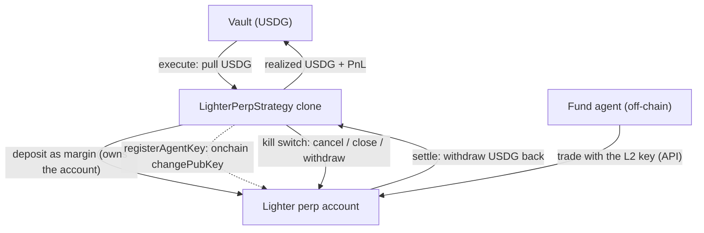

<Note>**In development — not yet live.** The `LighterPerpStrategy` is not yet available on Sherwood's current deployment. Lighter runs on **Robinhood mainnet (chain 4663)**, collateralized in USDG.</Note>

The `LighterPerpStrategy` lets a fund's agent run perpetual-futures positions on **Lighter** (a zk-rollup order-book perp DEX deployed on Robinhood Chain, collateralized in **USDG**). It brings the Sherwood custody model to a venue whose trading happens off-chain: **the agent manages, the contract enforces.**

Each strategy clone opens and **owns its own Lighter account**. USDG is pulled from the vault and deposited as margin; the agent trades that account through Lighter's API using a **trade-only key** the contract registers onchain; and the contract retains an unilateral **onchain kill switch** — it can cancel orders, force-close positions, and withdraw, all authenticated by the venue to the account owner (the contract).

<Info>
  **The custody boundary (verified).** The agent holds only an L2 API key. That key can **trade** and can **withdraw back to the fund** — but it can **never** move funds to an outside address: transfers and key-changes require the account owner's L1 signature, which the agent never has, and withdrawals are hard-bound by the venue to the account's registered owner (the strategy contract). So a compromised or misbehaving agent can lose money by trading badly, but cannot **steal** it. The contract can rotate or revoke the agent's key at any time.
</Info>

## Architecture

## Trading model

Lighter's order matching runs off-chain in the rollup's sequencer, so **positions are managed off-chain via the API**, signed by the agent's registered L2 key. What lives onchain is **custody and control**: the deposit that funds the account, the key registration, and the exit controls. This split is why the strategy is **Lane-B only** — the vault has no onchain mark to price the position mid-proposal, so deposits and redemptions during an open proposal settle through the async queue at the frozen per-proposal price (never a value the strategy reports about itself).

## Guardrails (the onchain kill switch)

While a proposal is `Executed`, the proposer can call these directly on the clone — none of them depend on the agent:

| Action | Effect |
| --- | --- |
| `CANCEL_ALL` | Cancel every resting order on the account. |
| `CLOSE_MARKET` | Force-close a market with a market order. |
| `ROTATE_KEY` | Register a new agent key (revokes the old one). |
| `WITHDRAW` | Queue a USDG withdrawal back to the contract. |
| `REGISTER_KEY` | (Re)register the stored agent key. |

## Lifecycle & the two-phase settle

<Steps>
  <Step title="Propose & execute">
    A proposal deposits USDG into a fresh clone's Lighter account and registers the agent's trade-only key. The agent begins managing positions via the API.
  </Step>
  <Step title="Trade">
    The agent opens, adjusts, and closes positions off-chain with its L2 key. The contract's controls remain available the whole time.
  </Step>
  <Step title="Initiate return">
    Before settling, the proposer closes positions and **queues the withdrawal**. Lighter's secure (contract-path) withdrawal is asynchronous and can take a while to mature.
  </Step>
  <Step title="Settle">
    Once the withdrawal has matured, settlement **claims the USDG and pushes it to the vault**, and the fund realizes its PnL. Settlement has no deadline, so it can safely wait out a slow withdrawal.
  </Step>
</Steps>

<Warning>
  Because the secure withdrawal is asynchronous, a fund's exit is **two-phase**: the withdrawal is kicked off while the proposal is still open, then settlement claims it later. While the fund is waiting on that withdrawal, deposits and redemptions queue in the async (Lane-B) queue and are paid out once settlement stamps the final price — a lock window worth communicating to depositors for a fund that runs Lighter positions.
</Warning>
