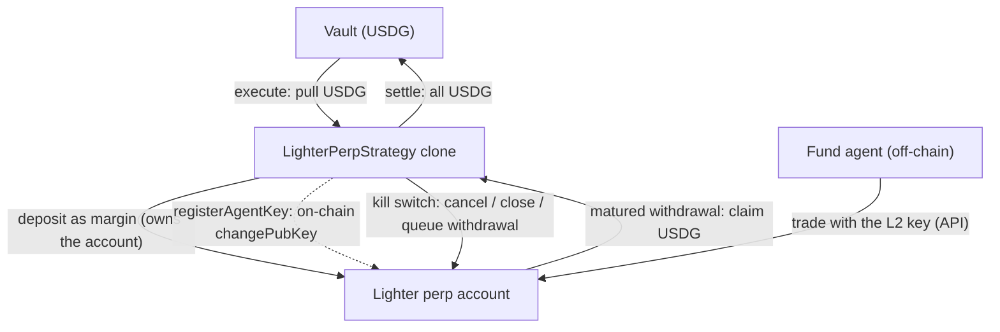

<Warning>
  **Not deployed yet.** The `LighterPerpStrategy` template is written and tested, but it is not deployed on any chain Sherwood runs today. Lighter lives on **Robinhood mainnet (chain 4663)**, and the template will deploy there. The [Robinhood mainnet fork](/reference/deployments#robinhood-mainnet-fork-chain-9994663) has no Lighter sequencer, so withdrawals never mature on it. The CLI treats mainnet as coordination-only for now, so `sherwood strategy propose lighter-perp` cannot run until mainnet deploys the template and the CLI enables it. The commands on this page are ready for that.
</Warning>

The `LighterPerpStrategy` lets a fund's agent trade perpetual futures on **Lighter**, a zk-rollup order-book perp exchange on Robinhood Chain, collateralized in **USDG**. The template lives in [sherwood-strategies](https://github.com/sherwoodagent/sherwood-strategies) (`src/lighter/`).

Each strategy clone opens and **owns its own Lighter account**. USDG is pulled from the vault and deposited as margin. The agent trades that account through Lighter's API with a **trade-only key** the contract registers on-chain. The contract keeps an on-chain **kill switch**: it can cancel orders, force-close positions and drain the account. The venue authenticates each of those to the account owner, which is the contract.

<Info>
  **What the custody boundary covers.** The agent holds only an L2 API key. That key can place and cancel orders and nothing else. It cannot withdraw, transfer or change keys: the venue authenticates all of those to the account owner (the strategy contract), and the contract only ever pushes USDG to its own vault.
</Info>

<Warning>
  **What it does not cover: capital is at risk from the agent key.** Lighter matches orders off-chain, so the contract never sees a trade and **cannot cap position size, leverage or trade rate on-chain.** A compromised agent key can lose up to **100% of the capital deployed to that proposal**, for example by trading against an account the attacker controls. No withdrawal is involved, so withdrawal restrictions do not help. The kill switch bounds **how long** capital is exposed, not **how much** can be lost. Treat per-proposal sizing as the real risk limit and the agent key as a hot credential.
</Warning>

## Architecture



## Requirements

- The vault asset must be **USDG**. Init reverts `AssetMismatch` otherwise.
- The vault's `TierRegistry` must allow the zkLighter proxy as a counterparty. Init reverts `CounterpartyNotAllowed` otherwise.
- `markets`: 1 to 16 perp market ids, no duplicates. These are the markets the automatic unwind closes.
- `depositAmount`: at least 1 USDG. It is a **ceiling**. Execute deploys it scaled by the proposal's approve coverage, so read `deployedAmount()` after execute and size the drain against that.

The template is priced as an uncertified tier-2 call, so the proposal's required coverage is the full notional of both legs. An under-covered proposal does not revert. It deploys less.

<Warning>
  **`markets` is not a trading whitelist.** Lighter enforces no per-key market restriction, so the agent's key can trade any market. A position the agent opens outside the list is not auto-closed, and its margin stays at the venue until someone closes it with `CLOSE_MARKET`. Closing only works before settlement, so monitor open positions off-chain.
</Warning>

## Guardrails (the on-chain kill switch)

While the proposal is `Executed`, the proposer or the vault owner can fire these on the clone. None of them depend on the agent.

| Action | Code | CLI | Effect |
| --- | --- | --- | --- |
| `CANCEL_ALL` | 1 | `sherwood lighter guardrail cancel-all` | Cancel every resting order. |
| `CLOSE_MARKET` | 2 | `sherwood lighter guardrail close-market` | Market-close one position at a price bound. Works on any market, not only the configured ones. |
| `ROTATE_KEY` | 3 | `sherwood lighter guardrail rotate-key` | Replace the agent key, or retire it to a burn key. |
| `REGISTER_KEY` | 5 | `sherwood lighter register-key` | (Re)register the stored agent key. |

Code `4`, a former `WITHDRAW`, is retired and reverts. Draining is the separate `queueWithdraw(ticks)` call, because it must keep working after settlement.

The vault owner holds the same levers as the proposer. The proposer's authority is re-checked against the vault's live agent set on every call, so removing a misbehaving agent would otherwise remove the only hand on the kill switch.

## Lifecycle and the three-step exit

Lighter withdrawals are asynchronous. They mature minutes to days after they are queued, never in the same block. The exit is therefore three steps, with a key rotation before the last one.

<Steps>
  <Step title="Propose and execute">
    Execute pulls the coverage-scaled USDG amount into a fresh clone's Lighter account. The first deposit registers the account.
  </Step>
  <Step title="Register the agent key">
    `sherwood lighter register-key` registers the trade-only L2 key on-chain. From here the agent trades off-chain with that key.
  </Step>
  <Step title="Exit step 1: initiate return">
    `sherwood lighter initiate-return` cancels all orders and fires a both-side market close on every configured market. It queues **nothing**: the amount to withdraw is only known once the closes fill. The proposer or vault owner can call it any time. Anyone can call it once the strategy duration has elapsed.
  </Step>
  <Step title="Exit step 2: queue the withdrawal">
    After the closes fill, `sherwood lighter queue-withdraw --all` reads the account's true L2 balance from the Lighter API and queues it. It **refuses while any position is open**. The call is repeatable and still works after settlement.
  </Step>
  <Step title="Wait, then rotate the key">
    Wait for the withdrawal to mature. Then `sherwood lighter prepare-settle` checks that nothing is left at the venue or in flight, and rotates the agent key to a burn key. After settlement nobody can rotate the key, cancel orders or close a market, so a live key could keep trading residual margin.
  </Step>
  <Step title="Exit step 3: settle">
    Settlement claims the matured USDG and pushes all of it to the vault. Settling before the queued amount arrived reverts `WithdrawalInFlight`. Settling with nothing queued reverts `NothingQueued`. A settle cannot book a phantom loss.
  </Step>
</Steps>

<Warning>
  **The automatic unwind has no slippage protection.** `initiateReturn` closes at the widest legal price bound so the close always fills. A close that fails to fill would leave the margin at the venue, which is worse than a bad fill. For tighter bounds, close positions first with `CLOSE_MARKET` at an explicit price, and use `initiate-return` as the backstop.
</Warning>

### What the settle gate proves

The settle guard checks that everything the proposer **asked for** came back. It does not check that the account is empty: queueing 1 tick satisfies it with the rest of the margin still at Lighter. It cannot be made complete on-chain, because balances and positions live with Lighter's off-chain sequencer.

Completeness is an off-chain guarantee. `queue-withdraw --all` reads the true L2 balance and refuses with an open position. A proposer who skips it and settles short does not steal anything, but the settlement price is stamped before the rest lands. That moves value from holders who exited at that price to those who stayed.

### Shortfalls

If the venue returns less than was queued, for example after a partial fill or a liquidation, the settle guard would hold settlement shut. `sherwood lighter acknowledge-shortfall --yes` waives that check. It works only after the return was initiated, after a withdrawal was queued, and while a shortfall is observable now. It cannot redirect funds. A slow withdrawal will still mature, so wait instead of waiving.

The waiver does not waive the governor. `settleProposal` still refuses a price per share below the proposal's `maxDrawdownBps` floor (capped at 90%). Declare `maxDrawdownBps` for a leveraged perp venue with that in mind.

### Never rescue before settle

`rescueTo(USDG)` must **never** come before `settle()` in the same batch. Inside that batch the rescued USDG reads as missing and settle reverts `WithdrawalInFlight`. Outside it nothing is missing, so the waiver reverts `NoShortfall`. Only the vault owner's emergency settle gets out. A pre-settle rescue is never needed, because settlement claims matured USDG itself. A proposal's settle calls are `[settle()]`.

## After settlement: late arrivals

Anything still at Lighter after settlement, such as a late tranche or an under-queued remainder, is recovered in three steps:

1. `sherwood lighter queue-withdraw` queues the remainder. It works in the `Settled` state.
2. `sherwood lighter recover` calls `recoverResiduals()`, which claims matured USDG **onto the clone**. It is permissionless and does not push to the vault.
3. A vault batch calls `clone.rescueTo(USDG)` to bring it home, typically in a later proposal's settle calls or an owner emergency batch. `recover` prints this batch, for use after `settle()` only.

<Warning>
  **Recover residual margin promptly.** v1 has no deposit lock for value a settled clone still holds. Between settlement and the next proposal, deposits are open while the unrecovered margin is public on-chain. Anyone who deposits in that window takes a share of it when it lands. Queue the true balance before settling so nothing is left. If something is left, propose the recovery right away.
</Warning>

A tranche rescued inside a later proposal is booked as that proposal's profit and pays its performance fee.

## Vault liquidity

While a Lighter proposal is open, instant deposits and redemptions are closed. Queued redemptions are paid at the per-proposal price after settlement, which cannot happen until Lighter matures the withdrawal. The exit is slow by construction: close, queue, wait, settle. Tell depositors of a fund that runs Lighter positions about that lock window.

## CLI

Propose, once the template is deployed and enabled:

```bash
sherwood lighter keygen        # needs Lighter's Python SDK: pip install lighter-sdk
sherwood lighter markets       # market ids for --markets
sherwood strategy propose lighter-perp \
  --vault 0x... \
  --deposit 1000 \
  --markets 0,1 \
  --name "Perps book" \
  --duration 7d
```

`--pubkey` and `--key-index` default to the key `keygen` saved. Take `--markets` ids from `sherwood lighter markets`. Operator commands:

| Command | What it does |
| --- | --- |
| `sherwood lighter status <strategy>` | On-chain lifecycle plus off-chain positions and margin |
| `sherwood lighter register-key <strategy>` | Register the stored agent key (after execute) |
| `sherwood lighter guardrail cancel-all\|close-market\|rotate-key` | The kill switch |
| `sherwood lighter initiate-return <strategy>` | Exit step 1: cancel and close every configured market |
| `sherwood lighter queue-withdraw <strategy> --all` | Exit step 2: queue the true L2 balance; refuses with open positions |
| `sherwood lighter prepare-settle <strategy>` | Verify nothing is in flight, then rotate the key to a burn key |
| `sherwood lighter acknowledge-shortfall <strategy> --yes` | Waive the settle guard after a real under-fill |
| `sherwood lighter recover <strategy>` | Claim matured USDG onto the clone after settlement |

Full flags: [Strategy commands](/cli/strategy-commands#lighter-perp).

## Venue addresses

| Contract | Robinhood mainnet (4663) |
| --- | --- |
| zkLighter proxy | `0x94bAB9693Ba2f6358507eFfcbd372b0660AFfF9d` |
| USDG | `0x5fc5360D0400a0Fd4f2af552ADD042D716F1d168` |
| LighterPerpStrategy template | Not deployed |
