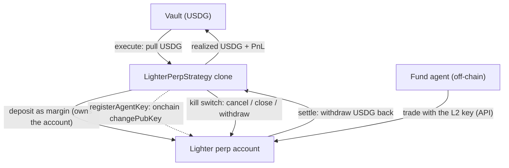

<Note>**In development — not yet live.** The `LighterPerpStrategy` is not yet available on Sherwood's current deployment. Lighter runs on **Robinhood mainnet (chain 4663)**, collateralized in USDG.</Note>

The `LighterPerpStrategy` lets a fund's agent run perpetual-futures positions on **Lighter** (a zk-rollup order-book perp DEX deployed on Robinhood Chain, collateralized in **USDG**). It brings the Sherwood custody model to a venue whose trading happens off-chain: **the agent manages, the contract enforces.**

Each strategy clone opens and **owns its own Lighter account**. USDG is pulled from the vault and deposited as margin; the agent trades that account through Lighter's API using a **trade-only key** the contract registers onchain; and the contract retains an unilateral **onchain kill switch** — it can cancel orders, force-close positions, and withdraw, all authenticated by the venue to the account owner (the contract).

<Info>
  **What the custody boundary does cover.** The agent holds only an L2 API key. That key **cannot move funds to an outside address** by transfer or withdrawal: transfers and key-changes require the account owner's L1 signature, which the agent never has, and withdrawals are hard-bound by the venue to the account's registered owner — the strategy contract. The contract can rotate or revoke the agent's key at any time, and can cancel, force-close, and withdraw without the agent's cooperation.
</Info>

<Warning>
  **What it does not cover — capital is at risk from the agent key.** Lighter matches orders off-chain, so the strategy contract never sees a trade and **cannot cap position size, leverage, or trade rate onchain.** A compromised agent key can therefore lose up to **100% of the capital deployed to that proposal**, including deliberately — for example by trading against an account the attacker controls at prices that transfer value out. Withdrawal restrictions do not prevent this, because no withdrawal is involved.

  The onchain kill switch bounds **how long** capital is exposed, not **how much** can be lost. The bound on magnitude is the amount deployed to the proposal, so treat per-proposal sizing as the real risk limit — and treat the agent key as a hot credential.
</Warning>

## Architecture

## Trading model

Lighter's order matching runs off-chain in the rollup's sequencer, so **positions are managed off-chain via the API**, signed by the agent's registered L2 key. What lives onchain is **custody and control**: the deposit that funds the account, the key registration, and the exit controls. This split is why the strategy is **Lane-B only** — the vault has no onchain mark to price the position mid-proposal, so deposits and redemptions during an open proposal settle through the async queue at the frozen per-proposal price (never a value the strategy reports about itself).

## Guardrails (the onchain kill switch)

While a proposal is `Executed`, the proposer can call these directly on the clone — none of them depend on the agent:

| Action | Effect |
| --- | --- |
| `CANCEL_ALL` | Cancel every resting order on the account. |
| `CLOSE_MARKET` | Force-close a market with a market order. |
| `ROTATE_KEY` | Register a new agent key (revokes the old one). |
| `WITHDRAW` | Queue a USDG withdrawal back to the contract. |
| `REGISTER_KEY` | (Re)register the stored agent key. |

<Note>
  **The configured market list is the *unwind* list, not a permission boundary.** A proposal names the markets the automatic exit will close, but the venue enforces no per-key market whitelist — the agent key can open a position in **any** Lighter market. A position outside the configured list is not closed by the automatic unwind and must be closed explicitly with `CLOSE_MARKET`, which accepts any market for exactly this reason.
</Note>

## Lifecycle & the staged exit

<Steps>
  <Step title="Propose & execute">
    A proposal deposits USDG into a fresh clone's Lighter account and registers the agent's trade-only key. The agent begins managing positions via the API.
  </Step>
  <Step title="Trade">
    The agent opens, adjusts, and closes positions off-chain with its L2 key. The contract's controls remain available the whole time.
  </Step>
  <Step title="Close">
    The proposer closes out every configured market. Nothing is withdrawn yet — the closing trades have to actually fill before the account's final balance is known.
  </Step>
  <Step title="Queue the withdrawal">
    Once the closes have filled, the proposer queues the USDG withdrawal for the **observed** balance. Splitting this from the close is deliberate: the closing trades' own profit or loss only exists after they fill, so an amount chosen earlier would systematically leave value behind.
  </Step>
  <Step title="Settle">
    Once the withdrawal matures, settlement **claims the USDG and pushes it to the vault**, and the fund realizes its PnL. Settlement has no deadline, so it can safely wait out a slow withdrawal.
  </Step>
</Steps>

<Note>
  If a withdrawal is queued for less than the account actually holds, the remainder is **not** lost: the withdrawal can be queued again for the difference, and recovery is available even after the proposal has settled.
</Note>

<Warning>
  Because the secure withdrawal is asynchronous, a fund's exit is **staged**: positions are closed, the withdrawal is queued once those closes fill, and settlement claims it later. While the fund is waiting, deposits and redemptions queue in the async (Lane-B) queue and are paid out once settlement stamps the final price — a lock window worth communicating to depositors for a fund that runs Lighter positions.
</Warning>
