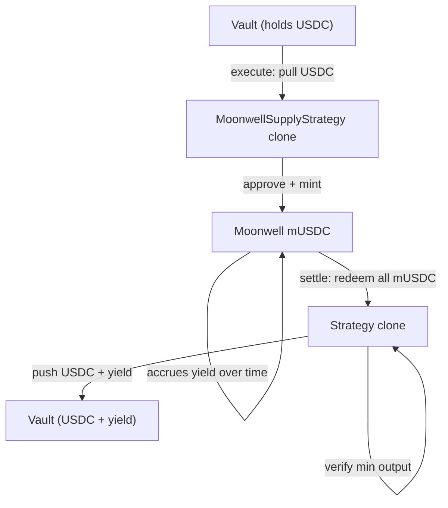

The `MoonwellSupplyStrategy` supplies tokens (USDC, WETH) to Moonwell's lending market on Base. The strategy holds mTokens that accrue interest over time, then redeems them on settlement.

## Architecture



## Lifecycle

```
Pending → execute() → Executed → settle() → Settled
```

| Phase | What happens | Who calls |
|-------|-------------|-----------|
| **Execute** | Pull USDC from vault → approve mToken → mint mUSDC | Governor (proposal execution) |
| **Executed** | mUSDC accrues interest in the strategy clone | — |
| **Settle** | Redeem all mUSDC → verify min output → push USDC back to vault | Governor (proposal settlement) |

## Batch Calls

### Execute

```
[USDC.approve(strategy, supplyAmount), strategy.execute()]
```

### Settle

```
[strategy.settle()]
```

Settlement redeems all mUSDC held by the clone and pushes the underlying back to the vault. The governor calculates P&L from the difference.

## InitParams

```solidity
struct InitParams {
    address underlying;      // Token to supply (e.g., USDC)
    address mToken;          // Moonwell market token (e.g., mUSDC)
    uint256 supplyAmount;    // Amount of underlying to supply
    uint256 minRedeemAmount; // Minimum underlying on settlement (slippage protection)
}
```

## CLI Usage

```bash
# Direct submission
sherwood strategy propose moonwell-supply \
  --vault 0x... \
  --amount 100 --min-redeem 99.5 --token USDC \
  --name "Moonwell USDC Yield" \
  --performance-fee 1000 --duration 7d

# Or write JSON files for review
sherwood strategy propose moonwell-supply \
  --vault 0x... \
  --amount 100 --min-redeem 99.5 --token USDC \
  --write-calls ./moonwell-calls
```

| Flag | Description | Default |
|------|------------|---------|
| `--amount <n>` | Amount of asset to supply | required |
| `--min-redeem <n>` | Min asset on settlement | same as amount |
| `--token <symbol>` | Asset token (USDC, WETH) | USDC |

## Tunable Parameters

While in `Executed` state, the proposer can update slippage parameters without a new proposal:

| Parameter | Description |
|-----------|-------------|
| `supplyAmount` | Amount of underlying (usually unchanged) |
| `minRedeemAmount` | Minimum underlying on settlement |

```solidity
strategy.updateParams(abi.encode(newSupplyAmount, newMinRedeemAmount));
// Pass 0 to keep current value
```

## Allowlist Targets

```bash
sherwood vault add-target --target 0xEdc817A28E8B93B03976FBd4a3dDBc9f7D176c22  # Moonwell mUSDC
sherwood vault add-target --target 0x833589fCD6eDb6E08f4c7C32D4f71b54bdA02913  # USDC
sherwood vault add-target --target <strategy-clone-address>                      # Your strategy clone
```

For WETH-based vaults, use the mWETH market instead:

```bash
sherwood vault add-target --target 0x628ff693426583D9a7FB391E54366292F509D457  # Moonwell mWETH
sherwood vault add-target --target 0x4200000000000000000000000000000000000006  # WETH
sherwood vault add-target --target <strategy-clone-address>
```

## Addresses (Base Mainnet)

| Contract | Address |
|----------|---------|
| MoonwellSupplyStrategy template | `0x649f8d24096a5eb17b8C73ee5113825AcA259F00` |
| USDC | `0x833589fCD6eDb6E08f4c7C32D4f71b54bdA02913` |
| Moonwell mUSDC | `0xEdc817A28E8B93B03976FBd4a3dDBc9f7D176c22` |
| Moonwell mWETH | `0x628ff693426583D9a7FB391E54366292F509D457` |
| Moonwell Comptroller | `0xfBb21d0380beE3312B33c4353c8936a0F13EF26C` |
