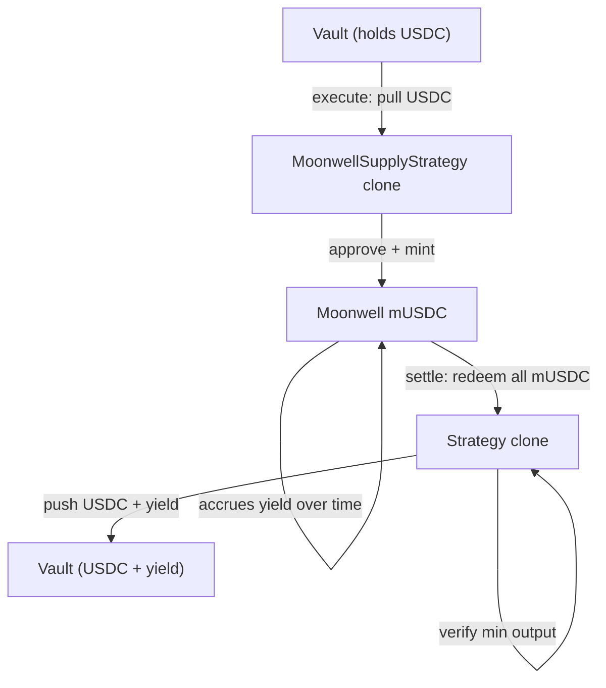

The `MoonwellSupplyStrategy` supplies tokens (USDC, WETH) to Moonwell's lending market on Base. The strategy holds mTokens that accrue interest over time, then redeems them on settlement.

## Architecture


```mermaid
graph TD
    V["Vault (holds USDC)"] -->|"execute: pull USDC"| S["MoonwellSupplyStrategy clone"]
    S -->|"approve + mint"| M["Moonwell mUSDC"]
    M -->|"accrues yield over time"| M
    M -->|"settle: redeem all mUSDC"| S2["Strategy clone"]
    S2 -->|"verify min output"| S2
    S2 -->|"push USDC + yield"| V2["Vault (USDC + yield)"]
```

## Lifecycle

```
Pending → execute() → Executed → settle() → Settled
```

| Phase | What happens | Who calls |
|-------|-------------|-----------|
| **Execute** | Pull USDC from vault → approve mToken → mint mUSDC | Governor (proposal execution) |
| **Executed** | mUSDC accrues interest in the strategy clone | — |
| **Settle** | Redeem all mUSDC → verify min output → push USDC back to vault | Governor (proposal settlement) |

## Batch Calls

### Execute

```
[USDC.approve(strategy, supplyAmount), strategy.execute()]
```

### Settle

```
[strategy.settle()]
```

Settlement redeems all mUSDC held by the clone and pushes the underlying back to the vault. The governor calculates P&L from the difference.

## InitParams

Init data is an **ABI-encoded positional tuple** (not a named struct) decoded in this order:

```solidity
(
    address underlying,       // Token to supply (e.g., USDC)
    address mToken,           // Moonwell market token (e.g., mUSDC)
    uint256 supplyAmount,     // Amount of underlying to supply
    uint256 minRedeemAmount,  // Minimum underlying on settlement (slippage protection)
    bool    isNativeEthMarket // true for native-ETH markets (mWETH) — see below
)
```

`isNativeEthMarket` flags markets like Moonwell `mWETH` that send **native ETH** (not ERC-20 WETH) on redeem. When set, settlement wraps the received ETH back to WETH via `IWETH.deposit` so the vault always receives ERC-20 tokens. On non-native markets it stays `false`, and any stray ETH transfer reverts (`EthWrapFailed`) as a dust-attack guard.

## CLI Usage

```bash
# Direct submission
sherwood strategy propose moonwell-supply \
  --vault 0x... \
  --amount 100 --min-redeem 99.5 --token USDC \
  --name "Moonwell USDC Yield" \
  --performance-fee 1000 --duration 7d

# Or write JSON files for review
sherwood strategy propose moonwell-supply \
  --vault 0x... \
  --amount 100 --min-redeem 99.5 --token USDC \
  --write-calls ./moonwell-calls
```

| Flag | Description | Default |
|------|------------|---------|
| `--amount <n>` | Amount of asset to supply | required |
| `--min-redeem <n>` | Min asset on settlement | same as amount |
| `--token <symbol>` | Asset token (USDC, WETH) | USDC |

## Tunable Parameters

While in `Executed` state, the proposer can update slippage parameters without a new proposal:

| Parameter | Description |
|-----------|-------------|
| `supplyAmount` | Amount of underlying (usually unchanged) |
| `minRedeemAmount` | Minimum underlying on settlement |

```solidity
strategy.updateParams(abi.encode(newSupplyAmount, newMinRedeemAmount));
// Pass 0 to keep current value
```

## Live NAV

Moonwell Supply is one of the strategies that exposes **live NAV**: `positionValue()` returns the current underlying value of the supplied position (`mToken balance * exchangeRateStored`). While a proposal is active, the vault marks shares to market and accepts deposits / withdrawals at fair NAV. New deposits forward through `onLiveDeposit`, which mints additional mTokens against the freshly-pushed underlying.

## Addresses (Base Mainnet)

| Contract | Address |
|----------|---------|
| MoonwellSupplyStrategy template | `0xb9Cd6d6720fc224508A07f0e43254A3cD65770E0` |
| USDC | `0x833589fCD6eDb6E08f4c7C32D4f71b54bdA02913` |
| Moonwell mUSDC | `0xEdc817A28E8B93B03976FBd4a3dDBc9f7D176c22` |
| Moonwell mWETH | `0x628ff693426583D9a7FB391E54366292F509D457` |
| Moonwell Comptroller | `0xfBb21d0380beE3312B33c4353c8936a0F13EF26C` |
