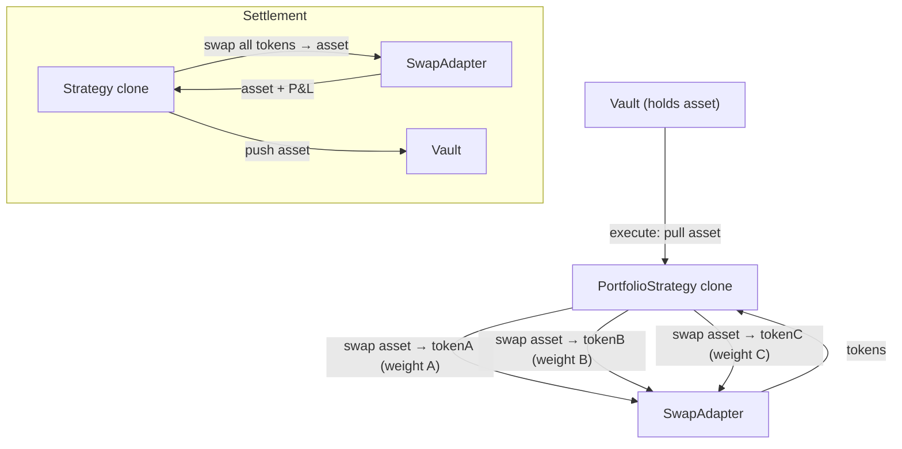

The `PortfolioStrategy` manages a weighted basket of up to 20 tokens. On execute it swaps the vault's asset into each token at the target weight; on settle it sells everything back to the asset. The proposer can rebalance at any time while the proposal is `Executed`, either by selling everything and re-buying at current weights or by using Chainlink Data Streams prices to swap only the deltas (gas-efficient).

Swaps go through `UniswapSwapAdapter` (Base) or `SynthraSwapAdapter` / `SynthraDirectAdapter` (Robinhood L2). The Uniswap adapter auto-detects routes: it tries direct asset→token pools at multiple fee tiers first, and falls back to an asset→WETH→token multi-hop when no direct pool exists — this is how you can hold tokens without liquid USDC pairs.

## Architecture



## Lifecycle

```
Pending → execute() → Executed → (rebalance?) → settle() → Settled
```

| Phase | What happens | Who calls |
|-------|-------------|-----------|
| **Execute** | Pull asset → swap to each basket token at target weight (via SwapAdapter) | Governor (proposal execution) |
| **Executed** | Proposer can `rebalance()`, `rebalanceDelta(reports)`, or update weights/slippage | Proposer |
| **Settle** | Swap all tokens back to asset → push to vault | Governor (proposal settlement) |

## Batch Calls

### Execute

```
[asset.approve(strategy, totalAmount), strategy.execute()]
```

### Settle

```
[strategy.settle()]
```

## InitParams

```solidity
struct InitParams {
    address asset;               // Vault asset (USDC on Base, WETH on Robinhood L2)
    address swapAdapter;         // UniswapSwapAdapter or SynthraSwapAdapter
    address chainlinkVerifier;   // Optional — required only for rebalanceDelta
    TokenAllocation[] allocations; // token + targetWeightBps[] (sum = 10000)
    uint256 totalAmount;         // Total asset to deploy
    uint256 maxSlippageBps;      // Per-swap slippage cap (default: 500)
}
```

- Max basket size: **20 tokens**
- Weights are in basis points and **must sum to 10000**
- `maxSlippageBps` applies to every swap (entry, settle, and rebalance)

## Rebalancing

While the proposal is `Executed`, the proposer can rebalance two ways:

| Method | Gas cost | When to use |
|--------|----------|-------------|
| `rebalance()` | High — sells all, re-buys at current weights | Weights changed, or simple periodic rebalance |
| `rebalanceDelta(ChainlinkReport[])` | Low — swaps only the deltas | Frequent rebalances with fresh oracle prices |

`rebalanceDelta` reads a Chainlink Data Streams V3 report for each token; reports older than 5 minutes are rejected. This path is only available on chains with a Chainlink verifier proxy.

## Tunable Parameters (Executed state)

| Parameter | Description |
|-----------|-------------|
| `targetWeightBps` | Per-token target weight (must still sum to 10000) |
| `maxSlippageBps` | Per-swap slippage cap |
| `swapExtraData` | Per-token extra data for the swap adapter (e.g. path override, fee tier) |

## Risk Notes

- **Swap impact:** Large allocations in thin pools can eat into P&L — set `maxSlippageBps` conservatively.
- **Oracle staleness:** `rebalanceDelta` rejects reports older than 5 minutes. If the feed goes stale, fall back to the full `rebalance()`.
- **Settle path:** `settle()` sells every token back to asset in a single transaction. A single illiquid token can revert the entire settlement; the proposer can update `swapExtraData` before settlement to route around it.

## CLI Usage

```bash
sherwood strategy propose portfolio \
  --vault 0x... \
  --amount 10000 \
  --tokens TSLA,AMZN,PLTR,NFLX,AMD \
  --weights 2500,2500,2000,1500,1500 \
  --max-slippage 500 \
  --name "Stock Basket" \
  --performance-fee 1000 --duration 7d
```

| Flag | Description | Default |
|------|------------|---------|
| `--amount <n>` | Total asset to allocate | required |
| `--tokens <list>` | Comma-separated token addresses or symbols | required |
| `--weights <list>` | Comma-separated weights in bps (sum = 10000) | required |
| `--max-slippage <bps>` | Per-swap slippage cap | 500 |
| `--fee-tier <n>` | Uniswap V3 pool fee tier | 3000 |
| `--swap-adapter <address>` | Override swap adapter address | auto-detected |

## Addresses

| Contract | Base | Robinhood L2 Testnet |
|----------|------|---------------------|
| PortfolioStrategy template | `0x7865eEA4063c22d0F55FdD412D345495c7b73f64` | `0xAe981882923E0C76A7F10E7cAa3782023c0abd9B` |
| Swap adapter | `0x121AaC2B96Ec365e457fcCc1C2ED5a6142064069` (Uniswap) | `0x39a37537E179919cb2dDDb1D6920dD11bAf3aDF0` (Synthra) |
| Chainlink Verifier Proxy | `0xDE1A28D87Afd0f546505B28AB50410A5c3a7387a` | `0x72790f9eB82db492a7DDb6d2af22A270Dcc3Db64` |
