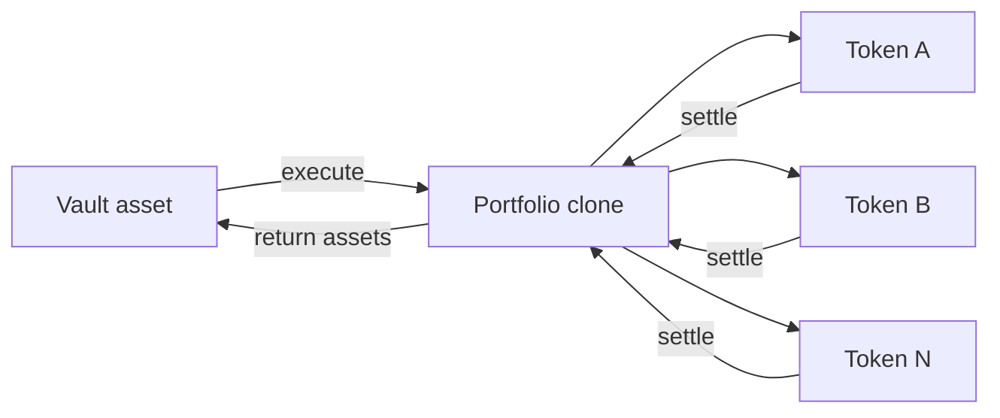

Portfolio is the only strategy template deployed on Robinhood L2 Testnet. A Portfolio clone buys a weighted token basket when its proposal executes and sells the basket back to the vault asset when the proposal settles.


```mermaid
flowchart LR
    A[Vault asset] -->|execute| B[Portfolio clone]
    B --> C[Token A]
    B --> D[Token B]
    B --> E[Token N]
    C -->|settle| B
    D -->|settle| B
    E -->|settle| B
    B -->|return assets| A
```

## Configuration

Each clone stores immutable initialization choices for one proposal path.

| Field | Rule |
| --- | --- |
| Basket tokens | 1 to 20 unique, nonzero token addresses |
| Target weights | One weight per token, totaling `10000` basis points |
| Amount | Nonzero amount of the vault asset |
| Swap adapter | Nonzero approved adapter address |
| Slippage | Greater than `0` and less than `10000` basis points |
| Swap route data | One encoded route per token |
| Price metadata | One feed identifier and decimals value per token |

## Execution and settlement

<Steps>
  <Step title="Clone and initialize">
    `StrategyFactory` creates an isolated Portfolio clone and binds its asset, proposer, basket, routes, feeds, and risk parameters.
  </Step>
  <Step title="Approve through governance">
    Shareholders vote on calls that approve the asset amount and invoke the clone.
  </Step>
  <Step title="Buy the basket">
    On execution, the clone pulls the approved amount from the vault and swaps it according to the target weights.
  </Step>
  <Step title="Operate within the strategy window">
    The proposer can use the allowed rebalance functions while the proposal is in the executed state.
  </Step>
  <Step title="Sell and settle">
    Settlement sells basket balances back to the vault asset and returns the result to the vault.
  </Step>
</Steps>

## Rebalancing

Portfolio supports two paths:

- `rebalance()` sells the current basket and buys it again at the current target weights.
- `rebalanceDelta()` uses verified Chainlink prices to trade only overweight and underweight amounts.

Only the proposal's configured proposer can rebalance, and only while the strategy is executed. Price reports must match the feed bound to each basket slot.

## Current route limitation

<Warning>
  The CLI's Robinhood testnet registry currently has no verified default stock routes. Token symbols alone are not enough to build a safe proposal. You must supply and independently verify each swap route and feed configuration. A deployed template does not guarantee that a particular basket has executable liquidity.
</Warning>

Before proposing a basket:

1. Confirm the token contract on chain `46630`.
2. Verify liquidity for the complete entry and exit route.
3. Confirm the adapter can quote that route.
4. Match each token to the correct Chainlink feed and decimals.
5. Simulate both execution and settlement calls.
6. Set slippage from observed liquidity, not from a generic default.

## Operator commands

```bash
sherwood strategy list
sherwood strategy status <clone-address>
sherwood strategy rebalance <clone-address>
```

Use `--json` with `strategy status` when an agent needs machine-readable balances, drift, and profit or loss.
