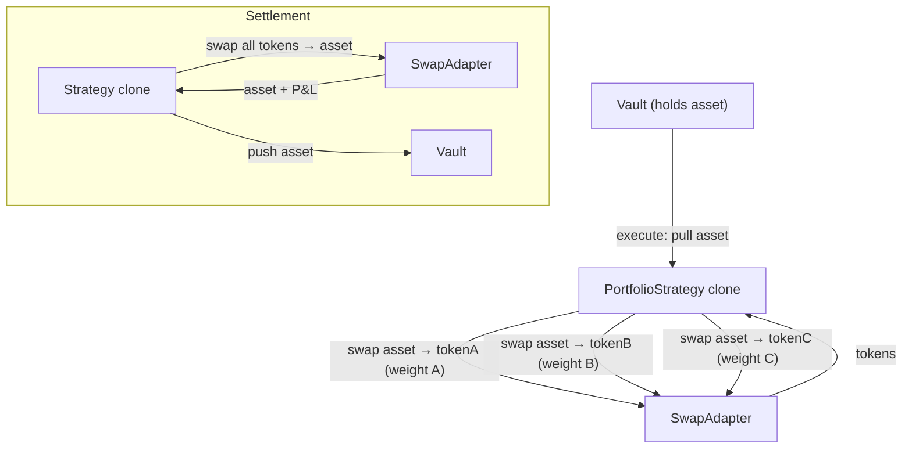

The `PortfolioStrategy` manages a weighted basket of up to 20 tokens. On execute it swaps the vault's asset into each token at the target weight; on settle it sells everything back to the asset. The proposer can rebalance at any time while the proposal is `Executed`, either by selling everything and re-buying at current weights or by using Chainlink Data Streams prices to swap only the deltas (gas-efficient).

Swaps go through `UniswapSwapAdapter` (Base) or `SynthraSwapAdapter` / `SynthraDirectAdapter` (Robinhood L2). Route selection is done **CLI-side**: the CLI probes direct asset→token pools at multiple fee tiers and falls back to an asset→WETH→token multi-hop when no direct pool exists, then encodes the chosen route into each token's `swapExtraData`. The on-chain `UniswapSwapAdapter` does not auto-detect — it reads a leading mode byte from `extraData` and executes exactly that route. This is how you can hold tokens without liquid USDC pairs.

### `swapExtraData` encoding

`extraData` is a 1-byte mode prefix followed by the mode's ABI-encoded route data:

| Mode | Route | Encoding (`bytes1(mode)` ‖ `abi.encode(...)`) |
|------|-------|-----------------------------------------------|
| `0` | V3 single-hop | `bytes1(0x00)` ‖ `abi.encode(uint24 fee)` |
| `1` | V3 multi-hop | `bytes1(0x01)` ‖ `abi.encode(bytes v3Path, uint16 perHopSlippageBps)` |

<Warning>
**Mode-1 carries `perHopSlippageBps` — manual integrators must include it.** For a multi-hop route the adapter pre-quotes each hop via `quoter.quoteExactInputSingle(...)` and floors each non-terminal hop's output at `quoted * (10000 - perHopSlippageBps) / 10000` (`perHopSlippageBps` must be ≤ 10000). Omitting the trailing `uint16` makes the adapter's `abi.decode(routeData, (bytes, uint16))` revert. The CLI sets this for you; only hand-encoded `swapExtraData` needs to supply it. (Sherlock run-2 #11 / PR #354.)
</Warning>

## Architecture



## Lifecycle

```
Pending → execute() → Executed → (rebalance?) → settle() → Settled
```

| Phase | What happens | Who calls |
|-------|-------------|-----------|
| **Execute** | Pull asset → swap to each basket token at target weight (via SwapAdapter) | Governor (proposal execution) |
| **Executed** | Proposer can `rebalance()`, `rebalanceDelta(reports)`, or update weights/slippage | Proposer |
| **Settle** | Swap all tokens back to asset → push to vault | Governor (proposal settlement) |

## Batch Calls

### Execute

```
[asset.approve(strategy, totalAmount), strategy.execute()]
```

### Settle

```
[strategy.settle()]
```

## InitParams

Init data is an **ABI-encoded positional tuple** (not a named struct). Tokens, weights, swap data, and price-feed decimals are passed as **parallel arrays** (same length, same order), not as a `TokenAllocation[]`:

```solidity
(
    address   asset,            // Vault asset (USDC on Base, WETH on Robinhood L2)
    address   swapAdapter,      // UniswapSwapAdapter or SynthraSwapAdapter
    address   chainlinkVerifier,// Used by rebalanceDelta / live-NAV; pass address(0) to opt out
    address[] tokens,           // Basket tokens
    uint256[] weightsBps,       // Target weight per token in bps (sum = 10000)
    uint256   totalAmount,      // Total asset to deploy
    uint256   maxSlippageBps,   // Per-swap slippage cap — REQUIRED, 1–9999 bps
    bytes[]   swapExtraData,    // Per-token adapter route data (mode byte + encoded path)
    uint8[]   priceDecimals     // Per-token Chainlink feed scale (8 for stocks, 18 for crypto)
)
```

- Max basket size: **20 tokens**
- Weights are in basis points and **must sum to 10000**
- `maxSlippageBps` applies to every swap (entry, settle, and rebalance). It is **required**: initialization reverts with `InvalidSlippage` if it is `0` or `>= 10000`. (The `500` you see in CLI examples is a CLI-side default, not a contract default.)
- `priceDecimals[i]` must be `<= 36` (`InvalidPriceDecimals` otherwise) so the decimal-scaling math in live NAV stays safe.

## Rebalancing

While the proposal is `Executed`, the proposer can rebalance two ways:

| Method | Gas cost | When to use |
|--------|----------|-------------|
| `rebalance()` | High — sells all, re-buys at current weights | Weights changed, or simple periodic rebalance |
| `rebalanceDelta(ChainlinkReport[])` | Low — swaps only the deltas | Frequent rebalances with fresh oracle prices |

`rebalanceDelta` reads a signed Chainlink Data Streams V3 report for each token and rejects any report past its own `expiresAt` timestamp (`StalePrice`). The separate 5-minute `MAX_PRICE_AGE` window gates the **live-NAV price cache** — it controls when `positionValue()` flips to `valid=false`, not which reports `rebalanceDelta` accepts. This path is only available on chains with a Chainlink verifier proxy.

## Tunable Parameters (Executed state)

| Parameter | Description |
|-----------|-------------|
| `targetWeightBps` | Per-token target weight (must still sum to 10000) |
| `maxSlippageBps` | Per-swap slippage cap |
| `swapExtraData` | Per-token extra data for the swap adapter (e.g. path override, fee tier) |

## Risk Notes

- **Swap impact:** Large allocations in thin pools can eat into P&L — set `maxSlippageBps` conservatively.
- **Oracle staleness:** `rebalanceDelta` rejects any report past its `expiresAt`. The 5-minute `MAX_PRICE_AGE` cache window governs live NAV: once the cached price for any token is older than 5 minutes, `positionValue()` returns `valid=false` and the vault falls back to the async-redeem queue. Keepers call `refreshPrices(reports)` (~every 3 min) to keep live NAV available; if the feed goes stale, fall back to the full `rebalance()`.
- **Settle path:** `settle()` sells every token back to asset in a single transaction. A single illiquid token can revert the entire settlement; the proposer can update `swapExtraData` before settlement to route around it.

## CLI Usage

```bash
sherwood strategy propose portfolio \
  --vault 0x... \
  --amount 10000 \
  --tokens TSLA,AMZN,PLTR,NFLX,AMD \
  --weights 2500,2500,2000,1500,1500 \
  --max-slippage 500 \
  --name "Stock Basket" \
  --duration 7d
```

| Flag | Description | Default |
|------|------------|---------|
| `--amount <n>` | Total asset to allocate | required |
| `--tokens <list>` | Comma-separated token addresses or symbols | required |
| `--weights <list>` | Comma-separated weights in bps (sum = 10000) | required |
| `--max-slippage <bps>` | Per-swap slippage cap | 500 |
| `--fee-tier <n>` | Uniswap V3 pool fee tier | 3000 |
| `--swap-adapter <address>` | Override swap adapter address | auto-detected |

## Addresses

| Contract | Base | Robinhood L2 Testnet |
|----------|------|---------------------|
| PortfolioStrategy template | `0x42069e51c415f4BF4442D80F1532Bd38140Bd135` | `0xAe981882923E0C76A7F10E7cAa3782023c0abd9B` |
| Swap adapter | `0x679400a781A66d801C20DfD9E0020704e21e9d54` (Uniswap) | `0x39a37537E179919cb2dDDb1D6920dD11bAf3aDF0` (Synthra) |
| Chainlink Verifier Proxy | `0xDE1A28D87Afd0f546505B28AB50410A5c3a7387a` | `0x72790f9eB82db492a7DDb6d2af22A270Dcc3Db64` |

Robinhood L2 (chain 46630) is the sole testnet network kept in beta because Synthra DEX + Chainlink Data Streams + the tokenized stock universe (TSLA / AMZN / PLTR / NFLX / AMD) are testnet-only deployments today.
