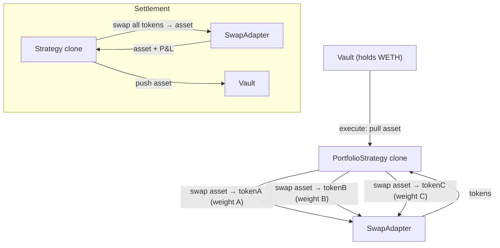

The `PortfolioStrategy` manages a weighted basket of up to 20 tokens. On execute it swaps the vault's asset into each token at its target weight; on settle it sells everything back to the asset. While the proposal is `Executed`, the proposer can call `rebalanceDelta()` to swap the drift back toward the weights the proposal committed to, priced off each token's Chainlink push feed.

The basket is **frozen at init**: weights and swap routes cannot be changed for the life of the proposal, and the slippage tolerance can only be tightened. Depositors approve a basket, not a mandate.

The vault's deposit asset is whatever the fund creator chose at creation. On the [Robinhood mainnet fork](/reference/deployments#robinhood-mainnet-fork-chain-9994663) — the chain of record — funds run against **USDG** or **WETH** and the wider mainnet stock universe; on Robinhood testnet the live funds use **WETH** and the basket is drawn from **TSLA / AMZN / PLTR / NFLX / AMD**.

## Swaps and the swap adapter

The strategy is DEX-agnostic: it never hardcodes a venue, it calls a pluggable **swap adapter**. On Robinhood testnet the deployed adapter is the `UniswapSwapAdapter` (Uniswap V3/V4-compatible), pointed at **Synthra** — a Uniswap-V3-compatible DEX and the chain's live venue. Two Synthra-native adapters (`SynthraSwapAdapter`, `SynthraDirectAdapter`) share the same interface as alternatives.

Route selection is done **CLI-side**: the CLI probes direct asset→token pools across fee tiers and falls back to an asset→WETH→token multi-hop when no direct pool exists, then encodes the chosen route into each token's `swapExtraData`. The on-chain adapter does not auto-detect — it reads a leading mode byte from the route data and executes exactly that route, which is how the basket can hold tokens without a liquid direct pair.

<Note>
  `swapExtraData` is a per-token route encoding: a 1-byte mode prefix (`0` = V3 single-hop, `1` = V3 multi-hop) followed by the route data. A multi-hop route also carries a per-hop slippage bound the adapter enforces against a pre-quote of each hop. The CLI fills this in for you; only hand-encoded `swapExtraData` needs to supply the multi-hop slippage field, or the adapter's decode reverts.
</Note>

## Architecture



## Lifecycle

```
Pending → execute() → Executed → (rebalance?) → settle() → Settled
```

| Phase | What happens | Who calls |
|-------|-------------|-----------|
| **Execute** | Pull asset → swap to each basket token at target weight (via the swap adapter) | Governor (proposal execution) |
| **Executed** | Proposer can `rebalanceDelta()`, or tighten `maxSlippageBps` | Proposer |
| **Settle** | Swap all tokens back to asset → push to vault | Governor (proposal settlement) |

### Batch calls

```
Execute: [asset.approve(strategy, totalAmount), strategy.execute()]
Settle:  [strategy.settle()]
```

## Init parameters

Init data is an **ABI-encoded positional tuple** (not a named struct). Tokens, weights, routes, feed decimals, and feeds are passed as **parallel arrays** — same length, same order:

```solidity
(
    address   asset,             // Vault asset
    address   swapAdapter,       // Deployed swap adapter (UniswapSwapAdapter)
    address[] tokens,            // Basket tokens
    uint256[] weightsBps,        // Target weight per token in bps (sum = 10000)
    uint256   totalAmount,       // Total asset to deploy
    uint256   maxSlippageBps,    // Per-swap slippage cap — REQUIRED, 50–1000 bps
    bytes[]   swapExtraData,     // Per-token adapter route data (mode byte + encoded path)
    uint8[]   priceDecimals,     // Per-token feed scale (8 for stocks, 18 for crypto)
    address[] feeds              // Per-token Chainlink AggregatorV3 push-feed address
)
```

- Max basket size: **20 tokens**; duplicate token addresses are rejected.
- Weights are in basis points and **must sum to 10000**.
- `maxSlippageBps` applies to every swap (entry, settle, and rebalance). It is **required** and bounded `MIN_SLIPPAGE_BPS` (50) to `MAX_SLIPPAGE_CEILING_BPS` (1000).
- Each `feeds[i]` must be non-zero and is bound **per slot**, so a price for one token cannot be used for another's. Three checks run at init: the feed must be allowed on `TierRegistry.isCounterpartyAllowed`, it must be the feed paired to that token (`isPriceSourceForToken`, else `PriceSourceNotPairedWithToken`), and its live `decimals()` must equal `priceDecimals[i]` (`<= 36`).

<Note>
There is no `chainlinkVerifier` argument and no Data Streams path. v1 prices every slot from a **Chainlink push feed** (`AggregatorV3Interface.latestRoundData`), with a flat `MAX_PUSH_PRICE_AGE` of 26 hours (24h heartbeat + 2h grace) on every read. The removed `feedIds` / `--feed-ids` and per-slot `--max-price-ages` surfaces have no replacement.
</Note>

## Rebalancing

While the proposal is `Executed`, the proposer can call **`rebalanceDelta()`** — no arguments, proposer-only. It prices every slot off that slot's bound push feed, then swaps only the drift away from the **init** weights: sell the overweight legs, buy the underweight ones. A reading older than `MAX_PUSH_PRICE_AGE` reverts `StalePrice`.

These prices size the delta swaps and nothing else. They are **not** a vault NAV source, so a stale or missing feed can block a rebalance but can never move deposit/redeem pricing.

There is no full `rebalance()` (sell-all, re-buy) and no way to re-weight mid-proposal: the weights voters approved are the weights the rebalance targets.

## Vault liquidity during a proposal

While a proposal on this strategy is executing, instant vault deposits and redeems are closed. Exits and entries go through the [async queue](/protocol/vault-liquidity): `requestDeposit` / `requestRedeem` escrow in the withdrawal queue and settle at the single frozen, realized per-proposal price. The vault does not mark the basket — `totalAssets()` is float minus queue reserve minus escrowed fees.

The `rebalanceDelta` push-feed path above is independent of this — it prices delta swaps during a rebalance, never vault NAV. See [Deposits & Withdrawals](/protocol/vault-liquidity) for the queue model.

## Tunable parameters (Executed state)

Only one, and only downward: the proposer may **tighten** `maxSlippageBps` (never loosen it, and never below 50 bps). Target weights and per-token `swapExtraData` routes are frozen at init — attempting to change either reverts `WeightsFrozen` / `RoutesFrozen`.

## Risk notes

- **Swap impact:** large allocations in thin pools can eat into P&L — set `maxSlippageBps` conservatively.
- **Oracle staleness:** `rebalanceDelta` rejects a reading older than 26 hours (`StalePrice`). There is no fallback rebalance path — a stale feed simply means the basket drifts until the feed recovers. These readings only size delta swaps, so staleness never affects deposit/redeem pricing.
- **Settle path:** `settle()` sells every token back to the asset in one transaction, along the routes committed at init. A single illiquid token can revert the whole settlement, and routes cannot be changed after the fact — pick them carefully at propose time.

## CLI usage

```bash
sherwood strategy propose portfolio \
  --vault 0x... \
  --amount 0.5 \
  --tokens TSLA,AMZN,PLTR,NFLX,AMD \
  --weights 2500,2500,2000,1500,1500 \
  --max-slippage 500 \
  --name "Stock Basket" \
  --duration 7d
```

| Flag | Description | Default |
|------|------------|---------|
| `--amount <n>` | Total asset to allocate | required |
| `--tokens <list>` | Comma-separated token addresses or symbols | required |
| `--weights <list>` | Comma-separated weights in bps (sum = 10000) | required |
| `--max-slippage <bps>` | Per-swap slippage cap (50–1000) | 500 |
| `--feeds <list>` | Chainlink AggregatorV3 push-feed address per token, **slot-aligned to `--tokens`**. Leave a slot empty (`0xA,,0xC`) to auto-resolve it from the registry | auto-resolved |
| `--price-decimals <list>` | Raw feed decimals per token; must equal the feed's live `decimals()` | 8 |
| `--fee-tier <n>` | Pool fee tier for route probing | 3000 |
| `--swap-routes <list>` | Per-token route spec; empty entry auto-detects | auto-detected |
| `--swap-adapter <address>` | Override swap adapter address | auto-detected |

`--feed-ids` and `--max-price-ages` were removed with the Data Streams path; `sherwood strategy rebalance` no longer accepts `--new-weights` (weights are frozen at init) and takes only a **lower** `--max-slippage`.

## Addresses

| Contract | Robinhood fork (9994663) | Robinhood testnet (46630) |
|----------|--------------------------|---------------------------|
| PortfolioStrategy template | `0xAA5872009c527cCb80343E41C52840CEdb095eb0` | `0x67420Cc504d70a42Adfd8867d878afe0978C7d10` |
| UniswapSwapAdapter | `0x54E6A7af53143556973493fDeC9d7837A77c67eF` | `0x4fc3492117cC3bbcE0b210D22a8DC244f9d86490` |

Per-token Chainlink push feeds live in each chain's address book (`CHAINLINK_<SYM>_USD_FEED`). See [Deployments](/reference/deployments) for the full tables and for which chain to target.
