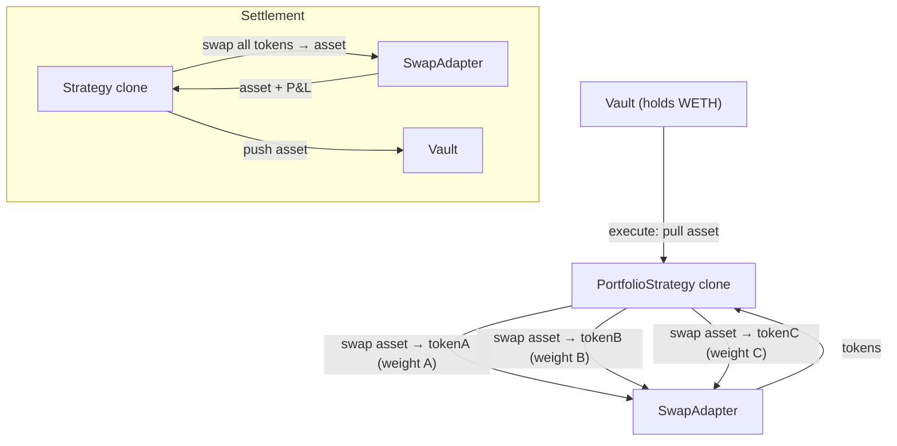

The `PortfolioStrategy` manages a weighted basket of up to 20 tokens. On execute it swaps the vault's asset into each token at its target weight; on settle it sells everything back to the asset. While the proposal is `Executed`, the proposer can rebalance at any time — either by selling everything and re-buying at current weights, or by using Chainlink Data Streams prices to swap only the deltas (gas-efficient).

The vault's deposit asset is whatever the fund creator chose at creation; on the current deployment (Robinhood testnet) the live funds use **WETH**, and the basket is drawn from the tokenized-stock universe **TSLA / AMZN / PLTR / NFLX / AMD**.

## Swaps and the swap adapter

The strategy is DEX-agnostic: it never hardcodes a venue, it calls a pluggable **swap adapter**. On Robinhood testnet the deployed adapter is the `UniswapSwapAdapter` (Uniswap V3/V4-compatible), pointed at **Synthra** — a Uniswap-V3-compatible DEX and the chain's live venue. Two Synthra-native adapters (`SynthraSwapAdapter`, `SynthraDirectAdapter`) share the same interface as alternatives.

Route selection is done **CLI-side**: the CLI probes direct asset→token pools across fee tiers and falls back to an asset→WETH→token multi-hop when no direct pool exists, then encodes the chosen route into each token's `swapExtraData`. The on-chain adapter does not auto-detect — it reads a leading mode byte from the route data and executes exactly that route, which is how the basket can hold tokens without a liquid direct pair.

<Note>
  `swapExtraData` is a per-token route encoding: a 1-byte mode prefix (`0` = V3 single-hop, `1` = V3 multi-hop) followed by the route data. A multi-hop route also carries a per-hop slippage bound the adapter enforces against a pre-quote of each hop. The CLI fills this in for you; only hand-encoded `swapExtraData` needs to supply the multi-hop slippage field, or the adapter's decode reverts.
</Note>

## Architecture



## Lifecycle

```
Pending → execute() → Executed → (rebalance?) → settle() → Settled
```

| Phase | What happens | Who calls |
|-------|-------------|-----------|
| **Execute** | Pull asset → swap to each basket token at target weight (via the swap adapter) | Governor (proposal execution) |
| **Executed** | Proposer can `rebalance()`, `rebalanceDelta(reports)`, or update weights / slippage / routes | Proposer |
| **Settle** | Swap all tokens back to asset → push to vault | Governor (proposal settlement) |

### Batch calls

```
Execute: [asset.approve(strategy, totalAmount), strategy.execute()]
Settle:  [strategy.settle()]
```

## Init parameters

Init data is an **ABI-encoded positional tuple** (not a named struct). Tokens, weights, routes, feed decimals, and feed ids are passed as **parallel arrays** — same length, same order:

```solidity
(
    address   asset,             // Vault asset (WETH on Robinhood testnet)
    address   swapAdapter,       // Deployed swap adapter (UniswapSwapAdapter → Synthra)
    address   chainlinkVerifier, // Data Streams verifier for rebalanceDelta; address(0) = push-feed mode
    address[] tokens,            // Basket tokens
    uint256[] weightsBps,        // Target weight per token in bps (sum = 10000)
    uint256   totalAmount,       // Total asset to deploy
    uint256   maxSlippageBps,    // Per-swap slippage cap — REQUIRED, 1–9999 bps
    bytes[]   swapExtraData,     // Per-token adapter route data (mode byte + encoded path)
    uint8[]   priceDecimals,     // Per-token Chainlink feed scale (8 for stocks, 18 for crypto)
    bytes32[] feedIds            // Per-token Chainlink feed id, or a packed push-feed proxy address
)
```

- Max basket size: **20 tokens**; duplicate token addresses are rejected.
- Weights are in basis points and **must sum to 10000**.
- `maxSlippageBps` applies to every swap (entry, settle, and rebalance). It is **required**: initialization reverts if it is `0` or `>= 10000`. (The `500` you see in CLI examples is a CLI-side default, not a contract default.)
- `priceDecimals[i]` must be `<= 36`, and each `feedIds[i]` must be non-zero — a Data Streams feed id when a verifier is wired, or a packed AggregatorV3 proxy in push-feed mode. Both are bound per slot so a report for one token can't be replayed into another's slot.

## Rebalancing

While the proposal is `Executed`, the proposer can rebalance two ways:

| Method | Gas cost | When to use |
|--------|----------|-------------|
| `rebalance()` | High — sells all, re-buys at current weights | Weights changed, or a simple periodic rebalance |
| `rebalanceDelta(reports)` | Low — swaps only the deltas | Frequent rebalances with fresh oracle prices |

`rebalanceDelta` reads a signed Chainlink Data Streams report (or a push feed, when no verifier is wired) for each token and rejects any report past its own freshness bound (`StalePrice`). It uses those prices purely to size the **delta swaps** during a rebalance — this is a gas-efficient rebalancing mechanic, **not** a vault NAV source. The Data Streams path requires the chain's verifier proxy, which is deployed on Robinhood testnet.

## Vault liquidity during a proposal

`PortfolioStrategy` exposes **no vault-side priceable position** — it does not override `positions()`, so the vault's live-NAV router finds nothing to price and **fails closed**. There is no instant (Lane A) exit for this strategy. While a proposal on it is active, vault deposits and redeems route through the [Lane B async queue](/protocol/vault-liquidity): `requestDeposit` / `requestRedeem` escrow in the withdrawal queue and settle at the single frozen, realized per-proposal price.

The `rebalanceDelta` Data Streams path above is independent of this — it prices delta swaps during a rebalance, never vault NAV. See [Deposits & Withdrawals](/protocol/vault-liquidity) for the full two-lane model.

## Tunable parameters (Executed state)

The proposer can update, without a new proposal: per-token **target weights** (must still sum to 10000), the **`maxSlippageBps`** cap, and each token's **`swapExtraData`** route (path override / fee tier).

## Risk notes

- **Swap impact:** large allocations in thin pools can eat into P&L — set `maxSlippageBps` conservatively.
- **Oracle staleness:** `rebalanceDelta` rejects any stale report; if fresh reports aren't available, fall back to the full `rebalance()`. These reports only size delta swaps — they are not a vault NAV source, so staleness never affects deposit/redeem pricing.
- **Settle path:** `settle()` sells every token back to the asset in one transaction. A single illiquid token can revert the whole settlement; the proposer can update `swapExtraData` before settlement to route around it.

## CLI usage

```bash
sherwood strategy propose portfolio \
  --vault 0x... \
  --amount 0.5 \
  --tokens TSLA,AMZN,PLTR,NFLX,AMD \
  --weights 2500,2500,2000,1500,1500 \
  --max-slippage 500 \
  --name "Stock Basket" \
  --duration 7d
```

| Flag | Description | Default |
|------|------------|---------|
| `--amount <n>` | Total asset to allocate | required |
| `--tokens <list>` | Comma-separated token addresses or symbols | required |
| `--weights <list>` | Comma-separated weights in bps (sum = 10000) | required |
| `--max-slippage <bps>` | Per-swap slippage cap | 500 |
| `--fee-tier <n>` | Pool fee tier for route probing | 3000 |
| `--swap-adapter <address>` | Override swap adapter address | auto-detected |

## Addresses

| Contract | Robinhood Testnet (chain 46630) |
|----------|---------------------|
| PortfolioStrategy template | `0x67420Cc504d70a42Adfd8867d878afe0978C7d10` |
| Swap adapter (UniswapSwapAdapter → Synthra) | `0x4fc3492117cC3bbcE0b210D22a8DC244f9d86490` |
| Chainlink Data Streams Verifier | `0x72790f9eB82db492a7DDb6d2af22A270Dcc3Db64` |

Robinhood testnet is Sherwood's current deployment target: Synthra DEX, Chainlink Data Streams, and the tokenized-stock universe (TSLA / AMZN / PLTR / NFLX / AMD) live there. Funds choose their own deposit asset; the live ones use WETH — no USDC is deployed on this chain. Support for more chains follows as the protocol expands beyond the current deployment.
