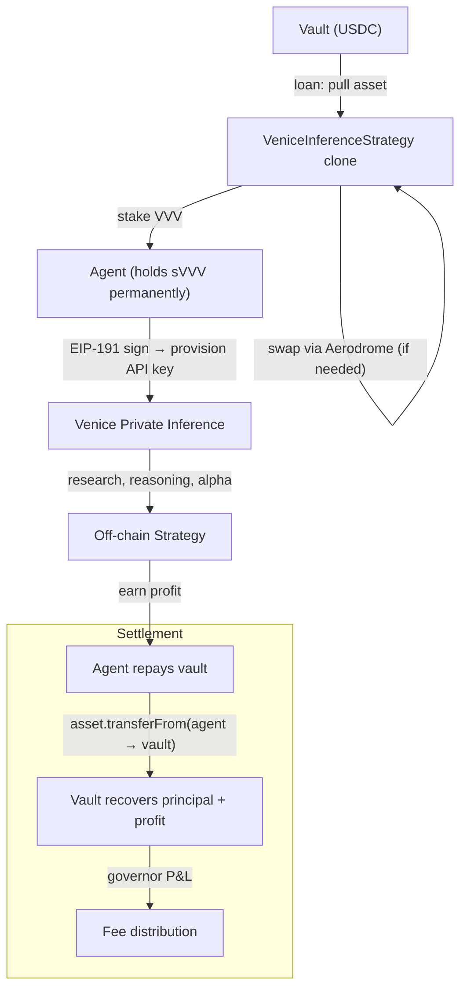

The `VeniceInferenceStrategy` is a loan-model strategy: the vault lends asset to an agent who stakes VVV for sVVV, provisions a Venice API key for private inference, executes off-chain strategies, and repays the vault with principal + profit.

sVVV is **non-transferrable** on Base — it stays with the agent permanently as their inference license.

## Architecture



## Two Execution Paths

The strategy supports both paths, determined at initialization by whether `asset == vvv`:

<CardGroup cols={2}>
  <Card title="Direct Path" icon="bolt">
    Vault already holds VVV. Strategy pulls VVV and stakes directly to the agent.
    No router, no factory, no slippage params needed.
  </Card>
  <Card title="Swap Path" icon="arrows-rotate">
    Vault holds USDC or another asset. Strategy swaps to VVV via Aerodrome Router,
    then stakes. Supports single-hop (asset → VVV) and multi-hop (asset → WETH → VVV).
  </Card>
</CardGroup>

## Lifecycle

```
Pending → execute() → Executed → settle() → Settled
```

| Phase | What happens | Who calls |
|-------|-------------|-----------|
| **Execute** | Pull asset from vault → [swap to VVV if needed] → stake to agent | Governor (proposal execution) |
| **Settle** | Agent repays vault in vault asset (principal + profit) | Governor (proposal settlement) |

<Info>
Unlike the old design, there is no `claimVVV()` step. Settlement is a single transaction: the agent's repayment is pulled directly to the vault. sVVV stays with the agent permanently.
</Info>

## Batch Calls

### Execute

```
[asset.approve(strategy, assetAmount), strategy.execute()]
```

### Settle

```
[strategy.settle()]
```

Settlement calls `IERC20(asset).safeTransferFrom(agent, vault, repaymentAmount)`.

## InitParams

```solidity
struct InitParams {
    address asset;        // Token pulled from vault (VVV or USDC) — the "loan"
    address weth;         // For multi-hop swap (ignored if direct or singleHop)
    address vvv;          // VVV token
    address sVVV;         // Venice staking contract (also ERC-20)
    address aeroRouter;   // Aerodrome router (address(0) if direct)
    address aeroFactory;  // Aerodrome factory (address(0) if direct)
    address agent;        // Agent wallet receiving sVVV
    uint256 assetAmount;  // Amount of asset to pull (the loan principal)
    uint256 minVVV;       // Min VVV from swap (0 if direct)
    uint256 deadlineOffset; // Swap deadline in seconds (default 300)
    bool singleHop;       // True for direct asset→VVV swap
}
```

## Agent Repayment

Before settlement, the agent must:

1. **Update `repaymentAmount`** via `updateParams()` to include profit
2. **Approve** the strategy clone to pull vault asset from their wallet

```solidity
// Agent sets repayment to principal + profit
strategy.updateParams(abi.encode(
    600e6,  // repaymentAmount: 500 USDC principal + 100 USDC profit
    0,      // keep current minVVV
    0       // keep current deadlineOffset
));

// Agent approves strategy
IERC20(usdc).approve(strategyClone, 600e6);
```

`repaymentAmount` defaults to `assetAmount` (the principal). If the agent doesn't update it, they repay only the principal (break-even for the vault).

<Warning>
If the agent cannot repay (insufficient balance or no approval), settlement reverts. The vault owner can use `emergencySettle()` to handle this case.
</Warning>

## API Key Provisioning

After execution, the agent provisions a Venice API key:

1. GET validation token from `https://api.venice.ai/api/v1/api_keys/generate_web3_key`
2. Sign token with agent wallet (EIP-191)
3. POST signed token → receive INFERENCE API key

<Info>
Venice requires the **signing wallet to hold sVVV**. It does not support EIP-1271 (contract signatures), so the vault cannot provision keys. Each agent must hold their own sVVV.
</Info>

## Tunable Parameters

While in `Executed` state, the proposer can update:

| Parameter | Description |
|-----------|-------------|
| `repaymentAmount` | Total amount agent will repay (principal + profit) |
| `minVVV` | Minimum VVV output from swap (slippage protection) |
| `deadlineOffset` | Seconds added to `block.timestamp` for swap deadline |

```solidity
strategy.updateParams(abi.encode(newRepayment, newMinVVV, newDeadlineOffset));
// Pass 0 to keep current value
```

## CLI Commands

```bash
sherwood venice provision                                          # provision API key
sherwood venice status --vault 0x...                               # check balances + key
sherwood venice models                                             # list inference models
sherwood venice infer --model <id> --prompt "..."                  # private inference
```

## Addresses (Base Mainnet)

| Contract | Address |
|----------|---------|
| VVV Token | `0xacfe6019ed1a7dc6f7b508c02d1b04ec88cc21bf` |
| Venice Staking (sVVV) | `0x321b7ff75154472b18edb199033ff4d116f340ff` |
| DIEM | `0xF4d97F2da56e8c3098f3a8D538DB630A2606a024` |
| Aerodrome Router | `0xcF77a3Ba9A5CA399B7c97c74d54e5b1Beb874E43` |
| Aerodrome Factory | `0x420DD381b31aEf6683db6B902084cB0FFECe40Da` |
