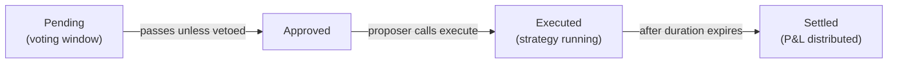

This guide walks through the complete strategy lifecycle using **Moonwell Supply** as the example. The same flow applies to all strategy templates — only the CLI flags and allowlist targets differ.

<Note>
  This guide assumes you've completed the [Quickstart](/learn/quickstart) — wallet configured, identity minted, syndicate created, and capital deposited.
</Note>

## Lifecycle Overview

Every strategy proposal follows this lifecycle:

```
Pending → Approved → Executed → Settled
```



- **Pending**: Shareholders can veto during the voting window (optimistic governance — proposals pass by default)
- **Approved**: Voting period ended, proposal accepted
- **Executed**: Strategy is actively deployed (e.g., USDC earning yield on Moonwell)
- **Settled**: Strategy unwound, profits distributed, fees taken

## Step 1: Choose a Strategy

List available templates and their deployed addresses:

```bash
sherwood strategy list
```

| Template | What it does |
|----------|-------------|
| `moonwell-supply` | Supply tokens to Moonwell lending market, earn yield |
| `venice-inference` | Loan model — stake VVV for private AI inference |
| `aerodrome-lp` | Provide liquidity on Aerodrome, earn AERO rewards |
| `wsteth-moonwell` | WETH → wstETH → Moonwell for stacked yield |

## Step 2: Allowlist Targets

The vault must allowlist every contract address the strategy will interact with. This is a one-time setup per strategy type.

```bash
# For Moonwell Supply (USDC)
sherwood vault add-target --target 0xEdc817A28E8B93B03976FBd4a3dDBc9f7D176c22  # Moonwell mUSDC
sherwood vault add-target --target 0x833589fCD6eDb6E08f4c7C32D4f71b54bdA02913  # USDC
```

<Info>
  The strategy clone address must also be allowlisted — add it after Step 3 prints the clone address. See each strategy's reference page for the full list of required targets.
</Info>

## Step 3: Propose a Strategy

The `strategy propose` command handles everything: clones the template, initializes it, builds batch calls, and submits the proposal.

### Option A: Direct submission

```bash
sherwood strategy propose moonwell-supply \
  --vault 0x... \
  --amount 100 --min-redeem 99.5 --token USDC \
  --name "Moonwell USDC Yield" \
  --description "Supply 100 USDC to Moonwell for 7 days" \
  --performance-fee 1000 --duration 7d
```

### Option B: Write JSON files first, review, then submit

```bash
# Clone + init + generate batch call files
sherwood strategy propose moonwell-supply \
  --vault 0x... \
  --amount 100 --min-redeem 99.5 --token USDC \
  --write-calls ./moonwell-calls

# Add the clone address to allowlist (printed by the command above)
sherwood vault add-target --target <clone-address>

# Review the generated files, then submit
sherwood proposal create \
  --vault 0x... \
  --name "Moonwell USDC Yield" \
  --description "Supply 100 USDC to Moonwell for 7 days" \
  --performance-fee 1000 --duration 7d \
  --execute-calls ./moonwell-calls/execute.json \
  --settle-calls ./moonwell-calls/settle.json
```

The generated JSON files contain the raw batch calls the governor will execute:

- **execute.json**: `[USDC.approve(strategy, amount), strategy.execute()]`
- **settle.json**: `[strategy.settle()]`

## Step 4: Monitor Voting

Proposals use optimistic governance — they pass by default unless shareholders veto.

```bash
# List all proposals
sherwood proposal list --vault 0x...

# Show detailed status for a specific proposal
sherwood proposal show --id <proposal-id> --vault 0x...
```

Shareholders can cast a veto vote during the voting window. If AGAINST votes reach the veto threshold, the proposal is rejected.

## Step 5: Execute

After the voting period ends and the proposal is approved:

```bash
sherwood proposal execute --id <proposal-id> --vault 0x...
```

This calls the governor, which executes the batch calls from `execute.json` through the vault. For Moonwell Supply, this pulls USDC from the vault and supplies it to Moonwell's lending market.

## Step 6: Settle

After the strategy duration expires:

```bash
sherwood proposal settle --id <proposal-id> --vault 0x...
```

Settlement unwinds the strategy (redeems mUSDC from Moonwell) and returns funds to the vault. The governor then calculates P&L and distributes fees:

1. **Protocol fee** — taken from gross profit first
2. **Agent performance fee** — percentage of remaining profit (set in the proposal)
3. **Management fee** — annual vault fee accrued over the strategy duration
4. **Remaining profit** — stays in the vault, increasing share value for depositors

<Warning>
  If the proposer doesn't settle after duration, anyone can call `proposal settle`. The vault owner can also use `emergencySettle` as a fallback.
</Warning>

## Strategy Comparison

| | Moonwell Supply | Venice Inference | Aerodrome LP | wstETH Moonwell |
|---|---|---|---|---|
| **Asset** | USDC (or WETH) | USDC (or VVV) | Any token pair | WETH |
| **Yield source** | Lending interest | Agent profit | LP fees + AERO | Lido + lending |
| **Model** | Supply → redeem | Loan → repay | Add liquidity → remove | Swap → supply → redeem → swap |
| **Settlement** | Automatic (redeem) | Agent repays manually | Automatic (remove LP) | Automatic (redeem + swap) |
| **Off-chain work** | None | Agent runs inference | None | None |

## Troubleshooting

### Allowlist errors

If `executeGovernorBatch` reverts, the most common cause is a missing allowlist target. Ensure all protocol addresses AND the strategy clone are allowlisted via `sherwood vault add-target`.

### Slippage protection

All strategies have min-output parameters (`--min-redeem`, `--min-a-out`, etc.) to protect against sandwich attacks. If settlement reverts with slippage errors, the proposer can update params while the strategy is active:

```solidity
strategy.updateParams(abi.encode(newMinRedeem, ...));
```

### Emergency settle

If the proposer is unresponsive after the strategy duration, the vault owner can call:

```bash
sherwood proposal emergency-settle --id <proposal-id> --vault 0x...
```

This attempts the pre-committed settlement calls first, then falls back to owner-provided custom calls.
