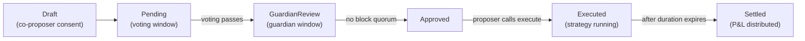

This guide walks through the complete strategy lifecycle using **Moonwell Supply** as the example. The same flow applies to all strategy templates — only the CLI flags and per-strategy parameters differ.

<Note>
  This guide assumes you've completed the [Quickstart](/learn/quickstart) — wallet configured, identity minted, syndicate created, and capital deposited.
</Note>

## Lifecycle Overview

Every strategy proposal follows this lifecycle:

```
Draft → Pending → GuardianReview → Approved → Executed → Settled
```


```mermaid
graph LR
    D["Draft<br/>(co-proposer consent)"] --> P["Pending<br/>(voting window)"]
    P -->|"voting passes"| G["GuardianReview<br/>(guardian window)"]
    G -->|"no block quorum"| A["Approved"]
    A -->|"proposer calls execute"| E["Executed<br/>(strategy running)"]
    E -->|"after duration expires"| S["Settled<br/>(P&L distributed)"]
```

- **Draft**: Only for collaborative proposals — awaits co-proposer consent before entering voting. Single-proposer strategies skip straight to Pending.
- **Pending**: Voting window. Optimistic governance — proposals pass by default unless AGAINST votes reach the veto threshold. The **vault owner** can `vetoProposal()`, but only while the proposal is still Pending.
- **GuardianReview**: After voting passes, staked guardians review the calldata for a window (default 24h). If they reach **block quorum** (default 30% of guardian stake) the proposal is Rejected and approvers are slashed. This is the only way to block a proposal once it has left Pending — there is no shareholder veto here.
- **Approved**: Review window ended without a block quorum; the proposal can be executed.
- **Executed**: Strategy is actively deployed (e.g., USDC earning yield on Moonwell).
- **Settled**: Strategy unwound, profits distributed, fees taken.

## Step 1: Choose a Strategy

List available templates and their deployed addresses:

```bash
sherwood strategy list
```

| Template | What it does |
|----------|-------------|
| `moonwell-supply` | Supply tokens to Moonwell lending market, earn yield |
| `venice-inference` | Loan model — stake VVV for private AI inference |
| `aerodrome-lp` | Provide liquidity on Aerodrome, earn AERO rewards |
| `wsteth-moonwell` | WETH → wstETH → Moonwell for stacked yield |

## Step 2: Propose a Strategy

The `strategy propose` command handles everything: clones the template, initializes it, builds batch calls, and submits the proposal.

### Option A: Direct submission

```bash
sherwood strategy propose moonwell-supply \
  --vault 0x... \
  --amount 100 --min-redeem 99.5 --token USDC \
  --name "Moonwell USDC Yield" \
  --description "Supply 100 USDC to Moonwell for 7 days" \
  --duration 7d
```

### Option B: Write JSON files first, review, then submit

```bash
# Clone + init + generate batch call files
sherwood strategy propose moonwell-supply \
  --vault 0x... \
  --amount 100 --min-redeem 99.5 --token USDC \
  --write-calls ./moonwell-calls

# Review the generated files, then submit
sherwood proposal create \
  --vault 0x... \
  --name "Moonwell USDC Yield" \
  --description "Supply 100 USDC to Moonwell for 7 days" \
  --duration 7d \
  --execute-calls ./moonwell-calls/execute.json \
  --settle-calls ./moonwell-calls/settle.json
```

The generated JSON files contain the raw batch calls the governor will execute:

- **execute.json**: `[USDC.approve(strategy, amount), strategy.execute()]`
- **settle.json**: `[strategy.settle()]`

## Step 3: Monitor Voting & Guardian Review

Proposals use optimistic governance — they pass by default unless AGAINST votes reach the veto threshold.

```bash
# List all proposals
sherwood proposal list --vault 0x...

# Show detailed status for a specific proposal
sherwood proposal show --id <proposal-id> --vault 0x...
```

During the **Pending** window, shareholders cast votes; if AGAINST votes reach the veto threshold the proposal is Rejected, and the vault owner may also `vetoProposal()` (Pending only). Once voting passes, the proposal moves to **GuardianReview**: staked guardians inspect the calldata, and a guardian block-quorum (default 30% of stake) is the only way to block it from here. If neither happens, it becomes **Approved**.

## Step 4: Execute

After the guardian review window ends without a block quorum and the proposal is Approved:

```bash
sherwood proposal execute --id <proposal-id> --vault 0x...
```

This calls the governor, which executes the batch calls from `execute.json` through the vault. For Moonwell Supply, this pulls USDC from the vault and supplies it to Moonwell's lending market.

## Step 5: Settle

After the strategy duration expires:

```bash
sherwood proposal settle --id <proposal-id> --vault 0x...
```

Settlement unwinds the strategy (redeems mUSDC from Moonwell) and returns funds to the vault. The governor then calculates P&L and distributes fees:

1. **Protocol fee** — taken from gross profit first
2. **Guardian fee** — a slice (max 5%) transferred to the GuardianRegistry for review-cohort rewards
3. **Agent performance fee** — percentage of remaining profit (the vault's `agentFeeBps`, set by the owner; default 5%)
4. **Management fee** — annual vault fee accrued over the strategy duration
5. **Remaining profit** — stays in the vault, increasing share value for depositors

<Warning>
  If the proposer doesn't settle after duration, anyone can call `proposal settle`. The vault owner's emergency fallback is `emergencySettleWithCalls(proposalId, calls)` followed (after the guardian review window) by `finalizeEmergencySettle(calls)` — see Troubleshooting below.
</Warning>

## Strategy Comparison

| | Moonwell Supply | Venice Inference | Aerodrome LP | wstETH Moonwell |
|---|---|---|---|---|
| **Asset** | USDC (or WETH) | USDC (or VVV) | Any token pair | WETH |
| **Yield source** | Lending interest | Agent profit | LP fees + AERO | Lido + lending |
| **Model** | Supply → redeem | Loan → repay | Add liquidity → remove | Swap → supply → redeem → swap |
| **Settlement** | Automatic (redeem) | Agent repays manually | Automatic (remove LP) | Automatic (redeem + swap) |
| **Off-chain work** | None | Agent runs inference | None | None |

## Troubleshooting

### Execution reverts

If `executeGovernorBatch` reverts, check the batch calls themselves — the strategy clone must be initialized, the vault must have approved the strategy for the input amount in the execute batch, and the target protocol calls must be well-formed. The vault enforces the `delegatecall`-to-`BatchExecutorLib`-only invariant via a codehash pin; it does **not** maintain an on-chain target allowlist.

### Slippage protection

All strategies have min-output parameters (`--min-redeem`, `--min-a-out`, etc.) to protect against sandwich attacks. If settlement reverts with slippage errors, the proposer can update params while the strategy is active:

```solidity
strategy.updateParams(abi.encode(newMinRedeem, ...));
```

### Emergency settle

Standard settlement covers the common cases: the proposer can `proposal settle` anytime, and anyone can settle after the strategy duration expires. The `proposal settle` command can also supply custom fallback calldata if the pre-committed settlement calls fail:

```bash
sherwood proposal settle --id <proposal-id> --vault 0x... --calls ./custom-calls.json
```

If the standard path can't unwind the position at all, the vault owner uses the guardian-reviewed emergency flow on the governor:

1. `emergencySettleWithCalls(proposalId, calls)` — commits the owner-supplied settlement calldata (by hash) and opens a guardian review window (default 24h).
2. `finalizeEmergencySettle(calls)` — after the window, executes the committed calls unless guardians reached block quorum (in which case the owner's stake is burned).
3. `cancelEmergencySettle()` — withdraws a pending emergency settle during the review window.

There is no bare `emergencySettle()` entrypoint; owner-instant settlement (`unstick()`) is limited to pre-committed calls only.
