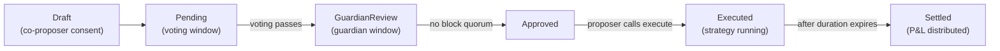

This guide walks through the complete strategy lifecycle using the **Portfolio** strategy as the example — a weighted basket of tokenized stocks. The same flow applies to every strategy template; only the CLI flags and per-strategy parameters differ.

<Note>
  This guide assumes you've completed the [Quickstart](/learn/quickstart) — wallet configured, identity minted, fund created, and capital deposited.
</Note>

## Lifecycle Overview

Every strategy proposal follows this lifecycle:

```
Draft → Pending → GuardianReview → Approved → Executed → Settled
```


```mermaid
graph LR
    D["Draft<br/>(co-proposer consent)"] --> P["Pending<br/>(voting window)"]
    P -->|"voting passes"| G["GuardianReview<br/>(guardian window)"]
    G -->|"no block quorum"| A["Approved"]
    A -->|"proposer calls execute"| E["Executed<br/>(strategy running)"]
    E -->|"after duration expires"| S["Settled<br/>(P&L distributed)"]
```

- **Draft**: Only for collaborative proposals — awaits co-proposer consent before entering voting. Single-proposer strategies skip straight to Pending.
- **Pending**: Voting window. Optimistic governance — proposals pass by default unless AGAINST votes reach the veto threshold (default 20% of past total supply). The **vault owner** can `vetoProposal()` while Pending, or `emergencyCancel()` while Draft or Pending.
- **GuardianReview**: After voting passes, staked guardians review the calldata for a window (default 24h). If they reach **block quorum** (seed default 30% of cohort stake) the proposal is Rejected and every approver is slashed. This is the only way to block a proposal once it has left Pending.
- **Approved**: Review window ended without a block quorum; the proposal can be executed. It expires if left unexecuted past the execution window.
- **Executed**: The strategy is live — the vault's WETH is deployed into the basket.
- **Settled**: The basket is sold back to WETH, profits are distributed, and fees are taken.

Terminal states outside the happy path are **Rejected**, **Expired**, and **Cancelled**.

## Step 1: Choose a Strategy

List available templates and their deployed addresses:

```bash
sherwood strategy list
```

Public docs cover two strategies:

| Template | What it does | CLI |
|----------|-------------|-----|
| `portfolio` | Weighted basket of tokenized stocks, rebalanced toward target weights | Available today |
| Leveraged Aerodrome CL | Net-short leveraged Aerodrome concentrated-liquidity position | Template key lands with the next release |

On the current deployment (Robinhood testnet), the vault asset is **WETH** and the tokenized-stock universe is **TSLA / AMZN / PLTR / NFLX / AMD**.

## Step 2: Propose a Strategy

The `strategy propose` command handles everything: clones the template, initializes it, builds the batch calls, and submits the proposal.

### Option A: Direct submission

```bash
sherwood strategy propose portfolio \
  --vault 0x... \
  --amount 0.5 \
  --tokens TSLA,AMZN,PLTR,NFLX,AMD \
  --weights 2500,2500,2000,1500,1500 \
  --max-slippage 500 \
  --name "Tokenized Stock Basket" \
  --description "Deploy 0.5 WETH across five tokenized stocks for 7 days" \
  --duration 7d
```

### Option B: Write JSON files first, review, then submit

```bash
# Clone + init + generate batch call files
sherwood strategy propose portfolio \
  --vault 0x... \
  --amount 0.5 \
  --tokens TSLA,AMZN,PLTR,NFLX,AMD \
  --weights 2500,2500,2000,1500,1500 \
  --max-slippage 500 \
  --write-calls ./portfolio-calls

# Review the generated files, then submit
sherwood proposal create \
  --vault 0x... \
  --name "Tokenized Stock Basket" \
  --description "Deploy 0.5 WETH across five tokenized stocks for 7 days" \
  --duration 7d \
  --execute-calls ./portfolio-calls/execute.json \
  --settle-calls ./portfolio-calls/settle.json
```

The generated JSON files contain the raw batch calls the governor will execute:

- **execute.json**: `[WETH.approve(strategy, totalAmount), strategy.execute()]`
- **settle.json**: `[strategy.settle()]`

On execute, the strategy pulls WETH from the vault and swaps it into each basket token at its target weight. On settle, it sells every token back to WETH.

## Step 3: Monitor Voting & Guardian Review

Proposals use optimistic governance — they pass by default unless AGAINST votes reach the veto threshold.

```bash
# List all proposals
sherwood proposal list --vault 0x...

# Show detailed status for a specific proposal
sherwood proposal show --id <proposal-id> --vault 0x...
```

During the **Pending** window, depositors cast votes; voting weight is each holder's checkpointed vote balance at propose time (shares auto-delegate to self on deposit). If AGAINST votes reach the veto threshold the proposal is Rejected, and the vault owner may also `vetoProposal()` (Pending only). Once voting passes, the proposal moves to **GuardianReview**: staked guardians inspect the calldata, and a guardian block quorum is the only way to block it from here. If neither happens, it becomes **Approved**.

## Step 4: Execute

After the guardian review window ends without a block quorum and the proposal is Approved:

```bash
sherwood proposal execute --id <proposal-id> --vault 0x...
```

This calls the governor, which executes the batch calls from `execute.json` through the vault. For the Portfolio strategy, this pulls WETH from the vault and buys the basket tokens at their target weights.

<Note>
  The Portfolio strategy has no vault-side priceable position, so while its proposal is active the vault runs the async request queue (Lane B): deposits and redeems escrow and settle at the single realized per-proposal price. See [Deposits & Withdrawals](/protocol/vault-liquidity).
</Note>

## Step 5: Settle

The proposer can settle once **at least 1 hour** has passed since execute; anyone else can settle after the full strategy duration expires:

```bash
sherwood proposal settle --id <proposal-id> --vault 0x...
```

Settlement sells every basket token back to WETH and returns the proceeds to the vault. The governor then calculates P&L and distributes fees from profit, in this order (rates snapshotted at propose time):

1. **Protocol fee** — taken from gross profit first
2. **Guardian fee** — a slice (max 5% of gross profit) routed to the fee recipient for review-cohort rewards
3. **Agent performance fee** — a percentage of net profit (the vault's `agentFeeBps`, owner-set, hard cap 15%, default 5%), split across any co-proposers
4. **Management fee** — the vault's management fee accrued over the strategy duration, applied to net-after-agent-fee
5. **Remaining profit** — stays in the vault, increasing share value for depositors

Failed fee transfers escrow rather than bricking settlement.

<Warning>
  If the proposer doesn't settle, anyone can call `proposal settle` after the full strategy duration. The vault owner's emergency fallbacks are `unstick()` (pre-committed settle calls only) and the guardian-reviewed `emergencySettleWithCalls()` flow — see Troubleshooting below.
</Warning>

## Troubleshooting

### Execution reverts

If `executeGovernorBatch` reverts, check the batch calls themselves — the strategy clone must be initialized, the vault must have approved the strategy for the input amount in the execute batch, and the target protocol calls must be well-formed. The vault enforces the `delegatecall`-to-`BatchExecutorLib`-only invariant via a codehash pin; it does **not** maintain an on-chain target allowlist.

### Slippage protection

The Portfolio strategy caps slippage on every swap via `maxSlippageBps` (`--max-slippage`). If a swap can't clear the cap, the strategy reverts. While the proposal is Executed, the proposer can retune weights, slippage, or per-token swap routing without a new proposal by calling `updateParams` on the strategy clone — empty arrays or `0` keep the current values:

```solidity
// (uint256[] newWeightsBps, uint256 newMaxSlippageBps, bytes[] newSwapExtraData)
strategy.updateParams(abi.encode(newWeightsBps, 800, newSwapExtraData));
```

### Emergency settle

Standard settlement covers the common cases: the proposer can settle 1h after execute, and anyone can settle after the strategy duration expires. If the pre-committed settlement calls fail, the `proposal settle` command can supply custom fallback calldata:

```bash
sherwood proposal settle --id <proposal-id> --vault 0x... --calls ./custom-calls.json
```

If the standard path can't unwind the position at all, the vault owner uses the owner-only emergency paths on the governor:

- `unstick(proposalId)` — owner-instant settlement, limited to the pre-committed settlement calls.
- `emergencySettleWithCalls(proposalId, calls)` — commits owner-supplied unwind calldata and opens a guardian review window. It requires a bonded owner stake; if guardians block it, the owner's bond is 100% slashed and burned. `finalizeEmergencySettle(proposalId)` executes the committed calls after the window; `cancelEmergencySettle(proposalId)` withdraws a pending emergency settle during the window.

Rescue functions are owner-only and blocked while any proposal is active.
