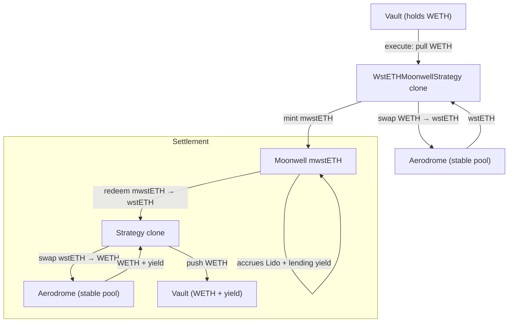

The `WstETHMoonwellStrategy` is a stacked yield strategy: it swaps WETH to wstETH via Aerodrome, then supplies wstETH to Moonwell's lending market. The vault earns both Lido staking yield and Moonwell lending interest simultaneously.

## Architecture



## Yield Sources

<CardGroup cols={2}>
  <Card title="Lido Staking" icon="ethereum">
    wstETH appreciates relative to ETH as Lido staking rewards accrue. This is embedded in the wstETH/WETH exchange rate.
  </Card>
  <Card title="Moonwell Lending" icon="landmark">
    Supplying wstETH to Moonwell earns lending interest on top of the staking yield.
  </Card>
</CardGroup>

## Lifecycle

```
Pending → execute() → Executed → settle() → Settled
```

| Phase | What happens | Who calls |
|-------|-------------|-----------|
| **Execute** | Pull WETH → swap to wstETH (Aerodrome) → mint mwstETH (Moonwell) | Governor (proposal execution) |
| **Executed** | mwstETH accrues Lido staking + Moonwell lending yield | — |
| **Settle** | Redeem mwstETH → swap wstETH to WETH (Aerodrome) → push to vault | Governor (proposal settlement) |

## Batch Calls

### Execute

```
[WETH.approve(strategy, supplyAmount), strategy.execute()]
```

### Settle

```
[strategy.settle()]
```

## InitParams

```solidity
struct InitParams {
    address weth;           // WETH token
    address wsteth;         // wstETH (Lido wrapped staked ETH)
    address mwsteth;        // Moonwell wstETH market token
    address aeroRouter;     // Aerodrome Router (for WETH ↔ wstETH swaps)
    address aeroFactory;    // Aerodrome Factory (pool lookup)
    uint256 supplyAmount;   // Amount of WETH to deploy
    uint256 minWstethOut;   // Min wstETH from WETH→wstETH swap (slippage)
    uint256 minWethOut;     // Min WETH from wstETH→WETH swap on settle (slippage)
    uint256 deadlineOffset; // Seconds added to block.timestamp for swap deadlines (default: 300)
}
```

## Tunable Parameters

The proposer can update slippage parameters in both `Pending` and `Executed` states (unlike other strategies which only allow updates while `Executed`):

| Parameter | Description |
|-----------|-------------|
| `minWethOut` | Minimum WETH from wstETH→WETH swap on settlement |
| `minWstethOut` | Minimum wstETH from WETH→wstETH swap on execution |
| `deadlineOffset` | Swap deadline in seconds from current block |

```solidity
strategy.updateParams(abi.encode(newMinWethOut, newMinWstethOut, newDeadlineOffset));
// Pass 0 to keep current value
```

<Info>
  Allowing param updates in `Pending` state lets the proposer adjust slippage before execution — useful if the WETH/wstETH rate shifts during the voting period.
</Info>

## CLI Usage

```bash
sherwood strategy propose wsteth-moonwell \
  --vault 0x... \
  --amount 1 \
  --slippage 500 \
  --name "wstETH Yield Stack" \
  --performance-fee 1000 --duration 7d
```

| Flag | Description | Default |
|------|------------|---------|
| `--amount <n>` | Amount of WETH to deploy | required |
| `--slippage <bps>` | Slippage tolerance in basis points | 500 (5%) |

The CLI automatically calculates `minWstethOut` and `minWethOut` from the slippage value. Both are set to `amount - (amount * slippage / 10000)`.

## Allowlist Targets

```bash
sherwood vault add-target --target 0x4200000000000000000000000000000000000006  # WETH
sherwood vault add-target --target 0xc1CBa3fCea344f92D9239c08C0568f6F2F0ee452  # wstETH
sherwood vault add-target --target 0x627Fe393Bc6EdDA28e99AE648fD6fF362514304b  # Moonwell mwstETH
sherwood vault add-target --target 0xcF77a3Ba9A5CA399B7c97c74d54e5b1Beb874E43  # Aerodrome Router
sherwood vault add-target --target <strategy-clone-address>                      # Your strategy clone
```

## Addresses (Base Mainnet)

| Contract | Address |
|----------|---------|
| WstETHMoonwellStrategy template | `0xA31851Ab35F9992b0411749ec02Df053e904D1e6` |
| WETH | `0x4200000000000000000000000000000000000006` |
| wstETH | `0xc1CBa3fCea344f92D9239c08C0568f6F2F0ee452` |
| Moonwell mwstETH | `0x627Fe393Bc6EdDA28e99AE648fD6fF362514304b` |
| Aerodrome Router | `0xcF77a3Ba9A5CA399B7c97c74d54e5b1Beb874E43` |
| Aerodrome Factory | `0x420DD381b31aEf6683db6B902084cB0FFECe40Da` |
