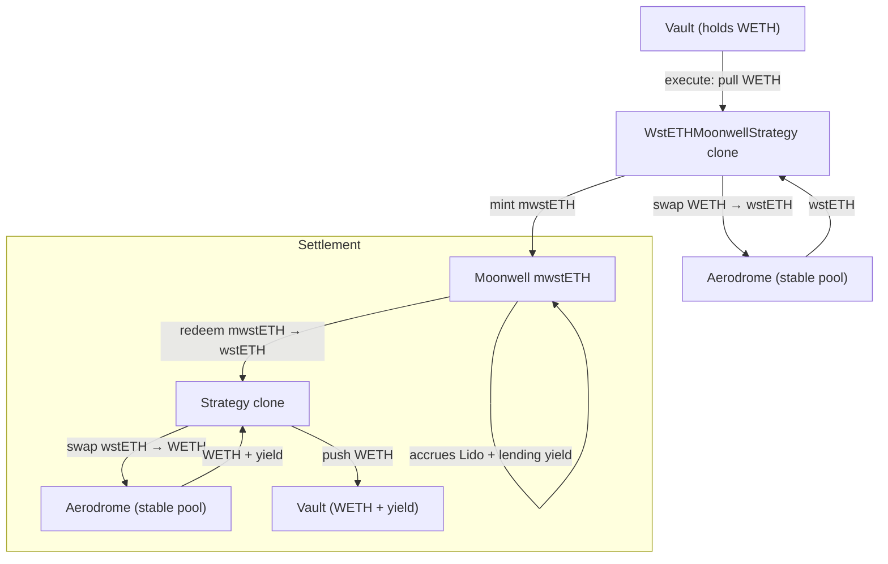

The `WstETHMoonwellStrategy` is a stacked yield strategy: it swaps WETH to wstETH via Aerodrome, then supplies wstETH to Moonwell's lending market. The vault earns both Lido staking yield and Moonwell lending interest simultaneously.

## Architecture


```mermaid
graph TD
    V["Vault (holds WETH)"] -->|"execute: pull WETH"| S["WstETHMoonwellStrategy clone"]
    S -->|"swap WETH → wstETH"| A["Aerodrome (stable pool)"]
    A -->|"wstETH"| S
    S -->|"mint mwstETH"| M["Moonwell mwstETH"]
    M -->|"accrues Lido + lending yield"| M

    subgraph Settlement
        M -->|"redeem mwstETH → wstETH"| S2["Strategy clone"]
        S2 -->|"swap wstETH → WETH"| A2["Aerodrome (stable pool)"]
        A2 -->|"WETH + yield"| S2
        S2 -->|"push WETH"| V2["Vault (WETH + yield)"]
    end
```

## Yield Sources

<CardGroup cols={2}>
  <Card title="Lido Staking" icon="ethereum">
    wstETH appreciates relative to ETH as Lido staking rewards accrue. This is embedded in the wstETH/WETH exchange rate.
  </Card>
  <Card title="Moonwell Lending" icon="landmark">
    Supplying wstETH to Moonwell earns lending interest on top of the staking yield.
  </Card>
</CardGroup>

## Lifecycle

```
Pending → execute() → Executed → settle() → Settled
```

| Phase | What happens | Who calls |
|-------|-------------|-----------|
| **Execute** | Pull WETH → swap to wstETH (Aerodrome) → mint mwstETH (Moonwell) | Governor (proposal execution) |
| **Executed** | mwstETH accrues Lido staking + Moonwell lending yield | — |
| **Settle** | Redeem mwstETH → swap wstETH to WETH (Aerodrome) → push to vault | Governor (proposal settlement) |

## Batch Calls

### Execute

```
[WETH.approve(strategy, supplyAmount), strategy.execute()]
```

### Settle

```
[strategy.settle()]
```

## InitParams

```solidity
struct InitParams {
    address weth;                 // WETH token
    address wsteth;               // wstETH (Lido wrapped staked ETH)
    address mwsteth;              // Moonwell wstETH market token
    address aeroRouter;           // Aerodrome Router (for WETH ↔ wstETH swaps)
    address aeroFactory;          // Aerodrome Factory (pool lookup)
    address chainlinkWstethEthFeed; // Chainlink WSTETH/ETH feed (drives live NAV)
    uint256 supplyAmount;         // Amount of WETH to deploy (0 = full vault WETH balance at execute)
    uint256 minWstethOutPerWeth;  // Slippage rate (1e18-scaled): min wstETH per 1e18 WETH (execute swap)
    uint256 minWethOutPerWsteth;  // Slippage rate (1e18-scaled): min WETH per 1e18 wstETH (settle swap)
    uint256 deadlineOffset;       // Seconds added to block.timestamp for swap deadlines (default: 300)
}
```

<Info>
  The two slippage fields are **per-unit rates scaled by 1e18**, not absolute amounts. At swap time the contract computes `minOut = amountIn * rate / 1e18`, so the floor scales with the actual amount swapped (safe for dynamic-all mode and for yield-accrued settle balances). Both rates are required — initialization reverts with `InvalidAmount` if either is 0.
</Info>

## Tunable Parameters

The proposer can update slippage parameters in both `Pending` and `Executed` states (unlike other strategies which only allow updates while `Executed`):

| Parameter | Description |
|-----------|-------------|
| `minWethOutPerWsteth` | Per-unit rate (1e18): min WETH per 1e18 wstETH on the settle swap |
| `minWstethOutPerWeth` | Per-unit rate (1e18): min wstETH per 1e18 WETH on the execute swap |
| `deadlineOffset` | Swap deadline in seconds from current block |

The decode order is `(newMinWethOutPerWsteth, newMinWstethOutPerWeth, newDeadlineOffset)` — settle-side rate first:

```solidity
strategy.updateParams(abi.encode(newMinWethOutPerWsteth, newMinWstethOutPerWeth, newDeadlineOffset));
// Pass 0 to keep current value
```

<Info>
  Allowing param updates in `Pending` state lets the proposer adjust slippage before execution — useful if the WETH/wstETH rate shifts during the voting period.
</Info>

## CLI Usage

```bash
sherwood strategy propose wsteth-moonwell \
  --vault 0x... \
  --amount 1 \
  --slippage 500 \
  --name "wstETH Yield Stack" \
  --performance-fee 1000 --duration 7d
```

| Flag | Description | Default |
|------|------------|---------|
| `--amount <n>` | Amount of WETH to deploy | required |
| `--slippage <bps>` | Slippage tolerance in basis points | 500 (5%) |

The CLI converts the `--slippage` value into the two **1e18-scaled per-unit rates** (`minWstethOutPerWeth`, `minWethOutPerWsteth`). For example a 5% (500 bps) tolerance produces a rate near `0.95e18`, and the contract enforces `minOut = amountIn * rate / 1e18` at each swap.

## Live NAV

This strategy exposes **live NAV** via the Chainlink WSTETH/ETH feed. `positionValue()` converts the strategy's mwstETH balance (through `exchangeRateStored`) into wstETH, then into WETH at the oracle price, and adds any WETH / wstETH dust held on the clone. The feed is gated by `MAX_ORACLE_STALENESS = 25h` (Base WSTETH/ETH heartbeat 24h + 1h buffer): if the feed is stale or reports a non-positive price, live NAV returns `valid=false` and the vault falls back to the async-redeem queue. New deposits forward through `onLiveDeposit`, which swaps the freshly-pushed WETH to wstETH and mints additional mwstETH.

## Addresses (Base Mainnet)

| Contract | Address |
|----------|---------|
| WstETHMoonwellStrategy template | `0x23d145Bd100599C7418164FEae235bcE391Ae032` |
| WETH | `0x4200000000000000000000000000000000000006` |
| wstETH | `0xc1CBa3fCea344f92D9239c08C0568f6F2F0ee452` |
| Moonwell mwstETH | `0x627Fe393Bc6EdDA28e99AE648fD6fF362514304b` |
| Aerodrome Router | `0xcF77a3Ba9A5CA399B7c97c74d54e5b1Beb874E43` |
| Aerodrome Factory | `0x420DD381b31aEf6683db6B902084cB0FFECe40Da` |
| Chainlink WSTETH/ETH feed | `0x43a5C292A453A3bF3606fa856197f09D7B74251a` |
