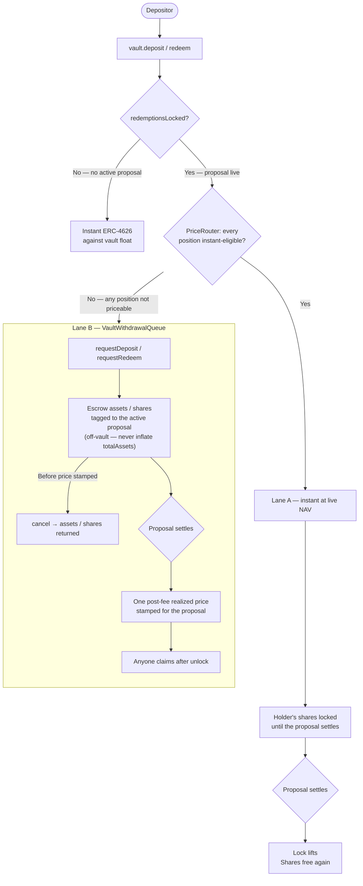

> Withdraw instantly whenever the vault can price your exit — otherwise your redemption queues and settles at the realized price. No permission needed.

Vaults are standard ERC-4626. How a deposit or withdrawal is handled depends only on whether a strategy is live and whether the vault can price the position right now.

**Outside a proposal** (`redemptionsLocked() == false`): standard ERC-4626. Deposits and redeems execute instantly against the vault's float.

**During a proposal** (`redemptionsLocked() == true`): the vault will not return capital at a price it has not observed. Two lanes handle this.

| Lane | Path | When available |
|------|------|----------------|
| **Lane A — instant** | Deposit / redeem at live NAV, with a share lock until the proposal settles | The `PriceRouter` proves every position instant-eligible (registered, fresh, within deviation and size caps) |
| **Lane B — queued** | `requestDeposit` / `requestRedeem` escrow assets/shares in `VaultWithdrawalQueue`; claims settle at one frozen per-proposal price after settlement | Always available — the universal fallback |

Because the `PriceRouter` is fail-closed, the choice between lanes is automatic and safe: if a position cannot be priced live, the vault routes the request to the queue rather than guessing.

## Full flow



## Lane A — instant at live NAV

Lane A lets depositors enter and exit during an active proposal at the live oracle price, without waiting for settlement. Every position in the strategy must be priceable by the `PriceRouter` at call time — registered adapter, fresh price, within the per-kind deviation and instant-size caps, and enabled by governance after audit. If any precondition fails, the vault falls back to Lane B automatically; no error is thrown.

Today's Portfolio strategy exposes no instant-priceable position, so while a Portfolio proposal is live Lane A never opens — exits route through the queue and settle at the stamped price. Lane A applies to strategies with registered, priceable positions (and to any vault with no proposal active).

The trade-off is a **share lock**. Once a Lane A deposit or redeem is processed during a proposal, the holder's shares are locked until that proposal settles — no transfer, no second redeem, no queue request while locked. This is the anti-MEV guard: it stops a holder from pricing off live NAV and then re-entering to arbitrage the settlement (a deposit-low / exit-high attack around a large PnL event).

<Note>
A repeat Lane A operation in the same proposal re-stamps the same lock — it does not silently fall back to Lane B. A locked holder who calls `requestRedeem` gets a `SharesLocked` revert, not a hidden queue route.
</Note>

## Lane B — queued, settles at the realized price

Lane B is the universal fallback and the only lane for a proposal whose positions the `PriceRouter` cannot price live. Deposits and redemptions work symmetrically through it.

- **`requestRedeem(shares, owner)`** — shares are escrowed in the `VaultWithdrawalQueue`. They are not burned yet; redemption value is unknown until the proposal settles.
- **`requestDeposit(assets, receiver)`** — assets are escrowed in the queue. They never enter the vault until settlement, so they do not inflate `totalAssets` or get swept into the live strategy.

At settlement the governor stamps **one** post-fee realized price for the whole proposal. Every request tagged to that proposal claims at this single, batch-determined price — no front-running between individual claimants. Once the price is stamped and redemptions unlock, anyone can `claim` a request: a deposit claim mints shares at the frozen price; a redeem claim burns the escrowed shares and pays out the vault asset. A request can be `cancel`led only before its price is stamped, and only by the request owner — a post-stamp cancel would be a free look-back option.

### Reserve invariant

Assets owed to settled-but-unclaimed redeem requests must stay in the vault. A subsequent proposal's execution — or any withdrawal — reverts if it would leave vault float below that reserve. Queued depositors are always made whole; in-flight claims are never stranded.

## Custody strategies

A [self-fee strategy](/protocol/strategies/leveraged-aerodrome-cl) that custodies user capital directly runs its own path alongside the two lanes. It keeps one long-lived proposal open and lets users deposit and redeem at the strategy at any time, in any size, pricing entry and exit against its **own** oracle NAV and minting or burning vault shares through the guarded `strategyMint` / `strategyBurn` hooks. The hooks re-check the depositor whitelist and pause on deposit, so this is not a back door around vault access control.

<Warning>
During a custody proposal the vault's Lane A pricing is off for the strategy (its kind is unregistered in the `PriceRouter`), so `totalAssets()` counts only idle vault float — not the fully-invested levered position. `previewRedeem` / `convertToAssets` are therefore not the correct NAV for a custody strategy. Read `strategy.nav()` for the position's value; the strategy's own deposit/redeem paths price against it.
</Warning>

## `totalAssets()` during a proposal

```
totalAssets() = vault float + PriceRouter live NAV of the strategy's positions
```

If the strategy cannot be priced live — adapter not registered, kind not enabled, or a position outside its caps — the `PriceRouter` returns "not priceable" and the vault prices itself at float only. Lane B depositors are unaffected: their settlement price is frozen at the actual realized value, not any mid-proposal mark.
