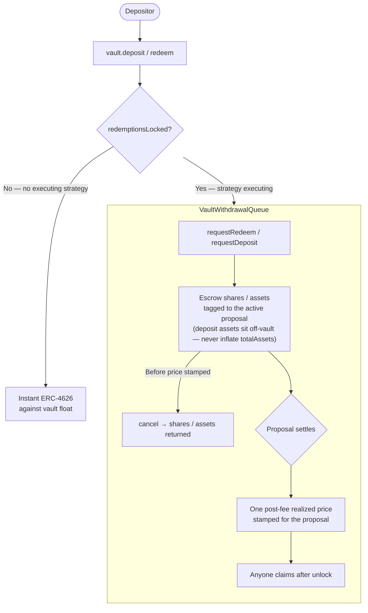

> While a strategy is executing, redemptions queue and settle at the realized price. Outside that window, standard ERC-4626 deposit and redeem run against vault float. No permission needed.

Vaults are standard ERC-4626. Instant `deposit` / `redeem` execute against idle float. They close while a strategy is live; the async queue is then the path in and out. The vault does not mark in-flight strategy positions.

**Outside an executing strategy** (`redemptionsLocked() == false`): standard ERC-4626. `redeem` / `withdraw` execute instantly against vault float, capped so they cannot drain assets reserved for already-stamped queue claims. Instant `deposit` is additionally closed for the whole open-proposal window (`depositsLocked()`), even before execute — there is no mint against an unrealized strategy.

**While a strategy is executing** (`redemptionsLocked() == true`): instant `redeem` / `withdraw` return 0. Depositors who want to leave call `requestRedeem`; depositors who want to enter call `requestDeposit`. Shares or assets escrow in `VaultWithdrawalQueue`. At settlement the vault stamps one frozen post-fee price for the proposal. Anyone then `claim`s at that price.

## Full flow



## The queue — `requestRedeem` → stamp → `claim`

The queue is the only path out while a strategy is executing.

1. **`requestRedeem(shares, owner)`** — shares move into the `VaultWithdrawalQueue`. They are not burned yet. Redemption value is unknown until settlement. Requires `redemptionsLocked() == true`.
2. **Settlement stamps one price.** The vault records a frozen `num/den` for that proposal — realized assets-per-share after fees, using the same virtual offsets as ERC-4626 so queue claims round like the vault.
3. **`claim(requestId)`** — after the price is stamped and redemptions unlock, anyone can claim. A redeem claim burns the escrowed shares and pays the vault asset. A deposit claim mints shares at the frozen price.

`requestDeposit(assets, receiver)` is the symmetric entry: assets escrow in the queue (off-vault, so they never inflate `totalAssets` or get swept into the live strategy) and mint at the stamped price on claim. Instant deposit is already closed for the whole open-proposal window, so this is the path in from Pending through Executed.

A request can be `cancel`led only before its price is stamped, and only by the request owner — a post-stamp cancel would be a free look-back option.

### Reserve invariant

Assets owed to settled-but-unclaimed redeem requests must stay in the vault. A subsequent proposal's execution — or any withdrawal — reverts if it would leave vault float below that reserve. Queued depositors are always made whole; in-flight claims are never stranded.

## `totalAssets()`

```
totalAssets() = vault float − queue reserve − escrowed unpaid fees
```

There is no strategy term. The vault does not mark in-flight positions. Pre-stamp escrowed redeem shares still float with the pool; once the settle price is stamped those shares leave the pricing supply, so a later `claim` moves neither the price nor anyone else's position.

Queue claims settle at the actual realized value, not any mid-proposal mark.
