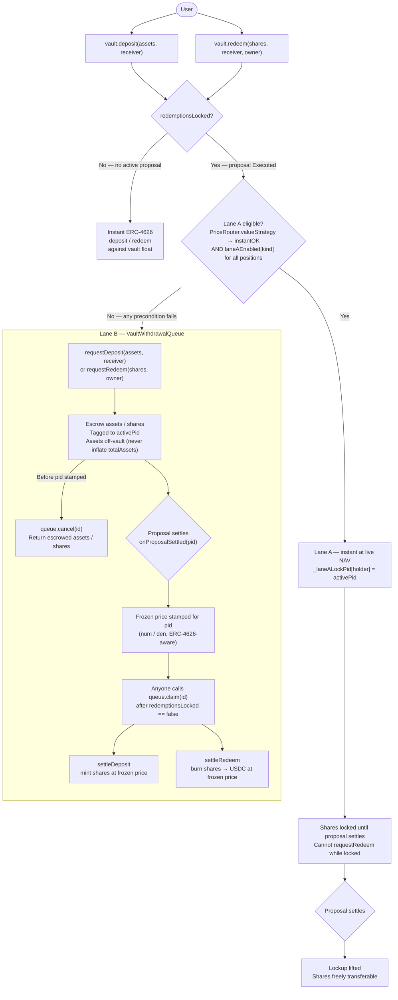

## Overview

Vault liquidity is handled differently depending on whether a proposal is active.

**Outside a proposal** (`redemptionsLocked() == false`): standard ERC-4626. Deposits and redeems execute instantly against the vault's float.

**During a proposal** (`redemptionsLocked() == true`): the vault cannot return capital at a price it hasn't observed yet. Two lanes handle this:

| Lane | Path | When available |
|------|------|----------------|
| **Lane A** — oracle instant | Instant deposit / redeem at live NAV, with a per-share lockup until the proposal settles | PriceRouter can price every strategy position live (`instantOK`) AND `laneAEnabled[kind] == true` for all position kinds |
| **Lane B** — async queue | `requestDeposit` / `requestRedeem` escrow assets/shares in `VaultWithdrawalQueue`; claims settle at the frozen per-proposal price after the proposal settles | Always available — universal fallback |
| **Custody model** — direct-at-strategy | `strategy.deposit` / `strategy.redeem` anytime, any size; the strategy custodies assets and mints/burns vault shares directly (bypasses both lanes) | Opt-in per strategy (custody strategies that run Lane A off), e.g. [Leveraged Aerodrome CL](/protocol/strategies/leveraged-aerodrome-cl) |

## Full Flow



## Lane A — Oracle Instant Lane

Lane A lets depositors enter and exit during an active proposal at the live oracle price, without waiting for settlement. The trade-off is a **per-share lockup**: once a Lane A deposit or redeem is processed, the holder's shares are locked (`_laneALockPid[holder] = activePid`) until that proposal settles.

**Preconditions — all must hold at call time:**

1. `priceRouter.valueStrategy(strategy)` returns `instantOK == true` — every position in the strategy is priced live by a registered adapter via the PriceRouter
2. `laneAEnabled[kind] == true` for every position kind in the strategy — governance enables this per-kind after audit

If either precondition fails at call time, the vault falls back to Lane B — the caller receives a queue request rather than an immediate settlement.

<Note>
A repeat Lane A operation in the same proposal re-stamps `_laneALockPid[holder]` with the same pid — it does **not** fall back to Lane B. A locked holder who calls `requestRedeem` while locked hits `SharesLocked`, not a silent queue route.
</Note>

**Fail-closed design:** the PriceRouter returns `(0, false)` on any adapter failure, oracle staleness, position over the instant-size cap, or transit window (e.g. `returnsInitiated == true` on the Hyperliquid strategy). A zero result with `ok == false` triggers the G3 check (`total == 0 → (0, false)`) and forces Lane B. No error is thrown — the vault always finds a path forward.

**G1 MEV protection:** the lockup until settlement prevents a deposit-low/exit-high attack where an actor enters right before a large PnL event and exits immediately after capturing the gain.

## Lane B — Async Request Queue

Lane B is the universal fallback. It is the only lane available for strategies that don't support Lane A (Hyperliquid Grid, Portfolio, Venice) and the automatic path when Lane A preconditions aren't met.

### requestDeposit

```solidity
vault.requestDeposit(assets, receiver)  // returns queueId
```

Assets are transferred from the caller into `VaultWithdrawalQueue` — they never enter the vault until settlement, so they don't inflate `totalAssets` or get swept into the active strategy.

### requestRedeem

```solidity
vault.requestRedeem(shares, owner)  // returns queueId
```

Shares are transferred from `owner` into the queue. They are not burned yet — redemption value is unknown until the proposal settles.

### Frozen settle price

When the governor calls `vault.onProposalSettled(pid)` at settlement, the queue stamps **one price** (per-share, ERC-4626-aware) for that proposal ID. Every request tagged to that `pid` claims at this single, batch-determined price — no front-running between individual claimants.

### claim

```solidity
queue.claim(id)  // callable by anyone once pid is stamped AND !redemptionsLocked()
```

- **Deposit claim** → `vault.settleDeposit`: mints shares at the frozen price, sends to `receiver`
- **Redeem claim** → `vault.settleRedeem`: burns the escrowed shares, sends USDC to `receiver`

### cancel

```solidity
queue.cancel(id)  // owner-only; only before the pid is stamped
```

Returns escrowed assets/shares to the request owner (`request.owner`). Reverts `NotQueueOwner` if `msg.sender != request.owner` — cancel cannot be performed on behalf of another user. Not available after the proposal settles (post-stamp cancel would be a free look-back option).

### Reserve protection

`executeGovernorBatch` tracks `reservedAssets()` — total USDC owed to stamped-but-unclaimed redeem requests. A subsequent proposal's execution reverts if it would leave vault float below this reserve, so in-flight redeem claims are never stranded.

## Custody Model — Direct-at-Strategy Deposits & Redeems

A **third model** exists alongside the two lanes for strategies that custody user capital directly. In this model a strategy runs one indefinitely-lived proposal and lets users **deposit and redeem at the strategy at any time, in any size** — `strategy.deposit(assets, minShares)` / `strategy.redeem(shares, minAssetsOut)` — **bypassing both Lane A instant and Lane B async**. The strategy prices the entry against its own oracle NAV and services exits via an oracle-free proportional redeem, then mints/burns vault shares through the vault's active-strategy hooks:

- `strategy.deposit` → `vault.strategyMint(user, shares)` (re-checks the depositor whitelist + `whenNotPaused`)
- `strategy.redeem` → `vault.strategyBurn(shares)` (not pause-gated, so exits survive an incident pause)

Both hooks are gated to `activeStrategyAdapter()` and are pure share operations (no asset movement or pricing on the vault side) — see the [SyndicateVault share hooks](/protocol/architecture#syndicatevault) in the architecture reference.

<Warning>
**During a custody proposal, `vault.totalAssets()` is float-only** — the vault's Lane A pricing is off for these strategies (`kind` unregistered in the PriceRouter), so `valueStrategy` returns `(0, false)` and `totalAssets()` counts only idle vault float, **not** the fully-invested levered position. `previewRedeem` / `convertToAssets` are therefore **not** the correct NAV for a custody strategy. **Integrators must read `strategy.nav()`** for the position's value. The custody strategy's own deposit/redeem paths price against `strategy.nav()`, not the vault.
</Warning>

The one-time genesis governance window (open + first settle) still applies: while the proposal is `Pending → GuardianReview → Approved`, `activeStrategyAdapter()` is `address(0)` and both hooks revert — the genesis blackout that precedes the first deposit. Once the proposal is `Executed`, anytime deposit/redeem is live indefinitely.

## Current Lane A Status by Strategy

| Strategy | Position kind | Adapter | Lane A enabled |
|---|---|---|---|
| Moonwell Supply | `MOONWELL_SUPPLY` | `MoonwellSupplyAdapter` | **Yes** (enabled post-audit) |
| Hyperliquid Perp | `HL_PERP` | `HyperliquidPerpAdapter` | **No** (pending post-audit multisig call) |
| Aerodrome LP | `AERO_LP` | `AerodromeLPAdapter` | **No** (pending audit) |
| Hyperliquid Grid | — (no positions reported) | — | **No** — Lane B only by design |
| Portfolio, Venice, Mamo | — | — | **No** — Lane B only |

Governance enables Lane A per-kind via `PriceRouter.setLaneAEnabled(kind, true)` after the adapter has been audited and a haircut + instant-cap have been configured.

## `totalAssets()` During a Proposal

```
totalAssets() = vault float + priceRouter.valueStrategy(strategy)
```

If Lane A is unavailable — adapter not registered, kind disabled, or strategy in an outbound transit window — `valueStrategy` returns `(0, false)` and the vault prices itself at float only. Lane B users are unaffected: their settlement price is frozen at the actual realized value, not the mid-proposal mark.
