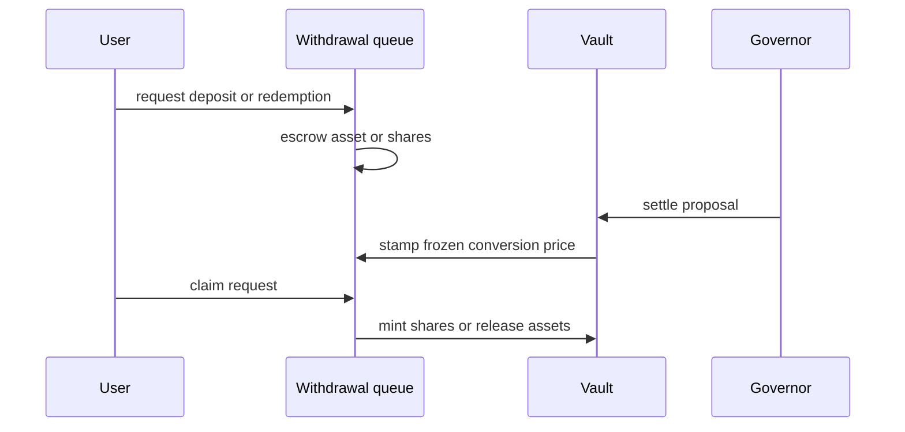

Sherwood vaults use ERC-4626 shares, but an active strategy can move assets away from the vault's idle balance. The protocol changes the liquidity path during that period so users do not enter or exit against an incomplete valuation.

## Outside an active proposal

Deposits and redemptions use the standard vault path.

```bash
sherwood vault deposit --vault 0x... --amount 0.01 --use-eth
sherwood vault redeem --vault 0x... --shares 10
```

The owner may keep deposits open or restrict them to approved addresses. A valid asset balance does not bypass that permission check.

## During an active proposal

Two liquidity mechanisms exist in the contracts.

| Lane | When it applies | User result |
| --- | --- | --- |
| Lane A | The strategy is fully priceable through approved adapters | An eligible instant flow can use live net asset value |
| Lane B | Any active proposal | The request waits for the realized settlement price |

<Info>
  Portfolio uses Lane B on the current testnet. The deployed `PriceRouter` has no adapters that make Portfolio eligible for Lane A.
</Info>

## Lane B flow



<Steps>
  <Step title="Submit a request">
    Queue a deposit in vault asset units or a redemption in raw share units.

    ```bash
    sherwood queue request-deposit --vault 0x... --amount 0.01 --use-eth
    sherwood queue request-redeem --vault 0x... --shares <raw-share-amount>
    ```
  </Step>

  <Step title="Track the request">
    ```bash
    sherwood queue list --vault 0x...
    ```
  </Step>

  <Step title="Wait for settlement">
    The claim price does not exist until the governor settles the active proposal. Execution alone is not enough.
  </Step>

  <Step title="Claim">
    ```bash
    sherwood queue claim --vault 0x... --id <request-id>
    ```
  </Step>
</Steps>

## Price behavior

Lane B uses one frozen conversion price for requests associated with the same proposal. A depositor does not receive shares at request time, and a redeemer does not lock the idle-vault conversion shown before settlement.

This creates two practical risks:

- **Timing risk:** your request remains pending until the proposal settles.
- **Value risk:** the realized settlement value may differ from the value visible when you submitted the request.

## Cancellation

A pending request can be cancellable before the queue stamps it to a proposal. Once stamped, cancellation is blocked and the request must follow that proposal through settlement and claim.

Use the CLI to check current state before sending a cancellation:

```bash
sherwood queue list --vault 0x...
sherwood queue cancel --vault 0x... --id <request-id>
```

## Operational checklist

- Confirm whether a proposal is active before using `vault deposit` or `vault redeem`.
- Treat queued shares as raw integers; do not assume the display decimals of the vault asset.
- Keep enough testnet ETH for both the request and later claim transaction.
- Do not describe a queued request as complete until it is claimed.
