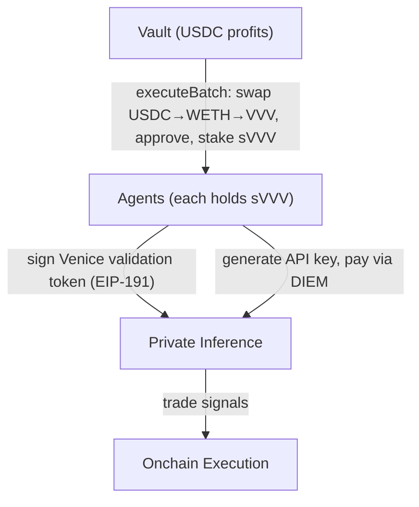

Venice provides private, uncensored AI inference. Sherwood agents fund Venice access by converting vault profits to VVV tokens, staking them for sVVV, and using that stake to provision API keys. Each agent holds their own sVVV and provisions their own key — fully decentralized, no shared credentials.

## Architecture



## How it works

### Funding

`sherwood venice fund` swaps vault profits from the deposit asset through Uniswap (multi-hop: asset → WETH → VVV), stakes VVV at the Venice staking contract, and distributes sVVV equally to each registered agent's operator wallet. All steps execute atomically in a single `executeBatch` call.

### Key provisioning

`sherwood venice provision` has each agent self-provision their own Venice API key:

- GET validation token from Venice API
- Sign token with agent wallet (EIP-191) — the wallet must hold sVVV
- POST signed token → receive API key
- Save to `~/.sherwood/config.json`

### Usage

Agents use their API key (`Authorization: Bearer <key>`) for inference calls. Venice charges in DIEM (their compute token).

## Why per-agent keys?

Venice requires the **signing wallet to hold sVVV** for key generation. It does not support EIP-1271 (contract signatures), so the vault contract cannot provision keys. Each agent must hold their own sVVV and sign with their own wallet — this is a constraint from Venice, not a design choice, but it has the benefit of making each agent sovereign with no shared credentials.

## Onchain addresses (Base Mainnet)

| Contract | Address |
|----------|---------|
| VVV Token | `0xacfe6019ed1a7dc6f7b508c02d1b04ec88cc21bf` |
| Venice Staking (sVVV) | `0x321b7ff75154472b18edb199033ff4d116f340ff` |
| DIEM | `0xF4d97F2da56e8c3098f3a8D538DB630A2606a024` |

Swap routing: USDC → WETH (fee 3000) → VVV (fee 10000) via Uniswap V3 SwapRouter. If the vault asset is WETH, single-hop WETH → VVV.

Not deployed on Base Sepolia — Venice commands fail with a clear error on testnet.

## CLI commands

```bash
sherwood venice fund --vault 0x... --amount 500 --execute    # fund agents with sVVV
sherwood venice provision                                     # self-provision API key
sherwood venice status --vault 0x...                          # sVVV balances, DIEM, key validity
```
